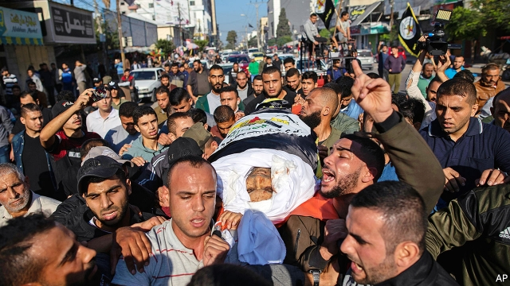

###### A kaleidoscope of possibilities

# The politics surrounding an assassination and its aftermath in Gaza 

 

> print-edition iconPrint edition | Middle East and Africa | Nov 14th 2019 

Editor’s note: This article was updated at 8am GMT on November 14th, 2019, to reflect the announcement of a ceasefire, as well as a higher death toll. 

THE MISSILE that was launched shortly before dawn on November 12th was just the beginning. Around 4am that morning, an Israeli aircraft struck a house in Gaza, killing Baha Abu al-Ata, a commander in the Palestinian Islamic Jihad (PIJ) militant group, and his wife. The group responded by firing hundreds of rockets at Israel (causing no deaths). At least 34 Palestinians, many of them militants, were killed in subsequent Israeli air strikes. 

There is a gloomy pattern to these repeated escalations, the last of which occurred in May. Both sides unleash salvos of fire for two or three days, then accept a truce, usually brokered by their Egyptian neighbours. PIJ angrily warned that this time would be different. “We are going to war,” said Ziad al-Nakhaleh, the group’s leader. Binyamin Netanyahu, the Israeli prime minister, “has crossed all red lines.” Assassinations in Gaza have occasionally led to wider conflicts. The killing of a Hamas commander in 2012 set off a brief war. 

For all its bluster, though, PIJ agreed to a ceasefire within 48 hours of the first shot. As the second-largest militant organisation in Gaza, PIJ is smaller (and less pragmatic) than Hamas, the Islamist group that has controlled the territory since 2007. Hamas pointedly declined to join the fighting, though it did not stop PIJ from firing rockets, as it often does when smaller militant groups attack Israel without permission. Leaders of the two groups were co-ordinating in a so-called “operations room”. But Hamas did not haul out—or loose off—its own arsenal of rockets. 

Hamas rose in the 1980s on a credo of resistance against Israel. Since it took power it has fought three wars against the Jewish state. The results have been disastrous for Gaza’s 2m people: thousands dead and tens of thousands of homes destroyed. Since 2007 a punishing Israeli and Egyptian blockade has paralysed the economy; tens of thousands of young people have left, seeking work and a future elsewhere. There is little popular support for more war. And though Hamas does not permit much open dissent, many Gazans privately wish to see the group gone altogether. 

To maintain its grip on power, Hamas would rather strike a truce with Israel in exchange for an easing of the blockade. But this would be unpopular with its own militant cadres. More thoughtful members of Hamas worry about becoming, in effect, a religious version of the Palestinian Authority (PA), the feckless semi-autonomous government in the Israeli-occupied West Bank. The group is struggling to control smaller factions keen on conflict with Israel, many of them stocked with disillusioned ex-Hamasniks. In August Israeli soldiers killed four armed Palestinians who were trying to cross the border. 

So far Israel has refrained from clobbering Hamas and risking a bigger conflict. Moreover, leaving it in control of Gaza meets Mr Netanyahu’s aim of keeping the leadership of the Palestinians divided between Hamas and the PA in the West Bank. 

He is also thinking about domestic politics. His coalition of right-wing and religious parties lost seats in two inconclusive elections in April and September. He has been stuck in a temporary minority government for months. Though Israeli generals back his claim that the timing of the assassination was based wholly on circumstances in Gaza, it was politically fortuitous for Mr Netanyahu. 

To form a new government he must convince the centrist Blue and White party to join him in coalition. But its leadership has so far refused, citing the criminal investigations against the prime minister, which are expected within weeks to culminate in bribery and fraud indictments. Mr Netanyahu has tried to break down their resistance by wooing Blue and White’s leader, Benny Gantz, a former army chief. He brought him into recent discussions over Gaza, with a view towards appointing him defence minister. 

A newcomer to politics, Mr Gantz seems tired of the incessant campaigning and manoeuvring of the past year. He is rumoured to be softening. He could accept an arrangement whereby he joins a Netanyahu-led coalition in return for a promise from the prime minister that he would suspend himself if he is indeed indicted. 

Mr Gantz would have to convince his colleagues, most of whom appear set against the idea. They are running out of choices. Blue and White could try to form a minority government supported by Arab-Israeli parties, which would not actually join the coalition. But the Gaza operation has made that harder. In tweets and speeches before and after the assassination, Mr Netanyahu accused Arab-Israeli politicians, who oppose military action in Gaza, of supporting Palestinian “war crimes”—and warned Mr Gantz against co-operating with them. 

The deadline for forming a government is December 11th. If no candidate succeeds by then, Israel will be plunged into its third election campaign in a year. Mr Netanyahu would remain as caretaker prime minister. Polling suggests that another vote is unlikely to make it any easier to form a government. Reaching a deal with Hamas looks simple by comparison. ■ 

