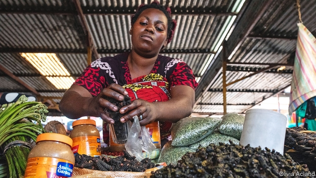

###### Grubs up

# Why eating bugs is so popular in Congo 

 

> print-edition iconPrint edition | Middle East and Africa | Nov 14th 2019 

AT A MARKET in Goma, a city in the east of the Democratic Republic of Congo, an old woman pulls the wings off live grasshoppers and tosses their wriggling bodies into a bucket. She collected the insects from the airport at 5am that morning, and will go back the next day. Grasshopper season has just begun. 

Throughout November dozens of grasshopper-hunters gather at Goma airport most mornings. It is one of the few buildings in the city with constant electricity, and the lights that mark the runway attract swarms of the bug. People stuff them into plastic bottles to take to market. Buyers season them with salt and eat them with rice or cassava. 

Selling insects is more lucrative than selling fruit. A small pile of grasshoppers fetches the equivalent of $0.60 (Congo’s GDP per person is $562). Gathering them costs nothing but time. Caterpillars are more valuable still. Once they are boiled and salted, a large handful will sell for $1.20—the same price as ten bananas. Households in Kinshasa, the country’s sprawling capital, consume about 300 grams of caterpillars (about 80, if they are averagely juicy) a week. 

The Congolese have been eating bugs for centuries. People say caterpillars, in particular, are not just tasty but healthy. “Our ancestors taught us to eat them to protect us from illnesses,” says Leonie Lukambala, a seller. She believes they can even help people infected with HIV. 

Caterpillars are packed with potassium, calcium and magnesium. A hundred grams of them will provide a person with the required daily intake of each of these minerals. They are richer in protein than beef or fish. A handful is packed with about 500 calories, more than are in a fast-food cheeseburger. But that is a boon, not a drawback, in a country that suffers from one of the world’s highest rates of malnutrition. 

Others around the world should catch up. Bug farming takes up less land, requires less food and does less damage to the environment than meat or fish farming. Crickets, for example, need 12 times less food than cattle to produce the same amount of protein. Bugs can even be fed farm and kitchen waste, such as rotten fruit and vegetables. 

Hunting insects is easy, too. Anyone can wander into the forest—or, indeed, to the airport—and gather caterpillars, ants and grasshoppers. But that can also lead to bad outcomes. The wrong variety of insect can poison consumers. Mrs Lukambala says she knows which caterpillars to pick because her family has gathered them for generations (the safe kind have red heads and fall out of trees). Your correspondent tried a sample: it was brittle and had a smoky taste. Add one more to the 2bn people worldwide who chomp insects. 

