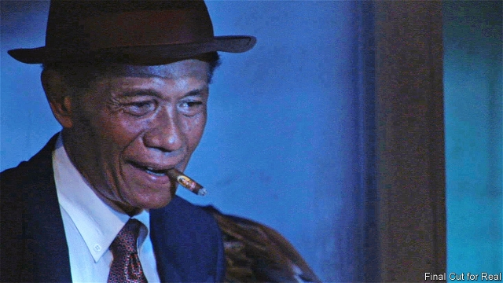

###### Indonesian mass murderer

# Obituary: Anwar Congo died on October 25th 

 

> print-edition iconPrint edition | Obituary | Nov 14th 2019 

THE FIRST time he tried to kill a man, he used a stinky durian fruit. It didn’t work. Eventually, he came to the view that the most efficient method was garrotting, and he was proud of how adept he became with the wire. It hadn’t always been so. 

He was born in Medan, a grimy industrial town in northern Sumatra that was home to Pancasila Youth, the main semi-official political gangster group that flourished as Indonesia’s military dictatorship grew ever more powerful in the mid-1960s. An attempted coup by leftists in 1965 had given the army the excuse it needed to unleash an orgy of killing across the country. Anybody opposed to the army could be accused of being a communist. As America became enmeshed in the Vietnam war, and the fear of communism’s possible domino effect across Asia took hold in the West, President Lyndon B. Johnson and his allies were happy to look away as more than a million alleged communists were tortured and killed, many of them Chinese Indonesians. 

Known as preman, from the English words “free men”, Pancasila’s death squads, with their political connections and their can-do/will-do swagger, proved the ideal recruiting ground for a boy like Anwar Congo. He had dropped out of school at the age of 12 and spent much of his time selling bootleg cinema tickets with his friends outside Medan’s main picture house. Dressed in a cowboy hat and a braided leather necktie complete with Texas star, he imagined himself as a skinny John Wayne, or, in a dark Panama and shades, as one of the mobster types in “Murder, Inc”. It was all a bit of a lark, until someone tried to ban American films, and the gangsters’ business slumped. 

As he grew older, he moved from cinema tickets into petty smuggling and illegal gambling, and soon he came to the attention of men like Ibrahim Sinik, a newspaper publisher and paramilitary gang boss. Mr Sinik decided who got killed in Medan and who should merely be shaken down for money. He needed protection, and the young film buff was just the guy to provide it. He’d go to a musical film in the afternoon, then sidle across the street—high on show tunes—and hop up the stairs to the roof of Sinik’s newspaper office where he changed into jeans or thick trousers and set to work. In the early days, he beat his victims to death. But there was so much blood. Even after it was cleaned up, it still stank. To avoid the mess, he switched to wire. With a wooden slat at either end, it was quick and clean. So many people were killed on that roof terrace, it was known as “the office of blood”. He is reckoned to have murdered at least 1,000 people with his own hands, and soon had his own gang known as the Frog Squad. 

When, at last, the killing came to an end in 1968, he moved into organising political muscle, clearing land for illegal logging. And there, in humanity’s dark shadows, he might have remained, were it not for the fact that in 2005, exactly 40 years after the genocide began, he met an idealistic young American-born documentary-maker named Joshua Oppenheimer. Thus began the second life of Anwar Congo. 

He was the 41st killer to be interviewed by Mr Oppenheimer. He gloated over how they used to crush their victims’ necks with wooden staves, how they hanged them, strangled them, cut off their heads, ran them over with cars—all because they were allowed to. And he insisted that they never felt guilty, never got depressed, never had nightmares. Dressed in white slacks and a lime Hawaiian shirt the first day he met the film-makers, he led them up to Mr Sinik’s roof and showed them in person, demonstrating on a friend, how he had garrotted his victims. And how afterwards, he would put on some good music, drink a little booze, smoke a little marijuana. Stepping lightly across the roof, he crooned: “Cha, cha, cha.” By now in his 60s and missing several teeth, he clacked his dentures when the camera began rolling. 

At home, he served the film-maker sweet tea. While the two men discussed what film they might make, he taught a young boy how to care for his pet duckling. He roped in his Pancasila friends to re-enact what they had done. The directors gave them carte blanche. The gangsters sketched out interrogations and how they beat women and burned down villages. Aided by a fat sidekick in drag, with bright lipstick and lime eyeshadow, they even re-enacted a beheading, and how afterwards they ate the victim’s liver. 

In the evening they watched the day’s rushes. Sometimes, wearing a burgundy Panama hat, he played one of the interrogators: “It must be fun being a communist. You fuck other people’s wives.” Or he’d play the film-maker, sitting high up in the cameraman’s chair, wholly consumed with panning across a scene of make-believe. 

And then, one day, he cast himself as a victim. He sat in the chair on the far side of the interrogator’s wooden desk. His shiny charcoal suit turned dark as he sweated at being questioned. After the wire was slipped around his neck, his right hand began to shake. “Did the people I tortured feel the way I do here?” he asked. “I felt all the terror possess my body.” 

“No,” Mr Oppenheimer quietly replied. “You’re making a film. They knew they were going to be murdered.” 

“The Act of Killing”, or Jagal as it was called in Indonesian, meaning “Butcher”, was tipped to win an Oscar when it was released in 2012. It became the country’s most viewed film after the producers made it available free online, and Indonesians began talking about the years of living dangerously in a way they never had before. 

As for Mr Congo, he evaded justice, but not punishment. The garrotting stayed with him. It was, he said, one of the easiest ways of taking a human life. When, on the final day of the shoot that had lasted five years, he was filmed returning, in a mustard double-breasted suit and lemony shirt, to the roof of Mr Sinik’s office, where so many men had died by his hand, he sniffed the night air and then he gulped. Turning away, he retched and retched—until he could retch no longer.■ 

