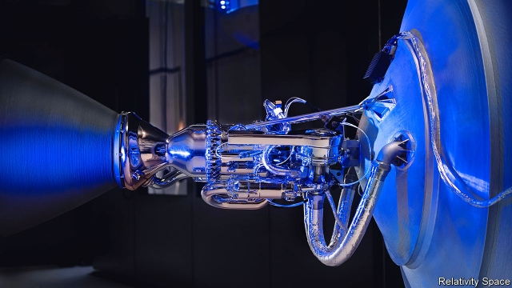
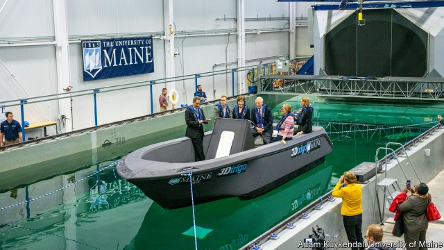

###### Additive manufacturing

# Giant 3D printers for making boats, bridges, buildings and rockets 

 

> print-edition iconPrint edition | Science and technology | Nov 14th 2019 

BOAT BUILDING is a long-winded and tedious business, even when what is going down the slipway is a small craft made from modern materials such as fibreglass, rather than something nailed together out of planks of wood. Construct a mould. Build up layers of resin and glass fibre inside that mould. Extract the completed structure and finish it. All told, it can take months. That, though, may soon change. For researchers at the University of Maine are now in the process of testing an 8-metre (25-foot) patrol boat that took just 72 hours to make from scratch (see picture overleaf). Their trick was to build the vessel using a giant 3D printer. 

Since they appeared in commercial form in the 1990s, 3D printers have generally been employed in factories to make small things like prototype models, components of jet-engines and dental crowns. Now, a new generation of outsize printers is arriving. These are capable of turning out much bigger objects than previously possible, and printing them faster. 

To print the patrol boat, part of an American army project, the team in Maine linked up with Oak Ridge National Laboratory, in Tennessee, which helped develop the printing process, and Ingersoll Machine Tools, in Illinois, which built the printer itself. The university reckons that for boat building, a common trade in the state, large 3D printers of this sort will dramatically cut the cost and time required to produce new vessels. 

Broadly speaking, the biggest object that can be turned out by a 3D printer is determined by the size of the printer itself—and most printers are not much larger than a large domestic refrigerator. Over the years engineers have come up with various ways of scaling this up a bit, by doing things like mounting the printing mechanism on a piece of external scaffolding. But the result is often a slow and inaccurate device that turns out things which require a lot of expensive hand-finishing. 

The University of Maine’s printer overcomes the problem of scale by suspending the printer’s business end—the nozzle that extrudes the ink—from a gantry. The ink is molten thermoplastic resin containing carbon fibres. Under the control of a computer the nozzle moves horizontally to build (as is true of any 3D-printing process) the desired object up layer by layer. After each layer is complete, the nozzle is raised slightly to deposit another on top of it until the object is finished. 

And this can be done quickly. The Maine university printer is able to extrude material at a rate of 70kg (150lbs) an hour. At the moment it can make things up to 30 metres long, 7 metres wide and 3 metres high, but those dimensions could easily be increased by building a bigger gantry. The arm carrying the nozzle can also be fitted with processing equipment, such as an automated milling head to grind off any surface imperfections. 

Having established the principle, the university is now looking to change the nature of the composite, to make the process more environmentally friendly. New England’s forestry industry is a potential source of cellulose fibres that could be incorporated into the ink instead of carbon fibres. That would please Greens, because carbon fibres are usually made from oil-based materials. Habib Dagher, one of the project’s leaders, says the aim is to print with a material containing 50% wood products. This would create a composite as strong and light as aluminium. And with further work the group hope to deposit that material at 230kg an hour. The researchers recently used cellulose fibres and a resin made from maize to print a mould for constructing the roof of a boat. To add to the greenery, this mould could be recycled and the material used again. 

Making moulds and production tools will be an important job for large-format 3D printing, says Craig Blue, director of energy efficiency at Oak Ridge. Tool-making is expensive for two reasons. It requires specialist skills. And the items produced tend to be one-offs or to be made in small numbers, so there are no economies of scale. For 3D printers, however, the cost of making one or many items is about the same. 

There are other advantages. For example, an Oak Ridge system was used by contractors to print specially shaped moulds for concrete castings on the façade of a 45-storey building on the site of an old sugar refinery in Brooklyn, New York. Usually, such moulds are made out of wood by skilled carpenters and might last only three or four pourings, so builders get through a lot of them. But, Dr Blue says, the 3D-printed versions, composed of carbon-fibre-reinforced plastic, were able to survive at least 200 pourings. 

Oak Ridge is also working on ways to print concrete structures directly. The practicalities of erecting massive 3D-printing gantries suggest printing skyscrapers and other large structures is probably best not done in one go, but in smaller sections. Printing precast concrete subunits in the controlled conditions of a factory and then assembling them on site can be better suited to making complex and artistic structures. This is the approach taken by Xu Weiguo and his colleagues at Tsinghua University in Beijing. They used a pair of robotic arms that extrude concrete mixed with polyethylene fibres to print precast sections which were then assembled into a 26-metre footbridge that spans a pond in an industrial park in Shanghai. 

This structure is styled after the Anji Bridge, a stone arch built around 600AD across the Xiaohe river in Hebei province. The replica took 450 hours to print—leisurely by the standards of Maine’s boatyard, but rapid compared both with the ten years the original took and the pace at which even modern building sites tend to move. The researchers reckon production costs were two-thirds that of making a similar bridge from conventionally cast concrete sections. 

Other forms of 3D printing are getting bigger and faster, too. Chad Mirkin and his colleagues at Northwestern University, Illinois, have come up with something they call high-area rapid printing (HARP). Their prototype can make things four metres tall, with a cross section of nearly a square metre. It does so by pulling these solid objects out of a shallow pool of liquid polymer. 

The printer scales up an existing industrial process which starts with the liquid polymer being held in a container with a transparent base. An ultraviolet image of the layers to be built is projected through the base. This triggers a chemical reaction which cures a corresponding layer of polymer immediately above the base, so that it solidifies into the image of the projected light. The first layer attaches itself to a tool lowered into the liquid from above. As the tool is raised it lifts the object out of the pool to permit subsequent layers to be added from below. 

The innovation which HARP brings is having a film of oil flow across the transparent base. This oil, the researchers say, behaves like “liquid Teflon”. It stops the polymer layers sticking to the base and also removes heat generated during curing. The result is that the printer can run much faster than was previously possible. It can, says Dr Mirkin, print in a couple of hours an object the size of an adult human being. A conventional 3D printer using this method would require a couple of days. 

 

The HARP process allows a wide range of materials to be printed at large scale, including hundreds of different polymers, each one of which could be hard, soft or rubbery. It can also print resins that contain materials like silicon carbide, which can be processed into hard-wearing heat-resistant ceramics. Components made from all these materials might be used in products ranging from cars to aircraft to buildings. The system can also be scaled up further, adds Dr Mirkin. He has co-founded a company, Azul 3D, to commercialise the process and expects the first HARP printer to be on the market in about 18 months. 

The most difficult task 3D printing faces, though, is printing large metal objects. The main way of printing in metal is to melt successive layers of a metallic powder using a laser or an electron beam. To stop the powder oxidising and being contaminated by impurities in the air—or worse, exploding—that process needs to be carried out in a chamber filled with an inert gas. Scaling this procedure up is tricky and would be exceedingly expensive. 

Yet metal printing is also escaping the box. One way it is doing so is by the deployment of large robots brandishing various types of MIG welders. “MIG” stands for metal-inert gas. MIG welders work by feeding a sacrificial electrode made of wire through the nozzle of a welding torch. The wire is connected at one end to a supply of electricity and at the other to an earthed workpiece. When the torch is held close to the workpiece an electric arc forms between its surface and the wire. The heat from the arc causes the wire and adjacent metal to melt and fuse together. During the process the torch blows an inert gas, such as argon, over the weld to protect it. 

To turn a welding torch into a 3D printer the robot welds continuously over the same area, building up layer after layer of metal. This process is used by MX3D, a Dutch 3D-printing company, to build a variety of metal objects. Appropriately for the Netherlands, these include a lightweight bicycle printed in aluminium and a 12-metre long stainless-steel pedestrian bridge to cross a canal in Amsterdam. 

Relativity Space, a firm in Los Angeles, is using large continuous-welding robots to build parts for space rockets (see picture at top of article). Each robot has an aluminium-alloy wire fed along its arm to the print head at its tip. The print head uses a high-temperature plasma arc to melt the wire and deposit it in layers whilst blowing an inert shielding gas around the arc. 

3D-printed rockets, Relativity Space says, can be made faster and with fewer parts than conventional ones. The company has big ambitions. Its first rockets will be used to launch satellites but it hopes eventually to use its production system, which it calls Stargate, to print a rocket on the surface of Mars. When it comes to wondering what 3D printing is capable of, it seems, even the sky is not the limit.■ 

