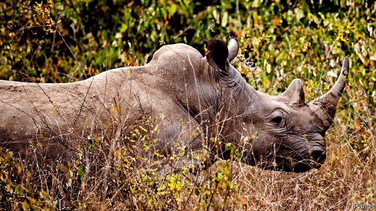

###### Conservation

# How to forge rhinoceros horn 

 

> print-edition iconPrint edition | Science and technology | Nov 14th 2019 

RHINOCEROS HORNS are big business. Traditional Chinese medicine uses them to treat rheumatism and gout, even though they have no actual pharmaceutical properties beyond placebo. And Yemeni craftsmen carve them into dagger handles. A kilogram can thus command as much as $60,000, so there is tremendous incentive for poachers to hunt the animals. Since almost all rhinoceros populations are endangered, several critically, this is a serious problem. Some conservationists therefore suggest that a way to reduce pressure on the animals might be to flood the market with fakes. This, they hope, would reduce the value of real horns and consequently the incentive to hunt rhinos. 

That would require the fakes to be good. But Fritz Vollrath, a zoologist at Oxford University, reckons his skills as a forger are up to the challenge. As he writes in Scientific Reports, he and his colleagues from Fudan University, in Shanghai, have come up with a cheap and easy-to-make knock-off that is strikingly similar to the real thing. 

The main ingredient of Dr Vollrath’s forged horns is horsehair. Despite their differing appearances, horses and rhinos are reasonably closely related. Horses do not have horns, of course. But, technically, neither do rhinos. Unlike the structures that adorn cattle and bison, which have cores made of bone, the “horns” of rhinoceros are composed of hairs bound tightly together by a mixture of dead cells. 

Examination under a microscope showed that hairs collected from horses’ tails had similar dimensions and symmetry to those found in the horns of rhinos. They also shared a spongy core structure. Horse hairs had a scaly layer that was absent from those of the rhino, but the researchers were able to strip this away with a solution of lithium bromide. 

The next task they tackled was making a suitable binding matrix. This, Dr Vollrath and his coauthor Mi Ruixin made from a fibrous protein-rich glue of the sort produced naturally by spiders and silkworms. They bundled the treated horse hairs as tightly as they could in a matrix of this glue, and then left the bundles in an oven to dry. 

The result was a material that, with some polishing, looked like rhino horn. Specimens on the black market are, however, inspected carefully before sale, so for the false horns to be effective they would need to stand up to closer scrutiny than the naked eye. To this end, Dr Vollrath and Dr Mi decided to test their product in detail. 

DNA analysis would certainly reveal fakes, but such analysis is complicated and therefore hard to do in the sorts of back rooms in which rhino-horn sales tend to take place. The forgeries passed other tests with flying colours, though. 

First, fake and real horn looked the same when examined under a scanning electron microscope. Next, they behaved similarly when tested by a technique that compared their capacity to absorb heat. Finally, when stressed or strained and then relaxed regularly for long periods, to probe their underlying mechanical properties, the results for real and false horn were indistinguishable. 

Whether using clandestine means to launch impeccable fakes onto the rhinoceros-horn market would truly reduce prices and sabotage demand remains to be tested. But it might. It is an old trick in warfare to flood the enemy with forged, worthless money. Something similar may yet help save the rhino.■ 

