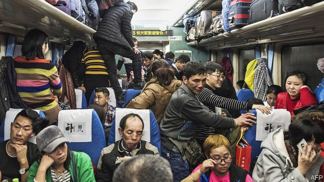
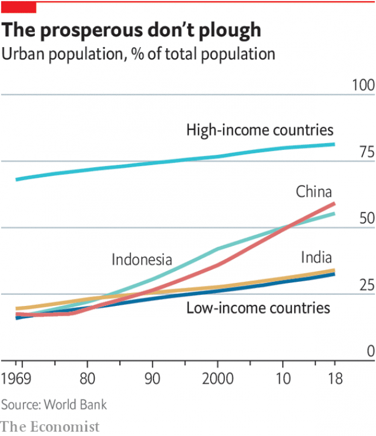

###### Domestic migration

# Why people should leave the countryside 

 

> print-edition iconPrint edition | Special report | Nov 14th 2019 

IN WEICHENG, A village in Hebei province, a group of friends are tucking into duck, broccoli and dumplings, flavoured with raw garlic and lubricated with baijiu liquor. It is the Chinese new year, and migrant workers have come home to see their families. Nationwide, some 3bn journeys were undertaken during the holiday season this year, making it the biggest mass migration ever; though next year’s will doubtless be even bigger. 

Suddenly a loud phone interrupts. Two men pop outside to take the call. When they come back, they both have new jobs: a three-month contract on a building site in Taiyuan, a city neither man has visited before. It pays 240 yuan ($34) a day, more than twice what they could make in the village. They were recruited by word of mouth—a former co-worker vouched that they were reliable. 

Weicheng village is not rich. Women break the ice on a river to hand-wash clothes. Toilets are holes in the ground. But villagers have motorbikes, televisions and plenty to eat. That is a huge blessing. Though no one dares talk about it, the elderly still remember mass starvation during the “Great Leap Forward” of 1958-61, when Mao Zedong forced peasants onto collective farms, where tens of millions died of hunger and disease. 

China is still a one-party state, but it owes much of its current prosperity to an increase in liberty. Since Mao died, his former subjects have won greater freedom to grow the crops they choose, to set up businesses and keep the profits, to own property, and to move around the country. The freedom to move, though far from absolute, has been transformational. Under Mao, peasants were banned from leaving their home area and, if they somehow made it to a city, they were barred from buying food, notes Bradley Gardner in “China’s Great Migration”. Now, there are more rural migrants in China than there are cross-border migrants in the world. 

By moving from unproductive paddyfields to better jobs in factories and shops, they have made themselves and China richer. Somewhere between a fifth and a third of the country’s colossal economic growth between the late 1970s and the current decade is due to this great migration. 

 

China’s population is now 60% urban, up from 18% in 1978. Sub-Saharan Africa is only 40% urban; India lags even further behind, at 34%. Mahatma Gandhi, modern India’s founding father, thought the growth of cities was “an evil thing, unfortunate for mankind and the world”. He believed that Indians would be spiritually more fulfilled if they stayed in villages, growing their own food and spinning their own clothes. 

Really? Five farmers in Gandhi’s home state of Gujarat showed your correspondent how much wheat they had harvested in three days, using hand-held sickles. A combine harvester could have done the job in a minute or two. 

The farmers are sharecroppers. They are always hungry at the start of the season, so the landlord advances them grain. Asked how much they currently owe him, they do not know: none of them can read or do sums. Asked how much they typically receive at the end of the year, they say “nothing”. The landlord always calculates that they have received their full share of the crop. He does not want them to have spare food or cash; if they did, they might quit. Aajeevika Bureau, a local charity, helps illiterate farm workers draw up contracts, and keeps copies on their behalf. But the quickest way to earn more is to move to a city. 

“In the city we have money,” says Ratansinh, who moved from rural Uttar Pradesh to Ahmedabad, the Gujarati commercial capital, when he was 18. “In the village we earned nothing. What we grew, we ate. What was left, we bartered for clothes and tools.” 

Now 52, he earns 24,000 rupees ($340) a month as a supervisor in a small textiles factory. The machines rattle loudly in the background as he talks. Like many Indian men who move to a city, he has left his family behind. His wife remains on the farm; his two children are at college. He goes back to the village for two months a year. He misses his wife, but “that’s the compromise you make. If I go back to the village, I can’t pay for my children’s education.” 

B.R. Ambedkar a contemporary of Gandhi’s who championed dalits, called the Indian village “a den of ignorance, narrow-mindedness and communalism”. Many migrants agree. “In my village, cutting someone’s tree down by mistake could lead to murder,” recalls Tawwaj Ali, a factory worker in Ahmedabad. “No one knows who you are in the city,” he adds, “so there’s less conflict.” Indeed, strict rules about “untouchability” are impossible to enforce in a jam-packed Mumbai train, notes Chinmay Tumbe of the Indian Institute of Management in Ahmedabad, author of “India Moving”. 

In rich countries 81% of people live in urban areas. Mechanised farms produce enough food for all, while leaving plenty of space for parks and wilderness. In the rest of the world half the population still lives in the countryside. Many politicians, like Gandhi, think they should stay there, either for romantic reasons (the countryside is so beautiful!) or because they do not want peasants building unsightly slums in their cities. 

Under China’s hukou (household registration) system, rural migrants who work in top-tier cities are treated as second-class citizens. The aim is to discourage them from settling there. They are barred from urban public services, and so must either leave their kids with grandma in the village or scrape together the cash to put them in shoddy urban private schools. Sometimes city authorities bulldoze these schools. The hukou system is one reason why rural Chinese children are dramatically worse educated than urban ones—and two-thirds of Chinese children are officially rural. 

Several people from Weicheng village work in Beijing. This means separation. “It would be impossible to get our kids into a public school there,” sighs a mother who looks after them in the village while her husband is away. 

In India the obstacles to internal migration are more subtle. One is language—India has more than 100 of them. Another is the difficulty of obtaining government benefits after crossing a state line. A study by Zovanga Kone of Oxford University and others finds that migration between neighbouring Indian districts is 50% higher if they are in the same state than if they are separated by a state border. 

Another problem is violence. Rape is common and poorly policed. So although many Indian women migrate to marry, few migrate to work (unlike in China). And because most migrant workers are men, the places where they cluster have wildly unbalanced sex ratios, making them even more dangerous for women. 

Babu Gamar, a farmer in Gujarat, says that half the men in his village go away to work. But “young women can’t go—they might be abused,” he says. Virjibhai Gamar, a neighbour, concurs. Every month he goes with his brothers to work on building sites. Their wives and sisters do not join them. 

The distorted sex ratio of Indian migrants helps demographers track trends that would otherwise be hard to measure. In areas that send a lot of migrants to cities, the working-age population is heavily female, but the elderly population is not, notes Mr Tumbe. That implies that rural migrants eventually go back home. Many scrimp in the city, often sleeping four to a room, so they can buy land in their village. 

In “Good Economics for Hard Times”, Abhijit Banerjee and Esther Duflo, two of the winners of this year’s Nobel prize for economics, argue that most people who would benefit from moving stay put, for three reasons. They value the familiar; they overestimate the risks of moving; and they do not know anyone or have anywhere to stay in the place they could go. 

Mr Banerjee and Ms Duflo suggest giving poor people small amounts of cash and some information. A charity in northern Bangladesh tried this. Some villagers were randomly selected and told how much higher wages were in a city. Others were given the same information plus $11.50 in cash—roughly the cost of a bus fare and two days’ food—but only if they went to work in the city. 

The villagers who were given information only were no likelier to migrate. But the combination of cash and nudge prompted 22% of households who would not otherwise have sent out a migrant to do so. And the families who sent out a migrant saw their daily intake of calories shoot up from 1,400 a head to 2,200; that is, from the edge of starvation to tolerable comfort. Mobility fills bellies. 

In rich countries internal migration is seldom a matter of life or death. But many people could earn more if they moved from stagnant towns to thriving ones. Hull’s jobless could easily find work in London. Alas, they will struggle to find a place to live. Rents are extortionate in the cities people most want to move to. NIMBYs block any structure that might mar their view. Red tape can make property several times more expensive than it need be, forcing potential migrants to stay where rents are cheap. Americans are barely half as likely to move to a different county as they were in the 1950s. And this means their talents are often wasted. Chang-Tai Hsieh of the University of Chicago and Enrico Moretti of the University of California, Berkeley estimate that artificial restrictions on housing supply knocked 36% off America’s aggregate GDP growth between 1964 and 2009. 

Because moving disrupts a previous way of life, it forces the mover to try new things. Mr Banerjee and Ms Duflo describe a natural experiment that took place when a volcanic eruption in 1973 destroyed a third of the houses on the Westaman islands, off the coast of Iceland. The lava struck randomly. Before the eruption, there was no significant difference between the people who lost homes and those who did not. But afterwards, the ones whose homes were destroyed were more likely to leave the islands, by 42% to 26%. (They were compensated for their loss, but did not have to spend the money on rebuilding their old home.) 

Researchers traced the islanders’ progress. They found that, for those who were under 25 at the time of the eruption, losing a house led to large material gains. “By 2014 those whose (parental) houses were destroyed earned over $3,000 per year more than those whose (parental) houses were not destroyed.” The gains came from moving: those who upped sticks made $25,000 a year more than those who did not. They were more likely to go to college, and to find a job that matched their intellect and aptitude, rather than following the islands’ default career of catching fish and getting by. Generations of parents have threatened to “light a fire” under their shiftless offspring. It turns out that’s not a bad idea. ■ 

