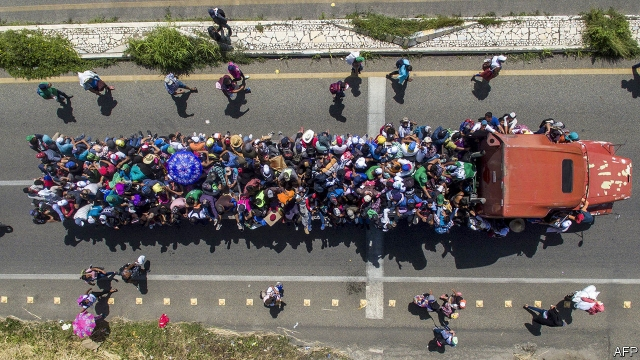

###### Voting with your feet

# Why voting with your feet is more effective than a ballot 

 

> print-edition iconPrint edition | Special report | Nov 14th 2019 

WHEN A VOTER casts a ballot, his choice is unlikely to affect his life. If he votes with his feet, there is a good chance he will change his life dramatically, observes Ilya Somin of George Mason University, author of a forthcoming book, “Free to Move”. Consider Edinson Infante, a Venezuelan who makes handbags out of banknotes, folded and glued together. A single lipstick placed in one of his bags is worth far more than the stack of Bolivars from which it was made. That is why Mr Infante emigrated. 

He could not make a living in Venezuela, a socialist dictatorship. So he moved to Colombia, the reasonably well-run country next door, where he sells his art on the streets. He now earns enough to pay rent, eat properly and send groceries home to his mother. He says he feels free in Colombia. He can stroll without feeling scared, and afford occasional treats like caramel sweets. 

Since 2014, 4.6m Venezuelans have voted with their feet against the violent, corrupt regime of Nicolás Maduro—a seventh of the population. In a country where elections are rigged, the only way they can get a better government is to go and find one. 

Foot-voting can take place over any distance and for many reasons. A person may move from Congo to Botswana to be better governed, or from New York to Florida for a lower tax bill and kinder weather. Foot-voters are typically better informed than ballot-casters. One vote is unlikely to affect an election result, so hours spent analysing each candidate’s policies are probably wasted. When migrating, by contrast, an informed choice pays huge dividends and an ignorant one can spell disaster. 

If people were allowed to vote freely with their feet, they would have more choices about the kind of society in which they lived. A gay man might choose to leave Iran, where his love is punishable by death, and move to Uruguay, where he could get married. A traditional Saudi man might choose to remain in Saudi Arabia, where Islamic piety is enforced and women are kept in their place. His wives might prefer to move to Canada, where they would be free to divorce him. The biggest gains from foot-voting often accrue to ill-treated groups such as ethnic and sexual minorities, and women. 

The lengths to which people will go to vote with their feet give a hint of how large the benefits can be. Emmanuel, for example, left Gabon because it fails to protect young women like her from sexual violence. Her father used to abuse her. When her mother found out, she blamed Emmanuel, beat her, threw her clothes into the street and ordered her out of the house. 

It is hard enough reporting a sex crime in a rich democracy, where the police are trained to treat allegations sensitively. In Gabon the cops are as scary as the criminals. Emmanuel saw no chance of justice, so when a friend offered her a plane ticket to Turkey, she went. From there, heavily pregnant, she boarded a flimsy boat bound for Greece. It leaked, and began to sink. She fell into the freezing water. Her friends called the coastguard, who found her after 45 minutes. Amazingly, both she and her baby survived. Now in Athens, she helps out at Melissa Network, a refugee charity, and hopes to train as a medical secretary. She says she feels much safer in Greece: “You have human rights here.” 

A worry about foot-voting is that it might retard reform in the places migrants leave. If the strongest objectors to Venezuela’s dictatorship have gone, who will stand up to it? It is a reasonable fear. When ethnic minorities flee to escape mistreatment, their departure may indeed reward their tormentors. For example, a politician may court the votes of his own tribe by stirring up animosity against another, thus spurring the out-group to leave his electoral district and making it easier for him to win re-election. 

However, foot-voting can also accelerate reform. Dissidents often find safety abroad. Exiles played a big role in ending apartheid in South Africa, and today are the most audible critics of authoritarian regimes in China and North Korea. Even the possibility of exit can influence how societies are run. If taxpayers can move, governments must govern better to avoid losing them. When the citizens of the closed, communist states of eastern Europe were allowed to head west and sample the fruits of capitalism in the late 1980s, the Soviet empire was revealed to be a failure, and collapsed. Migrants often stimulate reform at home by finding good ideas overseas and bringing or sending them back. India’s successful economic opening in the 1990s was informed by the observation that Indians were prospering everywhere except in India. 

The arguments for allowing more freedom to move are partly economic. Migrants from poor to rich countries could collectively increase their incomes by tens of trillions of dollars. For this opportunity, they would surely be willing to share some of the benefits with the rich-country voters who let them in. Since the economic disruption caused by migration is modest, an imaginative government with sensible policies (come to work, do not draw welfare) could raise living standards all round. 

But that is only half the story. Liberal, democratic capitalist societies have many flaws, but also great virtues: peace, freedom, tolerance and a culture that fosters innovation. The simplest way to spread these virtues is to let more people in. Every time a migrant flees a dictatorship for a democracy, global freedom grows a little. Every time someone leaves a kleptocracy for a more law-abiding state, humanity is slightly better governed. Every time a woman leaves a country where her testimony is worth less than a man’s, global sexism ebbs a millimetre or two. Migration is, therefore, a deeply moral issue. 

The more the West opens its doors, the richer and more powerful it will be in 50 years 

Rich countries have a choice. They are ageing. Without immigration, their populations will soon start to shrink, if they have not started already. They can choose to dwindle gradually into comfortable obscurity. Or they can confidently recruit talent from everywhere, inviting bright minds and willing hands to help build a bigger Australia, a bigger America or even a bigger Japan. 

The more the West opens its doors, the richer and more powerful it will be in 50 years. Indeed, as the world’s population stabilises and falls, each country’s weight in the world will depend more and more on whether people want to live there. This is one of the biggest advantages that rich democracies have over nationalist dictatorships such as China. On current trends, most will squander it. 

Potential migrants watch the news. The brightest have choices, and will shun places they think might mistreat them. Already, brainy Chinese are wondering whether they will be welcome in America, which is one reason why the number of new foreign students there fell by 7% in 2017-18. Brainy Indians are tiring of the interminable wait for a green card. Some give up and go elsewhere. 

Uma Kanekar, a high-flying Indian IT specialist, moved to Canada after a decade in the United States waiting vainly for a green card. The last straw was the realisation that her daughter Disha, a college student who had lived in New Jersey since she was six, might be sent back to India when she turned 21 and was no longer covered by her mother’s temporary work visa. Canada gave the family permanent residence in eight months. “It’s so nice to be in a country where you feel you belong,” says Disha. 

For all the furious demagoguery around migration, there is hope. Despite (or perhaps because of) Mr Trump, more Americans today say immigration should be increased than say it should be cut, finds a Pew poll. Majorities in Spain, Canada and Japan support keeping migrant flows the same or raising them. Most Greeks, Italians and Russians do not. So be it. Countries can have different policies. Many will build walls. If they fail to put well-designed doors in them, they will end up poorer, weaker and duller. ■ 

