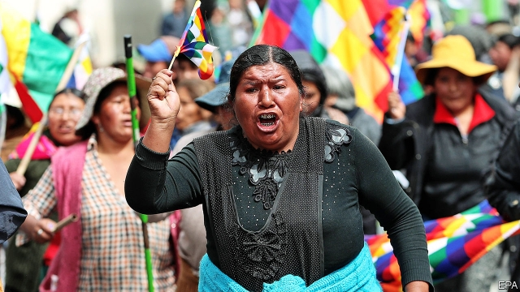

###### Rainbow resignation

# Evo Morales leaves Bolivia dangerously divided 

 

> print-edition iconPrint edition | The Americas | Nov 14th 2019 

BY NOVEMBER 12TH, two days after Evo Morales abruptly quit as Bolivia’s president, a tense calm had settled on La Paz, the administrative capital. The streets were deserted. Buses and cable cars were idle. Most residents stayed indoors. The army was in control of the streets. But the lull did not last. On the following day violence broke out again in several regions, including La Paz. At least ten people have died in unrest leading up to and following Mr Morales’s decision to step down. 

The renewed violence was a response to the naming of an interim president, Jeanine Áñez, who until Mr Morales’s resignation was the highest-ranking opposition politician in congress as the senate’s second vice-president. She has appointed a cabinet and promised to hold fresh elections soon. Much depends on whether these are accepted as legitimate by the millions of Bolivians who still revere Mr Morales. The signs so far are ominous. 

Mr Morales fell because he took reverence for granted, and imagined it to be more widely shared than it is. Elected Bolivia’s first president of indigenous origin in 2005, he expanded the rights of indigenous people and used money from sales of the country’s natural gas to reduce poverty. Before he became president, “poor people like us could never be more than a maid, driver or gardener”, says Lilian Peralta, who works in an electronics shop in La Paz. Such sentiments helped him win re-election twice. 

But as it became clear that Mr Morales intended to remain president, with almost unchallenged power, perhaps for life, Bolivians balked. In a referendum in 2016 they rebuffed his bid to run again for re-election in defiance of the constitution he had introduced. The constitutional court, which was by then an appendage of the presidency, said he could run anyway. 

When the election was finally held last month, he was declared the winner. He avoided a run-off vote against Carlos Mesa, his closest rival, by just 35,000 of the 6.1m valid votes cast. His party, the Movement to Socialism (MAS), maintained its majority in congress. But suspicions of fraud arose even as votes were being counted. Mr Morales’s decisive lead appeared after a mysterious suspension in the publication of results. Tens of thousands of people, both for and against the president, took to the streets across Bolivia. An anti-Morales “civic strike” shut down Santa Cruz, Bolivia’s biggest city. 

Mr Morales tried to restore calm, first by inviting the Organisation of American States (OAS) to audit the election results. Then, when the OAS team reported evidence of fraud, he promised new elections. That did not placate protesters. Police said they would no longer obey their commanders’ orders. On November 10th Williams Kaliman, the commander of the armed forces, suggested that Mr Morales step down so that “peace can be restored and stability maintained”. Until then, the army had been a “strong bastion of defence” for the president, notes Franklin Pareja, a political scientist at San Andrés University in La Paz. His authority gone, Mr Morales flew to Mexico, which granted him asylum. 

The stability that General Kaliman hopes for will be hard to achieve. Mr Morales is not helping. He called his departure a “civic, political and police coup”, adding, “My sin is being indigenous, a union leader and a coca farmer.” As he departed for Mexico, he promised in a tweet to “return with greater strength and energy”. 

That night his supporters burnt houses, businesses and buses in La Paz. The next day thousands marched through El Alto, a neighbouring city, waving the wiphala, the indigenous rainbow flag, and chanting, “Yes, now, civil war!” Pro-opposition rioters reportedly ransacked Mr Morales’s house in Cochabamba in central Bolivia. Videos appeared of police officers ripping the wiphala off their uniforms. 

Bolivia’s new leaders risk inflaming such divisions. Ms Áñez, a conservative from the department of Beni in the north-east, is now posing for photos with indigenous people. But she has provoked them in the past. Recently she tweeted a photo of people wearing indigenous dress along with jeans and tennis shoes. She commented: “Natives??? Look!”. Some people took that as a derisive questioning of their ethnic authenticity. 

Although she was next in line to be president after the most senior MAS officials quit, congress did not ratify her appointment. The MAS boycotted the session of congress that was summoned to install her, depriving it of a quorum. It did not ratify Mr Morales’s resignation for the same reason. The constitutional court, which had blessed Mr Morales’s run for re-election, came to Ms Áñez’s rescue. Her assumption of the presidency was legal, it ruled, because Mr Morales had fled and order needed to be restored. MAS legislators have said they will vote to “nullify” her appointment. 

Perhaps more powerful than the interim president is Luis Fernando Camacho, the leader of Comité pro Santa Cruz, the organiser of the Santa Cruz strike. He is a divisive figure. He initially called on all MAS legislators to resign, and proposed that a “transition junta” drawn from society, which the constitution does not provide for, run the interim government. Now he backs Ms Áñez. A fervent Catholic, Mr Camacho declared in the presidential palace vacated by Mr Morales that “the Bible has re-entered” the building. Some of his followers believe that the ex-president is anti-white. Mr Camacho has lately sought to heal such rifts by urging Bolivians to respect the wiphala. 

Much as Mr Camacho may wish it, Mr Morales’s resignation does not mean that the MAS is going away. “These people are forgetting that the MAS is the largest political force in the country,” says the mayor of a town in a rural part of southern Bolivia. He, like other MAS officials, says opposition supporters have threatened him. 

Mr Mesa, the runner-up in the presidential election, believes that Bolivia needs agreement between the MAS and the opposition on how to restore democracy. He has urged MAS legislators to help choose a new electoral tribunal, which would help legitimise the forthcoming elections. Without such forms of co-operation between foes and friends of Mr Morales, unrest may continue, warns María Teresa Zegada, a sociologist at San Simón University in Cochabamba. Although the protests started with the people, it is now up to politicians to come up with ways of ending them peacefully, she says. Leaving the pursuit of a solution to angry Bolivians on the streets “will lead to a tragedy”.■ 

