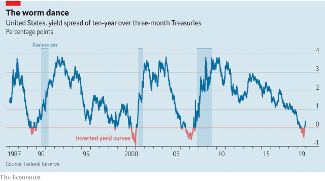

###### Inverse psychology

# America’s yield curve is no longer inverted 

 

> print-edition iconPrint edition | United States | Nov 14th 2019 

WHAT DO YOU get when you subtract the yield on short-term government bonds from that on longer-dated ones? A powerful economic omen, if recent history is any indicator. Around a year before each of the past three recessions the yield curve—which shows the return on government bonds from very short durations to very long ones—inverted. In July 2000, for instance, the yield on ten-year Treasury bonds dropped below that on three-month Treasury bills; by March 2001 the American economy had sunk into recession (see chart). When the same thing happened in March this year, alarm bells rang across corporate boardrooms and political campaigns. When the inversion deepened over the summer, traders and pundits began to speak of recession as a real possibility. 

Now, however, the curve has righted itself. From mid-October, long-term bond yields rose back above short ones (a move accompanied by other bullish financial-market signs, like rising stocks). Market-watchers are asking: was that a false alarm? 

 

Few economists think a yield curve inversion itself causes a slowdown. The link between the two has more to do with the effect of monetary policy on both. Short-term bond yields go up when the Federal Reserve raises its policy rate to keep the economy from overheating. A drop in long-term yields often occurs when markets expect slower growth ahead: a sign that the Fed has tightened a step or two too many, hitting the brakes hard enough to drag the economy into recession. 

This time around, the Fed seemed to take the omen seriously. Over the course of 2019 it has first abandoned plans to keep raising rates (which had been going up since 2015), then cut its policy rate three times, reducing the effective rate from 2.4% or so to 1.55%. The yield curve was not the only thing on the mind of its chairman, Jerome Powell: cuts were also a response to a deepening slowdown in manufacturing and a plateau in the growth rates of prices and wages. But the central bank nonetheless responded faster and more fiercely to an inversion than it usually does. If rate reductions have in fact spared the American economy from recession, then Mr Powell, by reacting promptly to the yield-curve omen, may have actually weakened its predictive power. Few workers, or presidents, are likely to complain. 

But the coast is not yet clear. The Fed might yet seize defeat from the jaws of victory. Rather than recognising its own success, it could interpret the un-inversion of the yield curve, and the absence (so far) of a downturn, as a sign that the original omen was a false alarm. Were a new round of headwinds to threaten the American economy and re-invert the curve, the central bank might wrongly dismiss the signal and under-respond, thus bringing on the foretold recession. 

It could also be that the slump that was predicted still looms ahead. Less than a year has gone by since the yield curve first inverted. Perhaps more important, each of the past three pre-recession inversions reversed themselves before the ensuing downturn began. So while financial markets are celebrating a bullet dodged, the bullet may still be on its way.■ 

