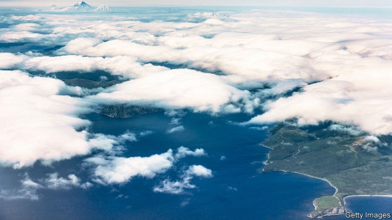

###### Come in, Sandy Point

# Extreme broadcasting in Alaska 

 

> print-edition iconPrint edition | United States | Nov 16th 2019 

FROM THE top of the KSDP radio tower, 200 feet in the air, station manager Austin Roof could see nearly all of Popof Island, a scrap of tundra surrounded by sea at the base of the Aleutian chain. But the picturesque view was not what he was thinking about as 25-mile-per-hour winds bellowed in his ears. “It was blowing like a son of a gun,” he said. The lines he was hoping to use to hoist a 75-pound antenna to the top of the tower were flying out of reach. Sand Point, a village of about 1,000 and the island’s only settlement, lay below him. “I don’t get paid extra for this,” he thought. 

In a remote, coastal village like Sand Point, the radio station provides a crucial service, and not just because it broadcasts reports from the commercial fishing industry—the community’s bread and butter—as well as games (home and away) of the high-school basketball team, the local pride and joy. The station is responsible for sending out emergency advisories, which are particularly important here along the Pacific Ring of Fire, one of the most seismically active places on Earth. Over the past five years the Aleutian Islands have experienced three tsunami alerts. 

In recent years, as state funds in Alaska for public radio have dwindled, the three-man crew at Sand Point’s radio station has had to take drastic measures: they have been trained in tower climbing and rescue so they can perform maintenance on their 1980s-era, 20-storey radio tower. Otherwise, Mr Roof explained, they would have to spend $5,000 to get a technician out to the village every time something comes loose. 

Since getting trained about four years ago, Mr Roof estimates he and his staff have carried out $100,000-worth of tower maintenance. At a time when America is in need of trusted—and locally minded—sources of information, this characteristically Alaskan, shoestring approach is helping keep an outpost of broadcasting alive. But even with DIY tower upkeep, Mr Roof recently cut staff hours and salaries, including his own, to make ends meet. 

Last summer exceptionally hot, dry conditions whipped up wildfires across Alaska, prompting public radio stations to work round-the-clock to provide updates on road closures and evacuations. In a video announcement, Governor Mike Dunleavy advised Alaskans to “stay tuned to the radio so you can get emergency updates”. Less than two hours later the governor, a devotee of the austerity schemes, vetoed all state funding for public broadcasting. 

