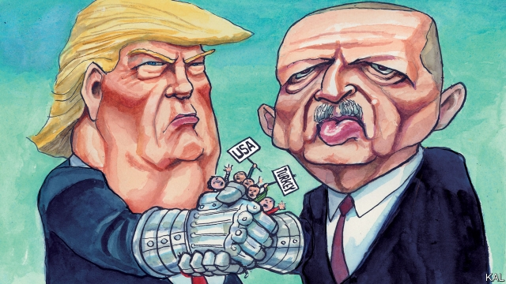

###### Lexington

# The strange love-in between Donald Trump and Recep Tayyip Erdogan 

 

> print-edition iconPrint edition | United States | Nov 14th 2019 

NO ONE KNOWS why President Donald Trump is so fond of autocrats—including his “friend” Muhammad bin Salman, “highly respected” Viktor Orban, beloved Kim Jong Un and of course Vladimir “so highly respected” Putin. But there is little doubt his predilection has turned out better for the strongmen than for America. 

Compared with subjugating a country, handling Mr Trump is not hard. The autocrats quickly realised the president wants a special rapport with them more than almost any policy outcome. That is why Abdel-Fattah al-Sisi—Mr Trump’s “favourite dictator”—felt able to pull Egypt out of the administration’s main Middle Eastern gambit, its so-called “Arab NATO”, a day after visiting the White House. It is why even Xi Jinping, at the rough end of Mr Trump’s tariffs, has received a few plums, such as the president dismissing pro-democracy protests in Hong Kong as “riots”. Yet no foreign leader has taken more skilful advantage of Mr Trump’s soft spot than his guest in Washington this week, Recep Tayyip Erdogan. 

Even before he persuaded Mr Trump to abandon the Syrian Kurds last month, Mr Erdogan was responsible for a serious deterioration in American-Turkish relations. Angered by Barack Obama’s failure to intervene more forcefully against his enemy Bashar al-Assad, among other grievances, the Islamist leader refused to take strong action against the jihadists crowding across Turkey’s southern border to join Islamic State. When the Obama administration backed another of his enemies, the Syrian Kurds, against the jihadists, Mr Erdogan looked for other ways to hit back. 

He has strained Turkey’s relations within NATO and pushed it further away from the European Union. He has embraced America’s regional adversaries, Iran and Russia, from which Turkey has bought a missile-defence system that could give Mr Putin access to NATO military secrets. Lest America miss the hint, Mr Erdogan’s bodyguards roughed up journalists outside the venerable Brookings Institution during the Turkish leader’s last call on Mr Obama, in 2016. During his first call on Mr Trump, they launched a more vicious assault on anti-Erdogan protesters and American police officers that left blood on the pavement outside the Turkish ambassador’s residence in Washington. Already alarmed by Mr Erdogan’s democratic backsliding, Congress, the Pentagon and State Department were appalled. Many questioned whether Turkey was still the crucial democratic Muslim ally, and “window onto the Middle East”, that Mr Obama and his predecessor George W. Bush saw it as. 

Yet Mr Trump, subject to an unrelenting charm offence by Mr Erdogan, declared the two countries “as close as we’ve ever been.” Beyond his usual regard for strongmen, he perhaps noted the many coincidences between himself and Mr Erdogan. Both are populists with a flair for stirring up religious conservatives. Both are fixated on interest rates and the “deep state” (a phrase that originated in Turkey). Both mix politics, family and business. Both have promoted a son-in-law—in Mr Erdogan’s case his finance minister, Berat Albayrak—over two less able businessmen-sons. 

Mr Erdogan’s approach stressed these similarities, with Mr Albayrak contacting Jared Kushner via a Turkish business partner of Mr Trump’s. Some suspect there may be more than national interests at stake. Mr Trump had investments in Turkey (and claimed to have a “little conflict” of interest there) before he became president. It seems equally possible Mr Erdogan has endeared himself to the president merely by making the bilateral relationship feel like a mano-a-mano business one, with no side-deals involved. 

Mr Trump, who calls the Islamist a “hell of a leader” and “friend of mine”, has deferred legally mandated sanctions on Turkey for its Russian missile-defence deal. His administration has also delayed penalising a Turkish bank for sanctions-busting in Iran. And the more anger this has stirred in Washington, among Elizabeth Warren, Mitch McConnell, in fact almost everyone outside the president’s family, the more vindicated Mr Trump seems to feel. He considers squealing from the Washington establishment an end in itself—and Mr Erdogan has egged him on. “The US has an established order that we can call a deep state—of course they are obstructing,” Turkey’s president lamented. 

Mr Erdogan’s mastery of Mr Trump was even clearer over the Syrian Kurds. In demanding America step back while his troops pushed them from his border, he appealed to Mr Trump’s inchoate desire to withdraw from Middle Eastern wars. Yet the US-backed Kurdish operation in north-eastern Syria was a textbook example of America not exposing its troops to a necessary war. The Kurds were doing the fighting on its behalf. That is a role Turkish troops might have been expected to fill; yet Mr Erdogan considered Islamic State a lesser enemy than Mr Assad or the Kurds. 

Mr Trump’s abandonment of the Kurds was an equally textbook blunder. It has empowered Mr Assad and Russia, with whom the Kurds have made a desperate alliance. It has made America look fickle and weak. It will lead to no significant withdrawal of American forces. It was also unnecessary, because American envoys were already hatching a plan to move the Kurds back from the Turkish border. And it has further aggravated anti-Turkish feeling in Washington—as shown by the House of Representatives’ vote to recognise the Ottoman empire’s onslaught against Armenians as a genocide and sanctions bills against Turkey in both chambers. 

This seems to have constrained Mr Trump’s largesse to Mr Erdogan a bit. Though he showered him with endearments at the White House this week, he did not promise the sanctions’ let-off Mr Erdogan craves. His restraint may be brief—with Mr Trump’s Republican critics about to switch to defence mode as his impeachment looms. Yet the mutual resentments unleashed by Mr Erdogan’s grandstanding and Mr Trump’s pandering will in any event be enduring. At every level beneath the presidency, America and Turkey have turned away from each other, even as the foundations of their alliance, NATO, the EU and American ambitions in the Middle East, are being eroded. It is not certain they can be turned back.■ 

