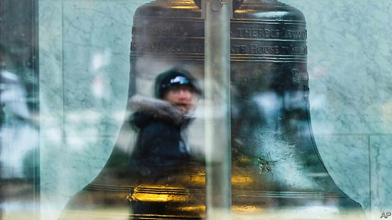

###### Clean slates, rich states

# Why states are rushing to seal tens of millions of old criminal records 

 

> print-edition iconPrint edition | United States | Nov 16th 2019 

AS A TEENAGER working at a Pennsylvania theme park Keith broke the law. For selling entry tickets on the side he was convicted of a third-degree misdemeanour. That record has dogged him since. Prospective employers shun him, he says. Keith has young children, and some schools block those with a record from being chaperones on trips or coaching a sports team. Before the internet and digitised databases, Keith could have hoped that his infraction would be forgotten once fines were paid or time served. No longer. Firms like InstantCheckMate, Truthfinder or SentryLink can dredge up records quickly. State files are easily searched online at no cost. Nine in ten employers, four in five landlords, as well as mortgage-lenders, universities and schools run such checks. 

A bipartisan movement is under way in states to do something about this. Last year lawmakers from both parties in Pennsylvania—nudged by an odd-bedfellows coalition of left-leaning activists, unions, chambers of commerce, Koch Industries and others—voted overwhelmingly to be the first state to do so. In June it started sealing over 30m records, and will soon be finished. That spurred others. In March Utah’s governor signed legislation to clean old records automatically, probably 30,000 cases yearly, amid hopes of boosting the supply of local labour. California enacted an automatic clean-slate law last month. That law does nothing to wipe old records, but at least allows for future expungement, from 2021, for arrests and less serious crimes. Michigan is next on the list. 

About 19m Americans have felony convictions. Millions more have been arrested, charged or convicted for a misdemeanour. Perhaps one-in-three adults, some 70m-100m people, have a criminal record reckons the Centre for American Progress, a think-tank. Researchers say that eight years after someone has committed a violent offence, or four years after they have committed a property one, they are no likelier than anyone else to break the law. 

Old records impose a broad cost, skewing labour markets by discouraging many from job-seeking. An estimate in 2016 by the Centre for Economic and Policy Research, a left-leaning think-tank, suggested the exclusion of ex-felons—mostly men—from job markets cost at least $78bn yearly in missed gross domestic product. States also miss out on tax revenues. Researchers at the University of Michigan set out the details in a paper in March that matched criminal histories to statewide wage- and jobs- data scraped from Michigan’s unemployment insurance scheme. They showed that sealing someone’s record coincides with a 13% better chance of getting a job within a year. Wages rise on average by 25% in two years and the poorest gain most. Recidivism was low. 

A puzzle was why, despite such gains, so few petition to clear their names says Graham Filler, a Republican state representative in Michigan. Just 6.5% of those eligible (after a spell of staying clean) expunge their record within five years. Fewer than 3,000 Michiganders do so yearly, from an eligible pool of at least 500,000. The answer is clear: it is a tedious process that can take nine months and may cost $2,000 in legal fees. For someone who has stayed clean for years, it also feels shameful to return to resubmit fingerprints and paperwork. “You don’t want to run back to the courtroom,” says Mr Filler. Other states can be worse. In Utah it can take two years to seal a record. 

Much better, therefore, if public records could be wiped automatically. Technically that’s easy. Groups like Code for America help to plug relevant software to states’ databases. Politically it is becoming possible too. This month in Michigan several bills sponsored by Mr Filler passed its assembly, with broad cross-party support. They should be law within months, making more crimes eligible to be expunged and implementing automation for old records from early 2022. Others including Louisiana, New York, North Carolina and Washington will probably opt to go automatic in the coming months. Some, like Illinois, that are legalising marijuana are at the same time enacting automatic clean slates for some drug convictions. Congress is also likely soon to consider clean-slate bills for federal records. 

Why the bipartisan rush for reform? Polls suggest 70% of voters like clean-slate efforts, and both parties want ways to shrink prison populations. An activist who campaigned for this for years says Republicans mostly seek economic gains from a bigger workforce, while Democrats talk of social fairness and not criminalising poverty. Happily, the same policy suits both. 

More broadly, states fret about putting up economic and other barriers for so many Americans with records. In recent years 35 states and over 150 cities have passed “ban-the-box” laws that forbid some employers (mostly in the public sector) asking job applicants about criminal records until late in the hiring process. Will such changes and Pennsylvania’s new law help Keith? He believes so, vowing he will “show everyone I can advance”. ■ 

