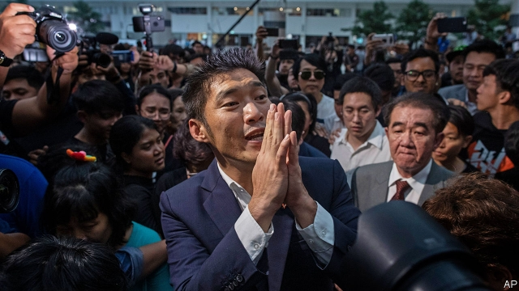

###### Future backwards

# A Thai opposition leader loses his seat in parliament but battles on 

 

> print-edition iconPrint edition | Asia | Nov 23rd 2019 

EVEN AFTER the verdict of Thailand’s constitutional court on November 20th, supporters of the Future Forward party, gathered outside, kept signing a portrait. It showed a beaming Thanathorn Juangroongruangkit, leader of the party. His actual face was far more grave as he sat in the courtroom, listening as the judges retroactively disqualified him from the election in March at which he became an MP. The decision marks the start of what will probably prove a prolonged period of difficulty for Mr Thanathorn and his party.  

The case turned on Mr Thanathorn’s ownership of shares in v-Luck Media. Under Thailand’s constitution and its web of election laws, owners of shares in media firms are barred from running for parliament. Mr Thanathorn (pictured) insists that before the election was called he sold his shares in V-Luck, publisher of glossy magazines such as Jibjib (Cheep cheep), the hard-hitting inflight publication of Nok Air, a budget airline. What is more, V-Luck ceased publishing months ago. But the court, which sees no problem with military coups, quibbled about how long it took him to cash the cheque from the sale and noted that the documents proving his case came from the company, not from regulators. For Mr Thanathorn, whose family owns a giant auto-parts firm, publishing was only a tiny sideline, even when v-Luck was a going concern. He says the case was trumped up for political reasons. He recently sued the seven election commissioners for rushing it to court. They deny wrongdoing. 

The ruling was hardly a surprise given Future Forward’s staunch opposition to the government of Prayuth Chan-ocha, who seized power in a coup more than five years ago. The party’s platform of reforming the army, decentralising government and breaking up business monopolies won it support from young Thais but enmity from the ruling elite. Founded less than three years ago, it is the third-largest party in parliament, and is paying for its popularity. More than a dozen lawsuits have been stacked up against Mr Thanathorn and other figures in the party. Meanwhile dozens of other MPs accused of maintaining media interests continue to serve unmolested. “I’ve been in this system for over 30 years and I believe this case should have been dismissed,” says a civil servant.  

Removing Mr Thanathorn from parliament changes little. He had already been suspended as an MP in May, pending the court’s decision. Other MPs from the party have proved themselves more than capable of lampooning the government without him. Mr Thanathorn remains party leader and will continue to campaign noisily against the subversion of democracy.  

How long will he be allowed to stay a thorn in Mr Prayuth’s side? The latest ruling may herald others that could eventually lead to Mr Thanathorn’s imprisonment and the dissolution of the party. “This is the first domino,” reckons a Thai academic. It’s not as if judges shy away from decisions with big political ramifications. Since 2006 the constitutional court has invalidated two elections and dissolved seven political parties. Mr Thanathorn is undeterred. “It is a long journey and we’ll keep moving forward,” he declared outside the court. ■ 

