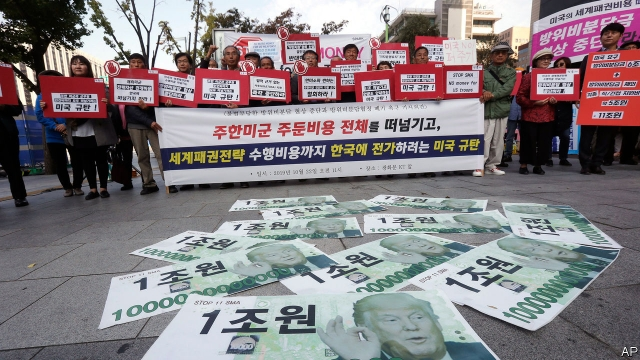

###### Cracks in the cladding

# America wants South Korea to pay much more to host American troops 

 

> print-edition iconPrint edition | Asia | Nov 23rd 2019 

AMERICAN DIGNITARIES like to talk about their country’s “ironclad” commitment to its alliance with South Korea and Japan, which has long been the main building block of the security architecture of north-east Asia. But when General Mark Milley, America’s representative on the trio’s joint military council, last reaffirmed that commitment on November 15th, his two fellow soldiers had plenty of reasons to be sceptical. Donald Trump, America’s president, has long complained of the costs of military alliances, which he thinks are a “bad deal” for America, and has mused aloud about bringing troops home. For months America has been pressing the governments of Japan and South Korea to provide more money to help defray the expense of deploying American troops to their countries. 

On November 19th South Koreans were given yet more reason for doubt. Merely an hour into a second day of talks about how to divvy up the cost of stationing American troops in South Korea, American negotiators walked out. South Korea was “not responsive” to America’s request for “fair and equitable” cost-sharing, said James DeHart, America’s chief negotiator. Jeong Eun-bo, his South Korean counterpart, said that although his country remained committed to finding a mutually agreeable solution by the end of the year, America’s demands were unacceptable “in principle”. South Korea’s foreign ministry said that America had demanded a “drastic increase” in the South Korean contribution. 

This year South Korea paid about $920m towards the cost of keeping America’s 28,500 troops in the country, mostly to cover the salaries of local staff and utility bills for bases. That in itself marks an 8% increase on the previous annual fee, to which South Korea begrudgingly acquiesced after fraught negotiations last year. South Korea also pays for military construction. A new base outside Seoul was built almost entirely by South Korea, at a cost of about $10bn. Although America has not made its demands public, it has reportedly requested a rise in the annual contribution to $5bn, with a similarly daunting increase suggested to Japan, which hosts more than 50,000 American troops. 

The row puts further strain on the region, amid a fierce diplomatic and commercial dispute between South Korea and Japan and stalled nuclear talks with an increasingly strident North Korea. South Korean officials were particularly put out when Mark Esper, America’s defence secretary, speaking during a press conference during a visit to the Philippines, did not rule out a drawdown of American troops if the two sides failed to reach an agreement. (The previous week, on the same day that General Milley had tried to put a brave face on things, Mr Esper had told his counterpart in Seoul that South Korea was a rich country which “could and should” pay more for its defence.) 

America’s demands are likely to increase anti-American sentiment among ordinary South Koreans, the vast majority of whom are keen on the alliance but oppose another big increase in South Korea’s contribution. There is rare unanimity among both the progressives in government and the conservative opposition that America is engaged in an unacceptable shakedown of a longstanding ally. Civic groups of various political stripes have held rallies in recent days, some urging America to remain committed, others telling American troops to “go home”. 

Resolving the impasse will be hard. With legislative elections due in April, Moon Jae-in, South Korea’s president, will be reluctant to make any big concessions. For all Mr Esper’s tactlessness, a drawdown of American troops is unlikely. But America’s demanding attitude and unpredictability are already pushing South Korea to hedge its bets. Over the weekend South Korean and Chinese defence officials agreed to co-operate more closely. This is practically meaningless, but highly symbolic. If America continues to mistreat its allies, it may yet push them into the arms of the very power it needs their help to contain. ■ 

