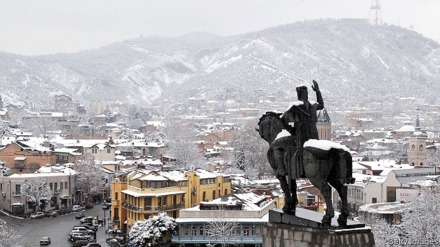

###### Magic mountains

# A saga of chocolate and upheaval in the Caucasus 

 

> print-edition iconPrint edition | Books and arts | Nov 23rd 2019 

The Eighth Life (For Brilka). By Nino Haratischvili. Translated by Charlotte Collins and Ruth Martin.Scribe; 944 pages; £20. To be published in America in April; $40. 

NINO HARATISCHVILI’S elegant epic recounts the fortunes of a Georgian family and the turbulent history of their country, from the beginning of the 20th century to the 2000s, through revolution, the fall of empires and world wars. It is a triumph of both authorship and painstaking translation (from the original German) by Charlotte Collins and Ruth Martin. Each of the seven sections focuses on one life, the saga stretching from link to fascinating link as if they were jewels on a charm bracelet. 

In the prologue Niza Jashi, a disaffected 32-year-old professor who has left Georgia for Berlin to escape her family’s terrible history, is suddenly forced to reckon with it. Brilka, her 12-year-old niece, has absconded from a dance troupe touring Amsterdam; her mother, Niza’s older sister Daria, is dead. Dedicating the narrative to the girl, Niza enjoins her to transcend their clan’s misfortune. In the book’s chain of stories, Brilka’s will be the “eighth life”—“because they say the number eight represents infinity…I am giving my eight to you.” 

The chapters that follow place Ms Haratischvili’s characters at the centre of the “red century”, combining magical realism with the more prosaic, social kind. Niza and Brilka are descendants of what once seemed set to be a dynasty of chocolatiers. Niza’s great-great grandfather had trained in patisserie-making all over Europe; back in Tbilisi he created mouthwatering confections and built a successful business. His most coveted recipe was for a chocolate elixir, the exact ingredients of which he guarded, fearing its dangerously addictive effects—a metaphor, in the novel, for the allure of extreme ideologies. 

The first biography related by Niza is that of Stasia, the patriarch’s middle daughter, a spirited young woman who yearns to train as a ballet dancer in Paris. Instead, in 1917 she marries a lieutenant in Russia’s White Guard, suffering isolation and disillusionment when she travels to Petrograd to find him. Crucially, her father has trusted only her with the secret chocolate recipe. 

Her tale is followed by those of her spoilt half-sister Christine, Stasia’s son Kostya and daughter Kitty, a singer, Kostya’s daughter Elene, and Elene’s daughters, Daria and Niza themselves. Ms Haratischvili’s writing is lyrical, but she does not gloss over the compromises people make to survive. Above all, “The Eighth Life” is an unforgettable love letter to Georgia and the Caucasus, to lives led and to come, and to writing itself, a frontier where, Niza says, “legend ends and facts begin”.■ 

