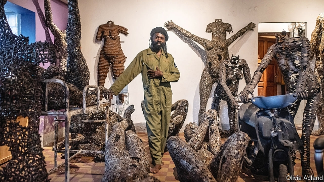

###### His dark materials

# Making sculpture out of bullets in Kinshasa 

 

> print-edition iconPrint edition | Books and arts | Nov 23rd 2019 

“FOR ME, KINSHASA is a beautiful woman who walks barefoot,” says Freddy Tsimba, a sculptor, in his studio in Matongé, one of the city’s most chaotic districts. The capital of the Democratic Republic of Congo (DRC) is home to some 12m people. Battered cars choke its highways; its unpaved backstreets are clogged with stinking black mud. Once known as “Kin la belle”, its residents—fed up with the festering rubbish and open gutters—re-christened the place “Kin la poubelle”, or “Kin the dustbin”. But the barefoot woman also has charm. She dances to the fuzzy rumba beats that blast out of almost every bar; her noisy thoroughfares are full of hopeful, chattering people. Mr Tsimba gets some of his best ideas from watching them. 

“The streets are like a school to me and they’re always changing,” he says, now sipping a beer at his favourite roadside bar while sketching with a Biro. Passing street-hawkers pause at the tables to offer everything from fried plantain to cigarettes, chewing gum, roasted caterpillars and plywood chess boards. In the narrow road, motorbikes swerve round groups of gossiping schoolchildren and women carrying bowls of bananas on their heads. 

Yet as well as responding to the city, Mr Tsimba also wants the city to respond to his art. In 2014 he took a house he had built from 999 machetes to one of Kinshasa’s busiest markets. He stood silently beside it and listened as people argued about what it meant. “The reaction was intense,” he says. “People here are still traumatised by the Kulunas,” a group of machete-wielding youths who rob and kill. Eventually, Mr Tsimba told the crowd he wanted to show that the machete was not just an instrument of death. It was invented for farmers to cut weeds and crops. It could become whatever you made of it—even a house. 

Turning old materials—often those associated with death—into sculpture is Mr Tsimba’s speciality. He has built pieces from bullet casings, mousetraps, keys, mobile phones and bottle tops. Last year he sold a sculpture of a man with outstretched arms at Bonhams, an auction house in London, for £12,500 ($16,150). It was almost three metres tall and made entirely from spoons. Art collectors in the DRC “talk about Freddy as a real game-changer,” says Eliza Sawyer, a specialist in African contemporary art at Bonhams. “He’s on the cards for the next Venice Biennale.” 

Much of Mr Tsimba’s work has a message of revival. Transmuting bullets into art shows that new life can emerge from destruction. In the same way, he hopes Congo itself will be able to regenerate after its bitter, bloody past. Militias have terrorised its eastern provinces for over two decades; in the war that lasted from 1998 to 2003 between 1m and 5m people were killed. In 1997, during an earlier war, rebels marched on Kinshasa in old gumboots; child soldiers shot Kalashnikovs at fleeing government troops and took the capital. Mr Tsimba turned up in a city along their route to collect material for his sculptures. 

“I started picking up bullets. Some people watching thought I was mad,” he recalls. “Then two soldiers appeared in front of me.” Mr Tsimba was arrested and tossed into a makeshift prison cell. When, after four days of drinking dirty water, a senior commander came to question him, Mr Tsimba—in an effort to prove he was sane—claimed that he was collecting the bullets to make kitchen pots. “Then the commander said: ‘OK, tomorrow you will show me how you do it’,” he remembers. 

With the help of two other prisoners, a small fire and an old bicycle (pedalled to fan the flames), Mr Tsimba made a pot. “The commander was happy. He told me: ‘As you work, I’ll find clients to buy the pots. We will make money’.” The artist begged to go home, but his captor insisted he must first make 300 pots. For more than three months Mr Tsimba laboured over the fire. When he had finally delivered his quota, the officer kept his word and freed him. “He gave me ten sacks of bullets to take home,” says Mr Tsimba. “I hid them inside bags of foufou [pounded cassava roots], and transported them back on a boat.” 

Some of these bullets are now in Paris, a few hundred metres from the Eiffel Tower. They have been transformed into a pregnant woman, holding a book sculpted out of 2,000 keys. “The idea is that through knowledge and culture, our country can be renewed,” says Mr Tsimba. The piece, called “Carrier of Lives”, is 4.25 metres tall and stands in the Palais de Chaillot. It was unveiled in December 2018 to celebrate the 70th anniversary of the Universal Declaration of Human Rights. 

Even though Mr Tsimba travels all over the world, exhibiting his work and rubbing shoulders with collectors, he says he will never leave Matongé—his birthplace, as well as where his studio sits. Walking through one of its litter-strewn back-alleys in a beret and overalls, he stops to greet friends and wave at shopkeepers. “I could never leave Kinshasa, [the city] is stronger than me,” he says. “The noise, the calls from people…It would be impossible.” ■ 

