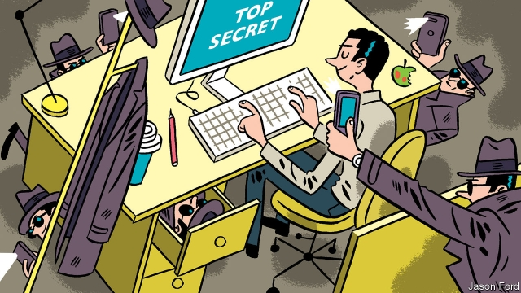

###### Spies like them

# The shape-shifting threat of Chinese espionage 

 

> print-edition iconPrint edition | Books and arts | Nov 23rd 2019 

Chinese Communist Espionage: An Intelligence Primer. By Peter Mattis and Matthew Brazil. Naval Institute Press; 384 pages; $45. 

Chinese Spies: From Chairman Mao to Xi Jinping. By Roger Faligot.Hurst; 568 pages; $34.95 and £30. 

THE CHILLING scene seems drawn from a thriller, but was horrifyingly real. One day in 2011 employees of a government ministry in Beijing were forced to watch the execution of a colleague who had been caught spying for the CIA. He was one of around 20 people rounded up as China eviscerated a network of informers. In their new book, Peter Mattis and Matthew Brazil note that the man’s pregnant wife was killed with him. The point of the shocking story is not just to illustrate a catastrophic failure of American intelligence. It captures the grave stakes of a clandestine game played, or fought, by China and the West. 

The rise of China under Xi Jinping has reinvigorated talk about great-power rivalry. In the imagination of many Westerners, the Communist Party of China has taken the place of its Soviet counterpart; China’s Belt and Road projects and overseas students, and Huawei’s telecoms networks, recall cold-war scares. Often, though, the fevered discussion of China’s reach and influence lacks a clear understanding of the tools at its disposal, and of what the modern Communist Party really wants. This fuzziness is especially evident in the realm of espionage. To some, every Chinese traveller is a potential spy; others dismiss fears of rampant Chinese spooks as paranoia. 

As Mr Mattis, a former CIA analyst, and Mr Brazil, a former American army officer and diplomat, point out, China has been playing spy games for decades. Western counter-intelligence agencies have been sounding warnings about them for just as long—if more quietly than today. For much of the cold war, however, the United States and China shared a common adversary in the Soviet Union. Deng Xiaoping even agreed to let America establish listening posts, or “big ears”, in the Xinjiang region of China’s far west to monitor the Soviets. On a visit to Beijing in 1980, Stansfield Turner, then director of the CIA, supposedly wore a fake moustache to evade the KGB. China itself was a much smaller worry. 

Today the scale and intensity of the Sino-Western duel are greater, as are the geopolitical stakes. Chinese espionage is routinely identified by Western security agencies as one of the most serious foreign-intelligence threats. China probably has more intelligence personnel than any other country. Hackers from the People’s Liberation Army and the Ministry of State Security have cracked open sensitive computer networks around the world. These days, China is implicated in the vast majority of commercial-espionage cases prosecuted by federal authorities in America. 

If Western countries have recruited agents in Beijing, meanwhile, the Chinese have reciprocated. In December 2017 two former French intelligence officials were charged with treason after allegedly spying for China. This April a former CIA agent pleaded guilty to conspiring with Chinese operatives, in a case that American officials suspected was linked to the deadly collapse of the agency’s network in China. 

For years America’s spies and their allies took on their Chinese counterparts on the quiet, preferring not to disrupt diplomacy. In any case, this was a slippery adversary to grapple with. In “Chinese Spies: From Chairman Mao to Xi Jinping”, Roger Faligot, a French author, relates the verdict of an FBI spy-hunter: the trouble with the job is that most targets don’t look or act like spies. They are not cloak-and-dagger types with handlers, cut-outs and dead drops; rather, they tend to be “academics, students, businessmen or journalists”. 

Poison-tipped umbrellas are no longer the tools of the espionage trade. Instead it relies on employees at American or European technology and defence firms taking home extra files—or photographing a computer screen on their smartphone, as in a recent case involving technology for a self-driving car in which the FBI arrested an engineer at Apple. China also acquires know-how by funding scientists at American institutions; some set up “shadow labs” in China that mirror their work in America. 

Invoking a Chinese term, Mr Faligot describes this multipronged approach to intelligence collection as the “sea-lamprey strategy”. This “slippery, greenish fish blends with the seascape”, then latches on to its prey, “siphoning off its blood through its multiple orifices”, Mr Faligot writes evocatively. Too evocatively, perhaps. Readers of his engrossing book might be prone to find Chinese spies everywhere, lurking like “deep-water fish” in Chinese communities from Vancouver to Sydney. 

Under President Donald Trump, America’s authorities have sometimes seemed inclined to do just that. Given China’s strident authoritarianism, the fear is understandable. But the amorphous nature of the threat demands a cool assessment. In their book, Mr Mattis and Mr Brazil provide a useful field guide to Chinese intelligence services, from the distrust and purges that weakened them under Mao to their more professional incarnations today. They also supply an eye-opening compendium of confirmed cases of Chinese skulduggery. Even so, charting the Chinese threat remains a work in progress. 

In many instances it is hard to discern how much damage has really been done by Chinese agents to other national interests, whether in America or elsewhere. Sometimes it is not clear that a Chinese agent is really a “spy”, as opposed to a businessman or student caught up in machinations larger than they appreciate. As the spy games become more complex and sophisticated, blunt crackdowns and blanket suspicions may be as damaging to Western societies—and the rights of innocent people—as naivety is to national security. The shadowy nature of espionage calls for democracies to be extra-vigilant, not only about spies but, just as important, about those responsible for hunting them. ■ 

