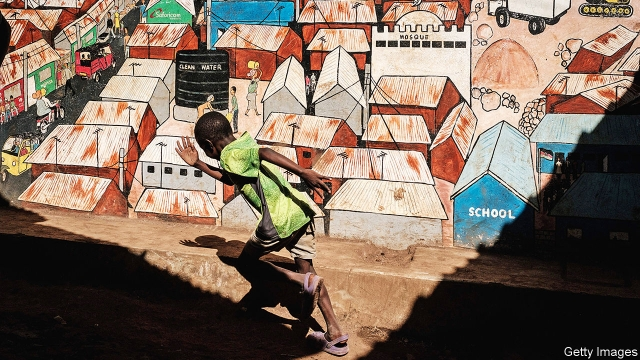

###### Boots on the ground

# When the meaning is in the method 

 

> print-edition iconPrint edition | Books and arts | Nov 23rd 2019 

Good Economics for Hard Times. By Abhijit Banerjee and Esther Duflo. PublicAffairs; 432 pages; $30. Allen Lane; £25. 

WHEN THE authors of this excellent book were awarded the Nobel prize for economics last month, French media crowed that a Frenchwoman had won it; Indian media that an Indian-born economist and his wife had done so. Most reports eventually mentioned that their national champion was not the sole laureate. But the parochialism of the headlines bears out one of the book’s central observations. 

The world is messier than conventional economic models assume. People respond not only to material incentives but also to the pull of tribe and custom. They are not only rational but also emotional, superstitious and attached to the familiar. All economists know that their models oversimplify—that is what models are for. But few have grappled as energetically with the complexity of real life as Esther Duflo and Abhijit Banerjee, or got their boots as dirty in the process. 

The couple are best known, along with their fellow Nobel laureate Michael Kremer, for pioneering the use of randomised controlled trials to answer economic questions. An earlier book, “Poor Economics”, is full of powerful examples. To see whether small loans improve the lives of the poor, the team persuaded a microlender in Hyderabad to expand into some randomly selected districts but not others. (They found that microcredit works, but not as well as its boosters claim.) In another trial, they found that Indian teachers were more likely to show up to work if they were made to take date-stamped photos of themselves, and their pay was docked if they missed classes. 

“Good Economics for Hard Times” is more wide-ranging. It reviews the evidence for what works and what doesn’t in tackling some of the world’s biggest problems, from climate change to trade. The authors admit that their knowledge is imperfect and their proposals will need refining. They don’t claim to understand what causes rapid economic growth, for instance. They would far rather you absorbed their evidence-based, trial-and-error method than any specific policy. 

The result is a treasure trove of insight. They describe how caste politics fosters corruption, how potential migrants can overcome their fear of the unknown, and how, when government posts are excessively well-paid, as they are in several poor countries, fresh graduates remain jobless for years rather than settle for a private-sector position. 

The authors are fascinated by what motivates people, and how this varies by social context. In an experiment involving coin-flipping for cash rewards, Swiss bankers are more likely to cheat if reminded beforehand that they are bankers, less so if they are asked to talk about what they do in their leisure time. In “banker” mode, it seems, people are more ruthlessly acquisitive than when in “volunteer football coach” mode. In a similar experiment, students in India cheated more when reminded that they hoped one day to work for the government; for students in Denmark, the opposite was true. A government’s reputation for corruption or cleanliness “affects the honesty of those who want to work for it”, suggest the authors. 

Thinking about inequality, they are sceptical about the fashionable idea that rich countries should offer every citizen a “universal basic income”. The real crisis in such places is not material deprivation but that “many people who used to think of themselves as middle class have lost the sense of self-worth that they used to derive from their jobs.” In poor countries, by contrast, material deprivation is a huge problem and an “ultra-basic” handout of a dollar or two a day could release people from penury and hunger. 

India could largely pay for this by abolishing wasteful subsidies for petrol, food and fertiliser. Universal cash payments are simple—a big plus when the government is incapable of administering complex social programmes. The authors do not imagine, however, that their logical arguments settle the matter. Mr Banerjee is running a randomised trial of ultra-basic cash payments in Kenya; he expects results next year. 

All readers will find something to disagree with in this book. It is too harsh on Margaret Thatcher and too kind to Europe’s farm subsidies. But they will be captivated by the authors’ curiosity, ferocious intellects and attractive modesty. “The only recourse we have against bad ideas”, they argue, is to “resist the seduction of the ‘obvious’, be sceptical of promised miracles, question the evidence, be patient with complexity and honest about what we know and what we can know.” Amen. ■ 

