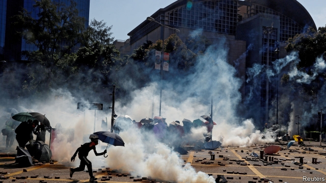
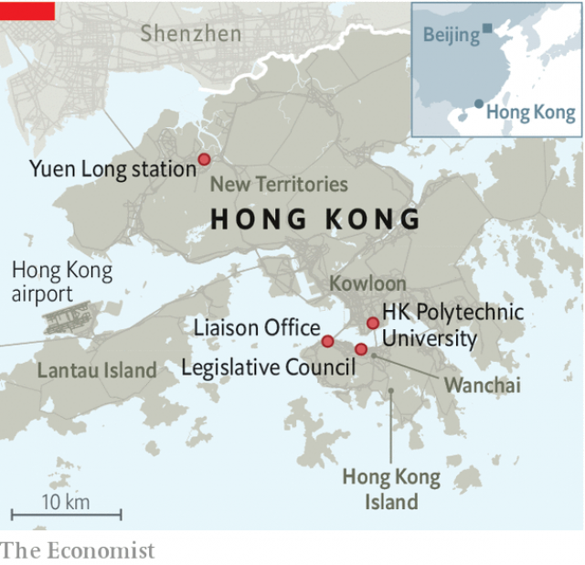
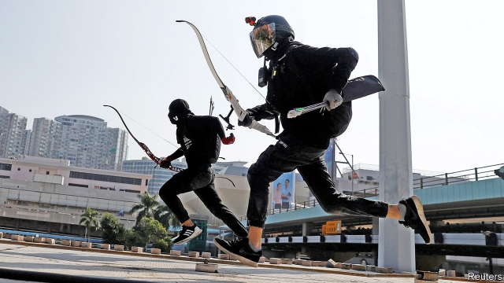

###### Catching fire

# Hong Kong stares into the abyss amid growing violence 

 

> print-edition iconPrint edition | Briefing | Nov 21st 2019 

SINCE THE middle of November, Hong Kong has been staring into the abyss. The violence attending its nearly six-month-old protest movement—both its participants, approvingly, and China’s central government, furiously, brand it a revolution—has stepped up a gear. Police have increased their use of tear-gas, rubber bullets and water cannon. Protesters who once carried nothing more offensive than an umbrella now wield bows and specialise in petrol bombs. Vigilante violence has flourished. The first deaths—a student who fell running from the police and a street-cleaner hit by a brick apparently thrown by a protester—have been recorded. 

On November 17th, in the most dramatic stand-off yet, the police began moving against protesters at the Hong Kong Polytechnic University (PolyU) who were mass-producing Molotov cocktails. The protesters barricaded themselves in. Riot police tasked with getting them out threatened to use lethal force in doing so. 

The fears which that provoked have waned. International calls for the police to stay their hand may have contributed to a decision to wait for the protesters to emerge—as many have, cold, tired, hungry and frightened. Thanks to mediation by social workers and a few local politicians, 300 protesters under the age of 18 were allowed to leave, though their personal details were carefully taken down. Others have made dramatic escapes. But as The Economist went to press 60 or so remained behind the barricades. Before making his own escape Mok, a 23-year-old graduate, told our correspondent that, “Even if we are dying on the campus or in the underground tunnels, we are not going to surrender.” With the language of martyrdom abroad, the risk of a bloody ending remains. 

The violence of the Hong Kong protests, and of the response to them, is hardly remarkable by international standards. Much worse has happened in Baghdad, Beirut, Santiago and Tehran over the past months. But by the standards of both Hong Kong and China’s Communist Party, these events are shocking. No one would have predicted in May that a proposed change to the territory’s extradition laws could lead to a sustained rebellion lit by burning vehicles. For one thing, China seldom treats rebellion with anything less than dire repression. For another, Hong Kongers tend not to see themselves as revolutionaries. But that, it seems, is changing. The protesters are willing to use violence in the service of decency and their way of life—to burn universities in order to save them. 

Hong Kong has never been a democracy. But in the later years of British rule its Legislative Council (Legco) gradually became more representative of the people. The territory’s courts enjoyed genuine independence, and its citizens a free press. As well as boasting one of the world’s most vigorous economies, the territory bore most of the hallmarks of a free society. 

Today, Hong Kong’s local district councils, for which elections are due to be held on November 24th, are the only tier of government chosen entirely through universal suffrage. But when China reclaimed the territory in 1997 it agreed that its form of government, courts, free press, trade relations, financial system and way of life should remain unchanged for 50 years: “one country, two systems”, in the phrase of Deng Xiaoping, then China’s leader. Though some of the territory’s autonomy was eroded in the 2000s, China largely kept to the deal, its concerns over excessive freedoms offset by a thriving economy and, to some extent, the opprobrium it would face should it break its word. 

But around the time that Xi Jinping, China’s current leader, came to power in 2012, the rate of erosion quickened. The government in Beijing pushed for a highly unpopular programme of “patriotic education” at schools to engender loyalty—a push that did not succeed, but still self-defeatingly contributed to the radicalisation of some of the territory’s young people. Proposed reforms that would have let Hong Kongers choose their chief executive, but in effect restricted the choice to a slate picked by Beijing, led to the Occupy Central protests of late 2014. 

This year the issue originally at stake was a bill which would have allowed anyone in Hong Kong accused of a crime in mainland China to be tried there—which is to say, in a system Beijing controls. Outrage at this new erosion brought 1m people on to the streets. Carrie Lam, the territory’s chief executive, ignored them. Her intransigence led to even larger protests. Organisers claim that a demonstration on June 16th brought 2m on to the streets—a turnout almost ten times larger than Martin Luther King’s March on Washington provided by a population less than a twentieth that of America in 1963. Civil servants, church groups, executives and the staff of Hong Kong’s biggest employers all joined in, as did teenagers, children and babes in arms. 

The heart of the protests, though, was to be found among young, well-educated Hong Kongers fighting for their city’s democratic autonomy. For most of them that fight was, to begin with, metaphorical. For some—those now known as the frontliners—it was not. They looked back on the non-violent protests of Occupy Central when, as Joshua Wong, one of Occupy’s leaders, put it, the police had arrested “anyone with a megaphone” and learned their lesson: they would be leaderless, anonymous and comfortable with violence. 

In “Longstreet”, a 1970s television programme, Bruce Lee tells his student “to be formless, shapeless—like water”; to take whatever form the circumstances require; to flow, creep, drip or crash. “Be water” became the movement’s watchword, votes on encrypted messaging apps its leaderless model of co-ordination. 

The frontliners’ early forays beyond previous norms—blocking roads with pavement railings and shouting taunts at the police—now seem, by their own admission, almost quaint. Direct clashes were few. The storming of Legco on July 1st, and the subsequent daubing of its chamber with slogans, shocked the authorities and some of the populace. But the writing on the walls was in paint, not blood. 

Other symbolic gestures were more aesthetically pleasing. A remarkably catchy, crowdsourced Cantonese anthem, “Glory to Hong Kong”, first heard at rallies, ended up sung by flash mobs of office workers during lunch breaks. A moment when a young girl and boy, forming a human chain, found themselves too shy to hold hands and instead gripped the two ends of a biro took flight on social media; within a day it had been mashed up with Michaelangelo into memes showing the spark of life, or freedom, flowing from one to the other. The “Goddess of Democracy” who graced the Tiananmen Square protests—herself a repurposing of the Statue of Liberty—appeared again, now known as “Lady Liberty” and kitted out with the practical but now also iconic appurtenances of protest: hard hat, gas mask and umbrella. 

 

The police met the water’s rising tide with what in retrospect seems like tolerance. When, three weeks after the storming of Legco, the frontliners painted slogans on the Liaison Office, symbol of the Chinese Communist Party’s authority over Hong Kong, the police were furious at having been outwitted. Yet when The Economist asked one officer what he and his colleagues near the office intended to do in the face of protesters barricading the road, he replied, with a wry smile: “Wait till the MTR [the underground system] closes and protesters take the last train home.” 

Elsewhere on the MTR, though, that night saw a decisive escalation. Men with triad links and metal staffs entered the Yuen Long station in the New Territories looking for democracy protesters on trains. They laid into passengers indiscriminately; local police, apparently turning a blind eye, failed to respond. That incident did more than any other to discredit a police force that used to be called “Asia’s finest”. Today, only Mrs Lam uses the phrase. 

Since then protesters have vandalised (or, in protest slang, “renovated”) state banks, Hong Kong’s biggest bookseller (which is owned by the Liaison Office) and restaurants with sympathies assumed to lie with the Communist Party. Rioters now set fires not only on the streets but inside buildings. On November 6th a pro-establishment politician with known links to the triads in Yuen Long was stabbed in broad daylight. People fear being attacked simply on the basis of being Mandarin-speaking mainland Chinese. Nihilism is trumping romanticism: “If we burn, you burn with us”, a rebel slogan from the climax of the Hunger Games saga, has gained currency. Earlier this month it was given awful form when a bystander confronting protesters was doused with something flammable and set on fire (he survived). 

Police commanders express bewilderment that the mass of ordinary, peace-loving Hong Kongers are not repelled by such scenes on the streets. Many are. But they are repelled yet more by the police. A survey published on November 15th by the Hong Kong Public Opinion Research Institute found that 83% blame the government, and especially the police, for the increase in violence. In a separate poll, 51.5% reported zero trust in the police force, up from just 6.5% before the protests began. 

Hong Kongers are appalled that police have lined uniformed schoolchildren against walls for random searches and have arrested 11-year-olds. Reports are growing of physical mistreatment in detention. Rules of engagement that in July were consistent with best international practice—rubber bullets fired only below waist height, tear-gas used to disperse not to kettle—have been thrown out of the window. Beatings at the time of arrest have become commonplace, sometimes escalating to frenzy. On November 11th an unarmed protester was shot in the stomach at point-blank range. And all this with impunity. Officially, only one officer out of over 30,000 has as yet been suspended for any action against a protester. 

It is possible to see a terrible symmetry at work, with frontline ninjas in helmets with camera mounts uncannily resembling the black-clad police of the rapid-action unit known as the Raptors. Each side’s epithets dehumanise the other—“dogs” for the police, “cockroaches” for the protesters. The litanies of brutality they recite match each other crime for crime. But a large part of the public, from taxi drivers to secretaries, sees no such balance. On October 1st, China’s national day, residents of high rises in Wanchai concealed hundreds of protesters suddenly cornered by riot police. Crowds scream at riot police in shopping malls and housing estates. Asia’s finest have become haak ging—“black police”. 

Police commanders blame Mrs Lam and her administration for forcing them to deal with the ever-worse symptoms of a problem which can only be sorted out politically. But Dennis Kwok, who represents the legal profession in Legco, says the police now take direct orders from central-government officials. Chris Tang Ping-keung, who was installed as police commissioner on November 19th, immediately changed the force’s motto from serving with “Pride and Care”—which aligned it with the citizens to whom it is nominally accountable—to serving with “Duty and Loyalty”. That will play well in Beijing. 

China’s official narrative about Hong Kong is that Western “black hands” are training, organising and even paying protesters to destroy Hong Kong—part of a larger plot to hold down a rising China. When America’s Senate passed a bill supportive of the protesters on November 20th Beijing reacted with a fury that grew out of and fed that narrative. Many mainlanders, bombarded by state media with images of protesters insulting China or waving foreign flags, long to see the protests crushed. 

The Chinese government is clear that it wants things sorted. But it has held back from sending in the People’s Liberation Army (PLA) and paramilitary police to quell the disturbances—indeed, though one can never know what a secretive leadership is planning, it may never seriously have been considered. In leaked comments from a private meeting with businessmen, Mrs Lam implied that China’s threats had been so much bluster. One of her advisers says that, although the protests represent a big loss of face to China’s leadership, the loss of face that would come with abandoning all semblance of “one country, two systems” would be worse. 

For a government that makes much of its decisiveness under the brilliant leadership of Xi Jinping, the absence of anything resembling a strategy to sort out Hong Kong is striking. The best spin that officials can put on it is that their leaders are playing a long game, waiting for popular sentiment to turn against the protesters and reconcile itself to something like the status quo ante. This seems unlikely—but possibly looks more plausible if you sincerely believe, as hardliners say they do, that Hong Kong opinion polls cannot be trusted because they are conducted by universities and think-tanks that are hotbeds of Western liberalism, and if your view of the territory has long been coloured by reports from Liaison Office officials who tell you what you want to hear. 

A deeper problem is that the government in Beijing has pre-emptively undercut the possibility of a satisfactory settlement. As the Hong Kong police argue in private, the unrest needs a political solution. But the Communist Party has systematically constrained the space in which the give and take of Hong Kong politics can take place. Those constraints created the dissatisfaction that led to the protests; coming to some accommodation would require setting some of them aside. But China’s leadership is unwilling to countenance such action. An example: when Hong Kong’s high court overturned a ban on face coverings imposed by Mrs Lam, the National People’s Congress in Beijing made its disapproval clear. 

If expecting politics to work in a place where they have tried to remove that possibility fails, China’s leaders “have no Plan B,” according to a senior adviser to Mrs Lam with close links to Beijing. And so things are left in the hands of Mrs Lam and her paralysed, incompetent government. Mrs Lam is showing the same intransigence in the face of calls for an independent investigation into the causes of the unrest and into police behaviour as she originally did over the extradition bill. When in an unaccustomed fit of good sense she acknowledged the need to reach out to young people, she did so at a youth camp organised by the reviled PLA—and in the Mandarin of the overlord rather than Cantonese. 

 

With no one in power taking the initiative and violence ratcheting up, the outlook appears grim. But the district-council elections set for November 24th could possibly help move the action away from the streets. These elections, mostly concerned with rubbish collection and the management of public housing estates, have never previously been a big deal. This time democrats see them as an opportunity to show that the energy of the streets can be channelled into the ballot box. 

With a democrat contesting every council seat and 386,000 (mainly young) new voters, the poll offers the chance for a symbolic coup de théâtre and, indirectly, a shift in the composition of Legco. Half of the committee’s 70 members are directly elected—six of the others come from the district councils. The election results will also affect the make-up of the committees, tightly circumscribed by Beijing, which every five years choose the chief executive. 

It might seem strange, in the current circumstances, that the elections are going ahead. But both sides want them. Mok, the protester behind the barricades at PolyU, says that though he views the elections as part of the tainted system he is fighting, he and his comrades are determined to vote. The government, for its part, desperately wants to show that some things are carrying on as normal. And for the elections to go ahead, it says it needs calm. This puts democratic leaders in something of a spot. They need the frontliners to leave the barricades—yet saying so out loud would risk splitting the protest movement. 

When his pupil in “Longstreet” worries that wateriness does not sound like the way to beat his fearsome opponent, Bruce Lee upbraids him: “You want to learn the way to win, but never accept the way to lose.” The Hong Kong protesters know that they are not going to win a liberal democracy any time soon. But nor do they necessarily need to follow Lee’s last advice: that the pupil must learn the art of dying. Some in Beijing acknowledge that a fundamental change has taken place in Hong Kong, and suggest that the central government will be “very cautious” about its next steps. In response to the suggestion that the Communist Party had lost the hearts and minds of a whole generation in Hong Kong, one thoughtful person in the capital said: “Oh, two.” That is the case for giving Hong Kong the political space to start sorting out the mess itself. It is not a case Mr Xi is likely to take to. But some waters flow slowly. ■ 

