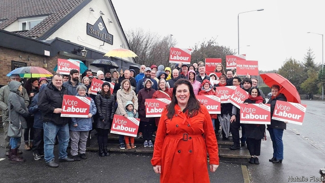

###### Left field

# Ashfield, the strangest seat in Britain’s election 

 

> print-edition iconPrint edition | Britain | Nov 21st 2019 

“I  TOLD MY first ever voter to fuck off on Saturday,” announces Natalie Fleet, Labour’s candidate in Ashfield, a former mining community in the Midlands. A constituent was ranting about Labour’s talk of giving 16-year-olds the vote, which Ms Fleet supports. After all, she explained to the voter, at that age she was already a mother. “Well, you should have kept your legs closed,” he said. “Well, you can fuck off,” she replied brightly. 

Such exchanges are rare during a campaign—and particularly in a seat like Ashfield, which Labour held by only 441 votes in 2017. With a Leave vote of nearly 70%, Ashfield is a test bed for the Conservatives’ strategy of wooing Labour supporters who backed Brexit. Those using it as a laboratory for British politics at large may be disappointed, however. Ashfield is perhaps the strangest seat in Britain, with enough characters and subplots to fill a political soap opera. 

The main contest is between Labour, the Tories and the Ashfield Independents. Under the leadership of Jason Zadrozny, the Independents stormed the local elections in May, ending up with 30 of 35 seats on the borough council only four years after they were founded. Mr Zadrozny, whom bookmakers consider the favourite to win the seat, is well-known locally for reasons good and bad. 

In 2015 he ran as a Liberal Democrat, but dropped out amid accusations of child abuse. The charges were dropped for lack of evidence on the morning of his trial. Mr Zadrozny is unhappy about how he was treated, and singles out Paddy Tipping, the police commissioner for Nottinghamshire and a former Labour MP. “I can’t wait for parliamentary privilege,” says Mr Zadrozny. “I’ll have Paddy Tipping’s trousers down.” 

Lee Anderson, the Conservative candidate, used to work for Gloria De Piero, Ashfield’s Labour MP, who is standing down. He defected to the Tories only last year. This week he suggested that nuisance tenants should be sent to live in tents (“Six o’clock every morning, let’s have ’em up…picking potatoes or any current seasonal vegetables. Back in the tent, cold shower, lights out at six o’clock, the same the next day”). 

Another ex-member of Ms De Piero’s staff has joined the Ashfield Independents. “It’s a very special mix of politics here,” admits Ms Fleet. Shortly after she spoke to The Economist, police were called following a row between activists at Labour’s constituency office. Two days later someone smashed its windows. 

In a tight national contest, every seat matters. Mr Zadrozny revels in the thought of holding the balance of power in a hung parliament. “Well, the DUP were worth a billion quid,” he says, referring to the Northern Irish party that propped up the Tories in return for $1.3bn for their region. “So I think I’m worth £100m-worth of infrastructure improvements to Ashfield.”■ 

