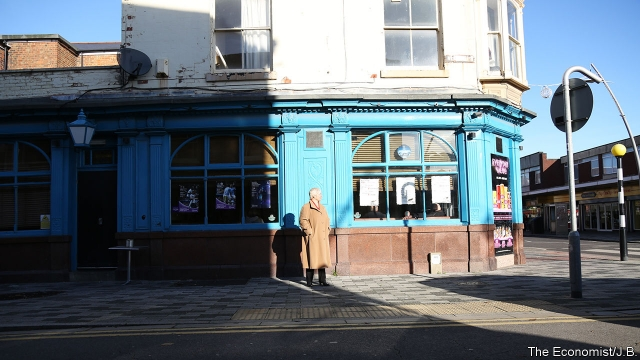
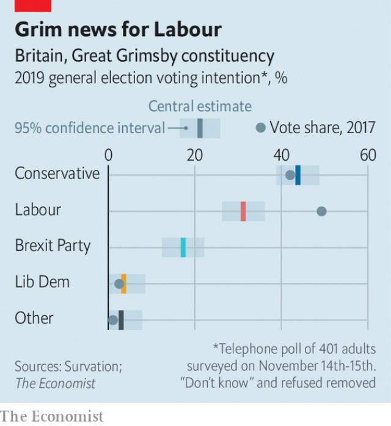
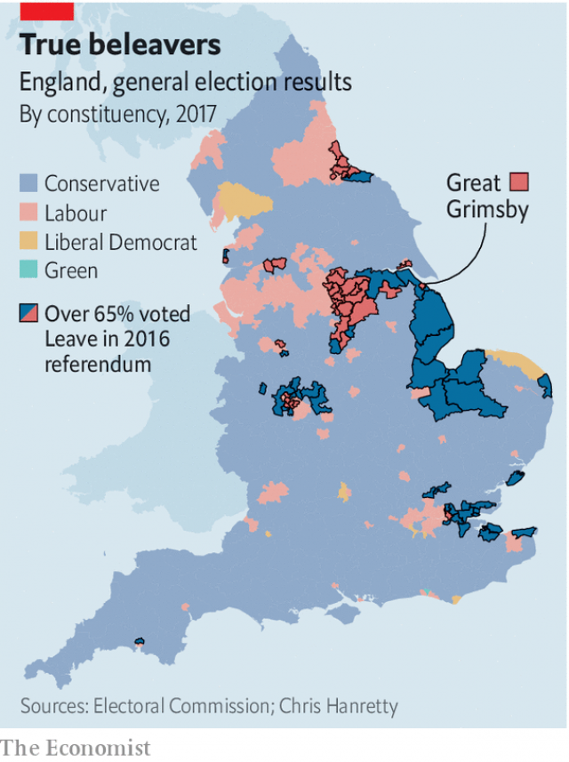

###### Swing seats

# Labour is losing the battle for Grimsby 

 

> print-edition iconPrint edition | Britain | Nov 21st 2019 

THE LABOUR PARTY has held Great Grimsby for 74 years. The Lincolnshire constituency’s past MPs include Anthony Crosland, who wrote one of the party’s most important post-war texts, “The Future of Socialism”, and Austin Mitchell, who once claimed that Grimsby would vote Labour even if the party put up a “raving alcoholic sex paedophile”. 

Yet the seat may be about to fall. A poll for The Economist by Survation suggests that the Conservatives lead Labour by fully 13 points (see chart). The usual caveats apply: local polling is tricky, the sample small and there are three weeks to go. But the big lead of the Tory candidate, Lia Nici (pictured), implies not only that Labour is in danger of losing one of its most dependable seats. It also suggests that Boris Johnson’s targeting of working-class, pro-Brexit towns in the north and the Midlands could well succeed. A realignment in British politics may be in the making. 

Labour’s decades in charge of Grimsby have seen steep decline. In the 1950s the town was home to the biggest fishing fleet on earth. The docks were a thriving community of small factories making nets and fishing gear, busy shops and smokehouses. Trawlers packed the harbour, as the world’s biggest ice factory, built to provide crushed ice for ships, loomed over everything. Now many of Grimsby’s fine buildings are crumbling and its streets quiet. 

 

The gutting of the fishing industry has devastated related trades (there were once eight jobs onshore for every one at sea). At 5.3%, Grimsby has one of Britain’s highest unemployment rates, and the social problems that go with it. Ex-fishermen can be found drinking in pubs at 9am. Drug gangs have set up in the homes of vulnerable people, a practice known as “cuckooing”. 

Such decline has created a powerful feeling of being ignored by Westminster and taken for granted by Labour. Locals complain that “London” is more interested in wasting billions on white elephants like HS2, a railway connecting the capital to big northern cities, than in improving the dire local rail links. In so far as “they” notice the east coast at all, they spray money at Hull, on the Yorkshire side of the Humber (Grimbarians’ dislike of Londoners is as nothing compared with their disdain for “Yorkies”). 

All this helped to persuade Grimsby to vote by more than 70% to leave the European Union, one of the highest shares in the country. Of the 70-odd constituencies that backed Brexit by more than 65%, the Tories already control 38; they now have their eye on the Labour-held remainder in the north and Midlands (see map). 

 

Mr Johnson’s pro-Brexit message seems to resonate. Grimbarians blame the EU for destroying their fishing industry with its regime of quotas, and regard Brussels as the embodiment of faraway and out-of-touch power. There is also unease about immigration. Grimsby had almost none until an influx of eastern Europeans after 2004 to work in the one remaining bit of the fish industry, processing imported fish. 

Locals have no time for Jeremy Corbyn, Labour’s leader. Three complaints are loudest: he is not a patriot; he is more interested in minorities than “people like us”; and he represents the hijacking of the Labour Party by London. Mr Mitchell expressed the sentiments of many locals when he recently urged people not to vote for Mr Corbyn and his “mob of cosmopolitan meritocrats who love the [EU] more than those at the bottom of society’s top-heavy heap”. 

This has caused acute problems for Grimsby’s Labour MP, Melanie Onn. She has agonised over Brexit, backing Remain and repeatedly opposing Theresa May’s deal, before voting for Mr Johnson’s version. She was conveniently out of town for Mr Corbyn’s two visits to Grimsby. Christopher Barker, the local Brexit Party candidate, says he has searched the internet for pictures of her with her party leader, only to come up blank. 

Can the Conservatives turn all this angst into victory? There are plenty of straws in the wind other than our poll. The Tories took control of the local council in May. They have found a good candidate in Ms Nici, who was brought up in Grimsby and worked in local television. She puts a positive spin on the town’s plight, admitting that it is “a bit rough around the edges” but pointing out that it has a legacy of mansions and parks from its glory days, and that it is embracing new technologies. The world’s biggest offshore wind farm, Dogger Bank, is being constructed off the coast. The Tories nevertheless face two hurdles. 

The first is that the Brexit Party has a clear message and a dynamic candidate. Mr Barker is an outsider—he has a posh accent and Yorkshire roots—but he is battle-hardened from recent European elections and is eloquent (if wrong) in arguing that a no-deal Brexit would not only honour democracy but revive the fishing industry. The decision of his party to stand down in Tory-held seats has blunted its insurgent message—the 17% it scores in our poll is lower than the 25% notched up by its forerunner, the UK Independence Party, in 2015. But there is no doubt the Conservatives would rather the Brexit Party wasn’t there. 

Their second hurdle is that, after three-quarters of a century, Labour has a powerful local machine. The Tories operate from a broom cupboard of an office, smaller even than the Brexit Party’s headquarters. Labour can call on the support of trade unions like Unite, which has an office in town. It can also remind voters that the party of Old Etonian Mr Johnson is even more culturally alien than the party of Islingtonian Mr Corbyn. 

But the signs are that the Labour Party will need an extraordinarily successful campaign to retain this deepest-red of constituencies. Perhaps Ms Onn could do as her predecessor, Mr Mitchell, once did, and change her surname to Haddock. ■ 

Dig deeper:Our latest coverage of Britain’s election 

