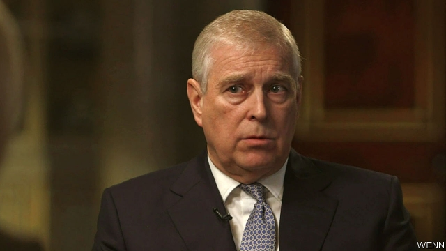

###### The panned old Duke of York

# Prince Andrew’s disastrous interview will not damage the queen 

 

> print-edition iconPrint edition | Britain | Nov 21st 2019 

IN HIS WRITINGS on the role of the monarchy, Walter Bagehot, this newspaper’s most famous editor, warned against letting in “daylight upon magic”. The glare from an LED softbox light panel certainly did Prince Andrew no favours. Defending his association with Jeffrey Epstein, a now-dead convicted paedophile, in an interview with the BBC, and denying an accusation by one of Epstein’s victims that he had had sex with her when she was 17, the prince—aka the Duke of York—looked pasty and shifty, his answers implausible and arrogant. 

He said staying with Mr Epstein was “convenient”. No doubt it was. Mansions in the centres of the world’s great cities usually are. But his claim that his primary purpose in spending four days at Mr Epstein’s house, during which he attended a dinner party there, was to break off the friendship face-to-face stretched credulity, especially when he put it down to his “tendency to be too honourable”. 

But it was the de haut en bas tone that was most astonishing. His alibi for one night on which he was said to have had sex with the girl was that he had been taking his daughter to the Woking branch of Pizza Express; he said he remembered it because going to Pizza Express in Woking was a “very unusual thing for me to do”. He denied having hosted a party on the grounds that it was “just a straightforward…shooting weekend”. And he failed to notice the stream of very young women in and out of Epstein’s houses because they were full of staff—to whom one would, obviously, pay no attention. 

The interview has done the prince permanent damage. On November 20th, after several businesses distanced themselves from his charities, he announced that he would be stepping back from royal duties “for the foreseeable future”. The bigger question is whether the monarchy has been damaged. Andrew is said to be the queen’s favourite, and it seems likely that she approved the interview. Even so, support for the monarchy will probably be unaffected. In the past quarter-century it has moved in a narrow band, from 65% to 80%. That may be in part because of the popularity of the incumbent, whose ratings politicians would kill for. According to YouGov, a pollster, she is the most popular royal, with 72% approval, and the most admired woman in the country. 

The queen’s most important quality is her ability to keep her mouth shut, a skill which neither Andrew nor his elder brother Charles has mastered. By sounding off about a wide range of subjects about which he has more opinions than knowledge, the heir to the throne has annoyed many. 

The queen’s willingness to keep her counsel has allowed her to remain a symbol rather than a person, and thus a focus, as the royal website puts it, for “national identity, unity and pride”. Prince Andrew has certainly united the nation in the past few days, but not in the way that his mother would have wished. ■ 

