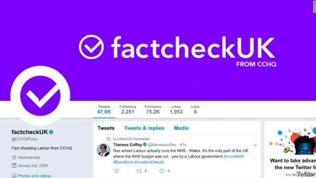
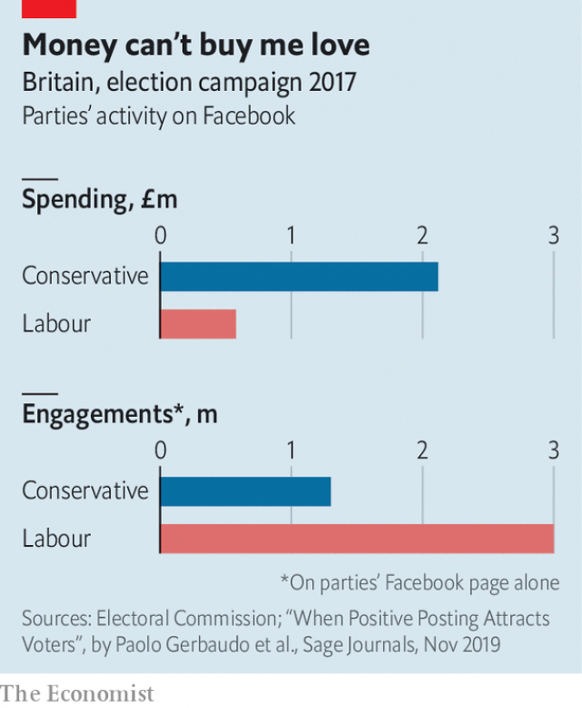

###### Trick or tweet?

# The Tories’ dodgy “factcheckUK” tweets are a taste of what’s to come 

 

> print-edition iconPrint edition | Britain | Nov 21st 2019 

AS BORIS JOHNSON and Jeremy Corbyn blustered their way through an unsatisfying televised debate on November 19th, a range of online fact-checking services helped sort the truth from the tosh. There was Full Fact, an established charity, FactCheck, run by Channel 4—and then there was factcheckUK, a new Twitter-based outfit which seemed particularly keen to pick holes in Mr Corbyn’s arguments. Closer inspection revealed that the account was in fact run by @CCHQPress, the Conservative Party press office. 

This election offers plenty of scope for such dodges, for it will be the least-regulated in living memory. The principal political battlefield is the internet. Two-fifths of all ad spending was online in 2017; this year it is likely to be well over half. In the last election, though the Tories outspent Labour online, they badly underperformed, getting half as many Facebook engagements at three times the cost. That may help explain the desperation to get ahead, manifested by their factcheckUK wheeze. 

Although campaigns are tightly regulated offline, the rules have not caught up with technology. Television advertising, for instance, is limited to a few dull party political broadcasts—but parties can broadcast as much as they like on YouTube. There are tight limits on election spending by candidates in their constituencies—but online ads can be bought centrally and targeted locally. Leaflets and posters that are produced by a political party must say so—but there is no such requirement for online content. And even where there are rules they are hard to apply online because, as the Twitter row shows, the origins of internet material can be obscure. 

Targeting is a particular source of concern. As shown by the Cambridge Analytica scandal, in which people’s Facebook profiles were improperly used to send personalised pro-Brexit ads, this is an area of keen interest to politicians. Targeting allows them to send different messages to different constituencies. That makes online ads more efficient than others, but also means that, as Sam Jeffers of WhoTargetsMe, a lobby group, says, “We’re now in an era when no two people will see the same campaign. We’ve lost our shared political space.” A US Senate report last month into Russian interference in the American election in 2016 exposed a dangerous example: blacks were sent content designed to stir up anger and discourage voting. 

 

These matters have been discussed at length by MPs, academics and campaigners, but nothing has changed. That is partly because online campaigning falls between several stools. The Electoral Commission regulates election finance but not advertising, the Advertising Standards Agency regulates advertising but not politics, and the Information Commissioner’s Office regulates personal data. None of these bodies wants to touch this particularly hot potato and politicians have been too Brexit-obsessed to legislate on anything else. 

While the government has done nothing the tech companies, prodded by accusations that they are undermining democracy, have taken some action. Facebook, the main online election battleground, now labels political ads with their source and target. It took down some government ads early in the campaign that were targeted at marginal constituencies but not labelled as political. It maintains a library of ads, where anyone can see how much advertisers have spent and who has been seeing them. Google has a similar one. 

Twitter has banned political advertising—which did not catch the factcheckUK tweets, for they were not paid posts. But the company has threatened that “any further attempts to mislead people by editing verified profile information—in a manner seen during the UK election debate—will result in decisive corrective action.” 

It is good that tech giants are making efforts to keep things clean, but not ideal that it is left to them. As Katharine Dommett of Sheffield University says, “I’m concerned that the rules for our democracy are being set by commercial companies that do not necessarily have our interests at heart.” ■ 

