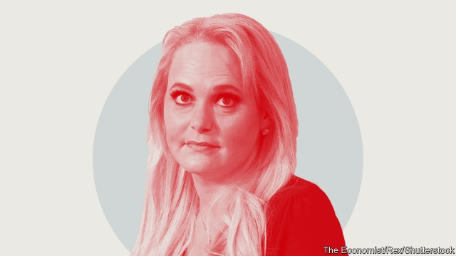

###### Speakers’ Corner

# The best quotes from the fourth week of Britain’s election campaign 

 

> print-edition iconPrint edition | Britain | Nov 23rd 2019 

Gremlin goes rogue“I have kept your secrets and I’ve been your friend. And I don’t understand why you have blocked me and ignored me as if I were some fleeting one-night stand or some girl that you picked up at a bar… And I’m terribly heart-broken by the way that you have cast me aside like I am some gremlin.”Jennifer Arcuri, a former close friend of Boris Johnson who accompanied him on official trips when he was mayor, hints that she has beans to spill. ITV 

Cat out of bag“Our ambition is to go up to a £12,500 [$16,150] threshold for national-insurance contributions. That would reduce the burden of taxation, particularly on people on low incomes…and the reason we want to do that is to help with the cost of living.”Mr Johnson inadvertently leaks a centrepiece of the Tory manifesto to the BBC  

Completely nuts“Not news. Not true. Just total bollocks.”Jo Swinson, Liberal Democrat leader, responds to a viral fake news story that she had tortured squirrels while describing them as “pleb bunnies”. Times 

No laughing matter“I have made the position clear.”Jeremy Corbyn’s claim about Labour’s rather complicated Brexit policy in a televised election debate prompted laughter from the audience. ITV 

Third time lucky?“Jeremy would have to make a decision, along with other sections of the party… Back in 2015, Ed Miliband resigned the following day. I think that was wrong of him to do that. You always need a period of reflection.”Len McCluskey, head of the Unite union, says that Mr Corbyn should not immediately quit as leader if Labour loses the election. New Statesman 

All politics is local“I have a great fondness for the north-east because of my time in the North Sea. It has a place in my heart for ever.”Ed Punchard, a former oil-rig worker, explains why he is standing as the Brexit Party’s candidate for Tynemouth—despite living in Australia. ChronicleLive 

