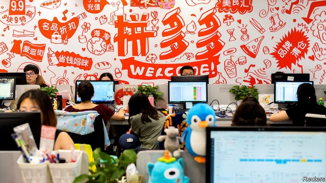
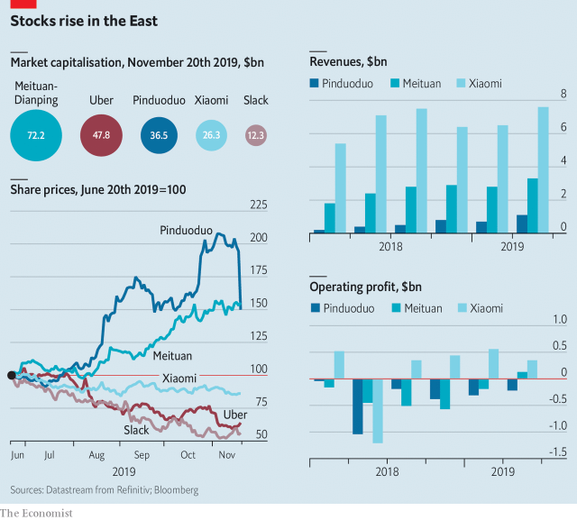

###### Group buy

# China’s tech darlings have been on a tear 

 

> print-edition iconPrint edition | Business | Nov 23rd 2019 

AMERICA’S TECHNOLOGY unicorns, as privately held startups worth $1bn or more are known, seem to lose their magic as soon as they go public. The market capitalisation of Uber is down by almost half since it listed in May. Lyft has shed a bit more even than its bigger ride-hailing rival. Neither is remotely profitable. Slack, a corporate-messaging service, lost $360m in its first quarter as a public company, over ten times more than as a private one a year earlier. Its share price has slid, too (see chart). 

China also has its own tech duds. Shares in Xiaomi, a maker of smartphones and gadgets, are worth half of their offering price last July. But other Chinese unicorns have managed to retain some of their mojo. 

Two in particular have been on a tear in the past six months: Meituan-Dianping, an online-services super-app that trades in Hong Kong, and Pinduoduo, a shopping app listed on New York’s Nasdaq exchange. With a market capitalisation of $72bn, Meituan is now China’s third-biggest listed internet firm, behind Alibaba and Tencent. Pinduoduo’s $36bn puts it fifth, behind Baidu. 

 

Meituan burned through cash to fuel its food-delivery and bike-rental businesses. Users were delighted; investors, less so. But the strategy appears to have paid off: the company reported its first net profit, of 876m yuan ($128m), in the second quarter. Sanford C. Bernstein, a research firm, reckons that Meituan may continue to make money, not least because its meal-toting rivals—including Alibaba—are losing their appetite to fork out much more. 

Pinduoduo, for its part, has overtaken JD.com as China’s second-largest e-commerce site by number of annual buyers (over 500m). It claims to be a combination of Costco (cheap) and Disneyland (thrills). Recruit friends to join you in ordering a crate of 30 kiwis, and their price falls. 

Pinduoduo boomed early on in underserved poor cities. But as it moves into richer ones it will come up against Alibaba, whose defences will be bolstered by the up to $12.9bn it plans to raise in a secondary listing in Hong Kong on November 26th. On November 20th Pinduoduo reported a loss in the third quarter that was wider than expected. Its shares fell by 23%. No one said staying magical would be easy.■ 

