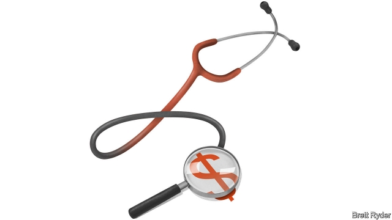
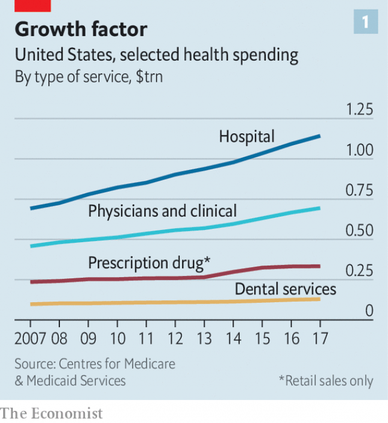
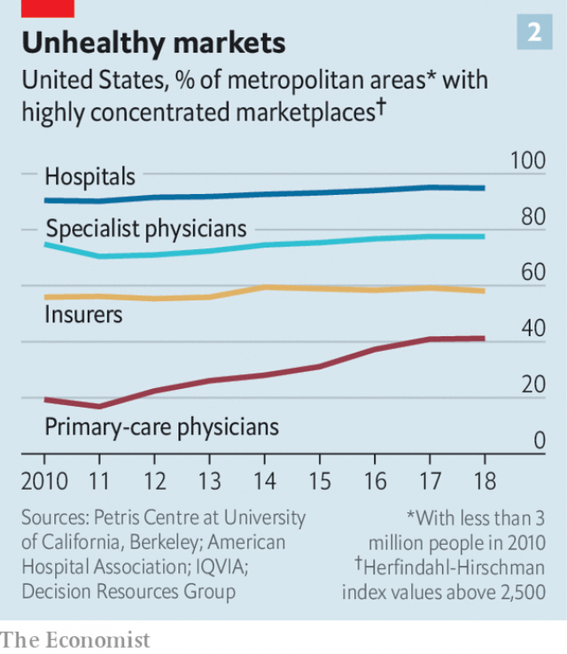

###### Diagnosis: opaque

# Donald Trump wants hospitals to be more upfront about prices 

 

> print-edition iconPrint edition | Business | Nov 23rd 2019 

“I DON’T KNOW if the hospitals are going to like me too much any more with this,” quipped President Donald Trump on November 15th. He was referring to two bold initiatives unveiled earlier that day by Alex Azar, his health secretary, to rein in America’s soaring health-care costs. The administration finalised a rule, to take effect in 2021, which will double down on its effort to bring price transparency to hospital care. And it put forward a new proposal, open for 60 days of public comment, that would force health-insurance firms to reveal confidential details of negotiated discounts with hospitals and doctors. It is the biggest shake-up of America’s $3.5trn health-care industry in years. And no, hospital operators are not happy. 

Mr Trump’s first round of hospital reform required hospitals to make public the full list of costs billable to patients or their insurers. Hospitals previously held these so-called “chargemasters” close to their chest. Since January, when the reform came into force, they have taken to releasing convoluted spreadsheets with theoretical list prices for thousands of procedures, all couched in impenetrable medical jargon—transparent in theory but “useless” in practice, says George Nation of Lehigh University in Pennsylvania. 

The new rule goes further. It requires hospitals to disclose and update details, including gross charges, cash prices and negotiated rates, for thousands of services. They must also explain in plain English how much a basket of 300 common services (things like MRI scans or hip replacements) will cost, including any extras and hidden charges. 

In setting his sights on hospitals, Mr Trump is taking on a colossus. They accounted for nearly a third of America’s health-care costs in 2017, far more than the share of much-maligned drugmakers (see chart 1). The country has over 6,000 hospitals. Only 1,300 or so are private for-profit institutions; the rest are non-profit or government-run. The lack of an overt profit motive has done little to rein in prices, however. Hospital costs have risen at an annual rate of close to 5%, compared with below 1% for drug prices. Nor has a charitable mission dampened the ambition of bosses at big hospital chains; seven-figure salaries are not unheard of at those with revenues exceeding $500m a year. They have also been on an acquisition binge. The number of deals has jumped from around 55 a year between 2002 and 2009 to 90 or more these days. Since 2018 non-profit hospitals have been the acquirers in three-quarters of the transactions. 

 

Early on, consolidation was fuelled by the passage in 2010 of the Affordable Care Act. Barack Obama’s health reform imposed red tape, such as a switch to electronic medical records, that some smaller hospitals found onerous. Moody’s, a ratings agency, thinks economies of scale and gaining leverage in negotiations with insurers are now the chief motive. 

The merger wave has increased concentration and pricing power. Brent Fulton of the University of California, Berkeley, found that 90% of America’s hospital markets, representing a population of over 200m, were highly concentrated (see chart 2). Zack Cooper of Yale University, whose team looked at insurance claims covering over a quarter of Americans with employer-provided health insurance, discovered that prices at hospitals with a local monopoly were 12% higher than in markets with four or more rivals. A study by an insurance-industry body concluded that consolidation cut costs by 15-30% at acquired hospitals, but average prices for hospital services still rose by between 6% and 18%. 

 

According to the American Hospital Association, a lobby group, operating margins in the industry rose from 4.4% in 2007 to 6.4% in 2017. But many hospitals in rural areas, which suffer from undercapacity, and in poor urban areas, which have lots of uninsured patients, barely break even or lose money. Big for-profit chains like HCA Healthcare, with around 180 hospitals, can enjoy high (if volatile) margins. Non-profit institutions often plough those gains into expansion or salaries. 

Given this concentration, many experts are sceptical that transparency alone can rein in prices. Sherry Gleid of New York University observes that patients are often not price-sensitive. They are either in need of urgent care, with no time to shop around, or have insurance, and so pay a fraction of the full cost (often nothing beyond an annual out-of-pocket limit). 

Insurers, for their part, care less about prices because they now make more money by managing health plans for self-insured employers than by managing risk. They may even like to see inflation rise, since they can take a bigger cut from a bigger base. A well-intentioned Obamacare rule forces insurers to pay out at least 80% of their revenue from premiums. But by capping margins, it encourages raising revenue, not efficiency—and higher costs can be used to justify higher premiums. 

Others are more hopeful. Marty Makary of Johns Hopkins University, author of “The Price We Pay”, a new book about America’s health-care system, thinks that a small number of “proxy shoppers” can bring about powerful change once prices are revealed, even if most patients remain insensitive to prices. Dr Makary points out that in elective procedures like LASIK eye surgery, cosmetic surgery or in vitro fertilisation, which enjoy full transparency, “prices fall and quality rises each year just like in every normal market.” 

It is possible that prices may initially rise in some places as cheaper hospitals raise theirs once they realise how much peers in similar markets or pricier local rivals are earning. The Federal Trade Commission (FTC) has raised that troubling prospect—and hospitals have (self-servingly) echoed it. Hospital lobbyists report their clients are likely to sue the government over the new rules. 

Larry Levitt of the Kaiser Family Foundation, a health-care think-tank, worries that many hospitals will ignore the paltry $300 daily penalty for scofflaws as a cost of doing business. But, he says, Mr Azar’s second proposal, to force disclosure of prices insurers actually pay, may prove potent. 

The cost of insurance is growing unbearable for many. Nearly 180m Americans, more than half the population, are covered by employer-provided health insurance. The average family’s premiums have shot up by 54% over the past decade, far outpacing wage growth, and employers are shifting more costs onto workers through ever higher out-of-pocket payments and deductibles. Reformers hope that by making real prices and out-of-pocket costs available upfront in simple language, patients can shop for non-emergency services. PwC, a consultancy, reckons these make up about half of all medical services by volume (though less by value). 

Why should hospital and insurance prices remain taboo, asks Dr Makary, when a corner of the health industry is already subject to strict transparency regulation? The Funeral Rule, enacted by the FTC in 1985, requires undertakers to provide itemised and detailed price data. What is good for the dead is surely good for the living.■ 

