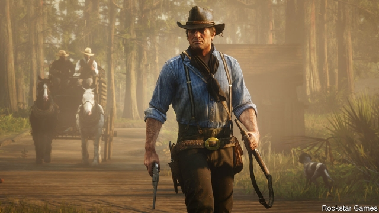

###### Mortal Kombat

# Google launches its game-streaming platform 

 

> print-edition iconPrint edition | Business | Nov 21st 2019 

THE LAUNCH in 2018 of “Red Dead Redemption 2” was a huge event in the history of entertainment. It raked in $725m in its first three days, behind only “Avengers: Endgame”, a recent superhero flick, and “Grand Theft Auto V”, a game from 2013—and that despite being available only to owners of pricey games consoles. On November 19th it became available to an even wider audience with the launch of Stadia, Google’s game-streaming service. 

Google is not the only tech titan to bet that streaming will prove as transformative for the $150bn video-game industry as it has been for music, film and television. This month Microsoft announced new games for its experimental xCloud service, which is due to launch in 2020. It will work with Xbox Game Pass, an existing download-based subscription service that offers more than 100 titles. Amazon is widely assumed to be working on something similar. Big Tech will be battling second-tier players, including Nvidia, a maker of gaming-focused computer chips, and Electronic Arts (EA), a games publisher. Sony, which makes consoles, already offers streaming through its PlayStation Now service. 

Streaming lets anyone with an internet connection play any game by farming out the computational heavy lifting required to run gaming software to cloud servers. It will not replace consoles overnight; both Microsoft and Sony are launching new machines next year. But by offering the option to play blockbuster games like “Red Dead Redemption 2” without paying upfront for hardware, it could lure owners of comparatively feeble devices such as smartphones, tablets and TVs to cutting-edge games. 

Catherine Gluckstein, one of the Microsoft executives in charge of xCloud, points out that of the 5bn people who own smartphones, about half dabble in cheap-and-cheerful mobile games. Next year xCloud tests will be expanded to India, where consoles remain a luxury but internet no longer is; more than 500m Indians enjoy access to the web, mostly on their phones. Michael Pachter of Wedbush, an investment firm, thinks streaming’s worldwide expansion could triple the size of the gaming market to nearly $500bn by 2030. 

 

If, that is, the companies can pull it off. Streaming a film or a song is straightforward. Data can be downloaded ahead of time to smooth out connection hiccups. Not for games, which must react instantaneously to players’ moves and vice versa. Even with a rock-solid connection (which most mobile ones are not) commands take time to travel from the controller to the data centre and back. This can introduce annoying delays. And distributing games the old way, via physical disks or downloads, is cheap, whereas providing high-end, game-capable computing in the cloud is not, notes Piers Harding-Rolls, an analyst at IHS Markit, a research firm. A decade ago early attempts at game streaming flopped precisely because of high prices and iffy technology. 

All eyes are now on Google. Like Amazon and Microsoft, it owns a worldwide network of cloud-computing data centres, which could help surmount technological niggles. But unlike Microsoft or Sony, it lacks deep roots in gaming. And in contrast to Amazon, whose 100m Prime subscribers could, Mr Patcher thinks, be offered games as part of their membership, it must build a customer base from scratch. 

Stadia’s debut could have gone better. Promised features have been delayed. Prices remain high: early adopters must pay $129 for a controller and $10 a month for a subscription, and then fork out some more for individual games. (A subscription-free option, with less fancy graphics, will launch in 2020.) 

Most worrying, Google has struggled to convince publishers to sign up. Just 22 games were available at Stadia’s launch. The test version of Microsoft’s xCloud features over 50. Sony’s PlayStation Now has over 650 games (although some are over a decade old and the service is available only on PCs and the PlayStation). For all its heft elsewhere, in gaming Google continues to look like a bit player. ■ 

