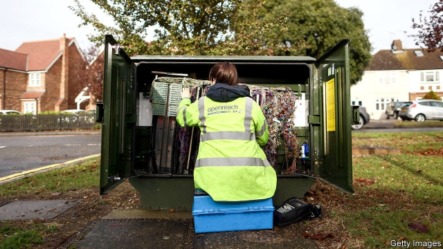
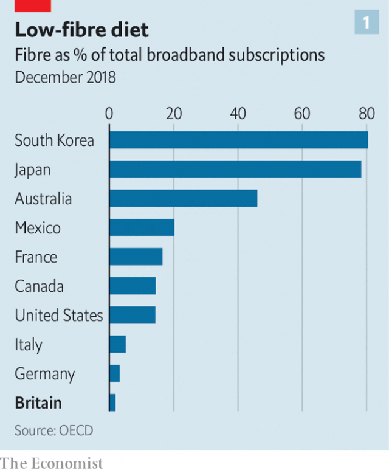
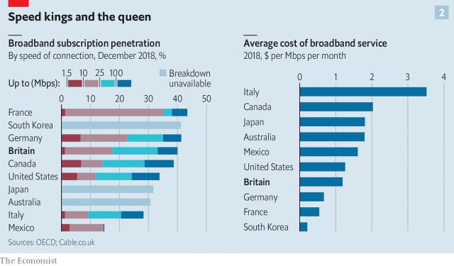

###### Political bandwidth

# Nationalising BT may not improve Britain’s broadband 

 

> print-edition iconPrint edition | Business | Nov 23rd 2019 

IN 1990 BRITISH TELECOM (BT), a former state-owned monopoly, was in the early stages of upgrading its copper wires to fibre-optic cables. Its plans were scotched by the Conservative government of the day, worried that it would damage the competitiveness of other firms in Britain’s newly liberalised telecoms markets. Three decades on, broadband is once again a hot-button election issue. The opposition Labour Party wants parts of BT to be renationalised—and a full fibre-optic upgrade to be completed. British Broadband, as the new entity would be called, could then offer free connectivity to every citizen and firm. 

Labour thinks state control could lift Britain in global fibre-optic rankings. The OECD, a rich-country club, puts it 35th out of 37 countries in its use of the technology, which allows far higher speeds than copper wires (see chart 1). The government has already pencilled in £5bn ($6.5bn) to raise fibre’s share of broadband. 

On top of nationalisation, Labour wants to boost this pot to £20bn and to maintain the new network via a tax on technology firms that furnish services over it. Nationalised industries are not always inefficient, Labour says. Jeremy Corbyn, its leader, has compared the project to the National Health Service, which achieves passable results while spending less per person than most other rich-country health systems. 

 

It is true that some of the speediest nations have been more willing to spend and to prod private firms than Britain has, which for decades has relied on opening up BT’s core network so that other firms can piggyback off it as the main mechanism to improve standards. But wiring up a rich microstate like Singapore or San Marino is a doddle compared with doing the same in sparsely populated Scotland. So is hooking up flats, which are more popular in continental Europe than in Britain. 

Perhaps the closest comparison would be with Australia’s state-run National Broadband Network, which also promises a high-speed connection to every home (though consumers must still pay private internet-service providers to connect to it). It is late and its costs have risen from A$30bn in 2013 (then $29bn, and 1.9% of GDP) to A$51bn today, which is 2.6% of GDP. Critics call it a wasteful mess. Even defenders say it has become a political football. 

 

British broadband is not quite as awful as the fibre figures imply (see chart 2). Different comparisons of broadband speeds give different results, though most put Britain behind other rich countries. On the other hand, prices are reasonable. And though ultra-fast connections are rare by international standards, so are truly sluggish ones. Such digital equality should please the egalitarian Mr Corbyn.■ 

