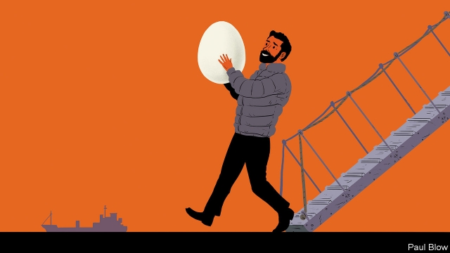

###### Bartleby

# Refugees make great entrepreneurs and workers 

 

> print-edition iconPrint edition | Business | Nov 21st 2019 

MOHAMMED RAHIMEH left Damascus in December 2015, rather than be conscripted into the Syrian army. His journey to London took him through Lebanon and Greece and included 11 months in the notorious “Jungle” camp in Calais. Despite leaving Syria with no cooking qualifications or English skills, he is now in the process of setting up a food business in Britain. 

History is replete with immigrants who have brought economic skills with them, from the Flemish weavers who came to England in the 14th century to the millions of Europeans who emigrated to America in the late 19th. Today’s migrants also have plenty to offer, if only the authorities will let them work. 

While he was waiting for his asylum claim to be processed in Britain, Mr Rahimeh wasn’t allowed to take a job. But he did develop his cooking skills, focusing on a recipe involving eggs, onions, tomatoes and spices. With the help of Alexandra Simmons, a volunteer he had met in Calais, he set up Mo’s Eggs, a business that offered a Syrian brunch. He was able to take advantage of a trend for pop-up restaurants, venues that only exist for a day every week or month. 

The first site was a pizza restaurant in Archway, in north London, and his first event was Ms Simmons’s 30th birthday party. He served around 60 people every month until the venue closed, but will soon open a new place in Tooting Broadway, in the south of the city. In the interim, he has been working at a market stall to learn more about the food trade. 

This is what immigrants tend to do; they work hard so they can rebuild their lives and they spot niches in the market that others might miss. A similar path was followed by Majeda Khoury, a human-rights activist who made her way from Damascus to Britain. She learned to cook thanks to a charity called Migrateful and prepares food associated with different Syrian cities; a favourite dish in Damascus, harak osbao, features lentils and pasta with tamarind, coriander, garlic and pomegranate molasses. Now she runs catering at big events for charities that want to focus on Syria. 

Both Ms Khoury and Mr Rahimeh benefited from sales and marketing training by the Enterpreneurial Refugee Network (TERN), a charity. Charlie Fraser, TERN’s co-founder, says the aim is to launch 1,000 refugee-led businesses in Britain by 2025. 

It is very hard for refugees to start a business when they cannot leave the camps in the first place. Paul Hutchings is trying to help those people who are stuck. He used to be a market researcher, before going to Calais to help refugees in 2008. In 2016 he set up Refugee Support, another charity, which has been involved in camps in Bangladesh, Cyprus, Greece and Mexico. 

The model is to promote dignity rather than dependence; instead of just handing out food and clothes, the charity set up a shop. It created tokens so residents could buy their own things. Dina Nayeri, a former refugee, says this is very important; at one camp she attended, people had to search through piles of old clothes that were dumped on the floor. Ms Nayeri says that many refugees struggle with trauma, feelings of shame and inferiority and the expectations of other people that they should always be grateful. After she made it to America, Ms Nayeri became a writer, publishing two novels and a non-fiction book, “The Ungrateful Refugee”. 

Dignity also requires that refugees find work. If they stay in the camps, they qualify for grants from the EU but the risk, Mr Hutchings says, is that they become institutionalised. At first, Refugee Support tried to give microloans to let people set up small businesses. But this ran into a regulatory brick wall. 

So instead, Mr Hutchings rented a building, now called the Dignity Centre, where people can learn skills. One of the projects is a sewing co-operative which has 18 machines, where refugees make bags, cushion covers and aprons. The charity provides the material, machines and electricity and sells the goods online at Refumade.org; each item comes with a message about the person who made it. The sewing workers are mostly women. For the men, the charity has set up a bicycle-sharing scheme in Cyprus to help them find work away from the camps. 

The refugees Bartleby spoke to had undergone an immense struggle to reach their current position. Their determination to make something of their lives was truly striking. That is the kind of work ethic any company, and any country, ought to value.■ 

