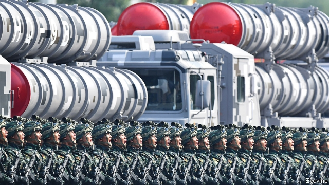
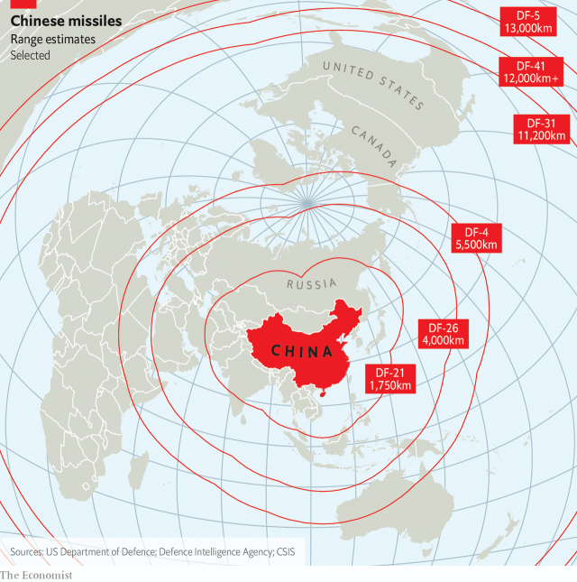

###### Warheads up

# China’s nuclear arsenal was strikingly modest, but that is changing 

 

> print-edition iconPrint edition | China | Nov 21st 2019 

“I’M NOT AFRAID of nuclear war,” boasted Mao Zedong, China’s leader, in Moscow in 1957. Mao noted that even if half of China’s population were to perish in a radioactive inferno, 300m would remain. His Soviet hosts, who were hardly known for their softhearted devotion to human rights, were shocked. Yet despite Mao’s insouciance, China did not follow America and Russia into the arms race that saw them pile up 60,000 nuclear weapons in the three decades after that speech. 

China is a military behemoth, but a nuclear minnow. It accounts for well over half the increase in global defence spending since 1990, but its nuclear stockpile is just 2% of the world’s total, with a paltry 290 bombs—about the same as France or Britain. Nor does it have much to deliver them with. The country is thought to have fewer than 90 launchers for its land-based missiles (compared with America’s 400) and just 20 nuclear-capable bombers (America has 66), according to the Federation of American Scientists, a research group. 

China’s nuclear modesty is striking in other ways, too. America and Russia both keep their weapons on high alert, with nuclear warheads attached to missiles even in peacetime. They reserve the right to be the first to use nuclear weapons in a conflict. And they have lots of tactical weapons (less destructive ones) that can be used on the battlefield instead of against cities. 

The PLA Rocket Force—the unit in charge of nuclear weapons—does not appear to do any of this. It is not thought to keep warheads attached to missiles, even though that makes them slower to use and more vulnerable to pre-emption in a crisis. China also says it has a policy of No First Use, meaning that it would launch nuclear weapons only in retaliation for a nuclear strike from another country (although American officials are sceptical). And it does not seem to have any tactical nuclear weapons, perhaps because it doubts they could be used without escalating a conflict. 

China has a conservative view of deterrence. “China’s attitudes toward nuclear weapons have remained relatively constant from Mao Zedong to Xi Jinping,” note Fiona Cunningham of George Washington University and Taylor Fravel of MIT. “China has sought to maintain the smallest possible force capable of surviving a first strike and being able to conduct a retaliatory strike.” But what has sufficed in the past may not in the future. 

 

When President George W. Bush pulled America out of the 30-year-old Anti-Ballistic Missile (ABM) treaty in 2002, China was alarmed. The missile defences that he was withdrawing to develop would have little hope of intercepting thousands of Russian missiles at once, but they might be capable of swatting away a relatively paltry volley from China. Barack Obama continued to invest in missile defence. Then Donald Trump doubled down, spending over $10bn on missile shields in 2019 and pursuing exotic schemes like space-based lasers to zap missiles. China was particularly incensed by America’s deployment of a THAAD missile-defence system in South Korea in 2017, whose radar, Chinese experts argued, would be able to peer into their country and distinguish real warheads from decoys. 

At the same time, America intensified work on long-range conventional missiles that could hit any spot on Earth with great accuracy within an hour. The Pentagon is pouring billions of dollars into hypersonic gliders that can do just this (China is building these too, but its own gliders seem to lack the range to hit America). 

China fears that such weapons might wipe out most of its warheads and launchers. Even rudimentary American missile-defences would then be able to mop up the “ragged retaliation” from China’s surviving nukes. Many American strategists reckon that this strategy—known as damage limitation—is preferable to accepting mutually assured destruction. America believes that this possibility gives it a psychological advantage in any crisis. 

In response, China seems to be coming out of its nuclear shell. For one thing, it is making its weapons more nimble. At a parade to mark 70 years of Communist rule on October 1st, the star of the show was the DF-41 missile. It is thought to be China’s first road-mobile (ie, easy to hide) and solid-fuelled (ie, quick to launch) missile that is capable of hitting any part of America. 

Chinese missiles are also being stuffed with more warheads, which makes it easier to overwhelm and bamboozle missile defences. And China is steadily working towards longer-range nuclear missiles for its submarines. That allows it to strike America from the safety of its own waters. 

Because new weapons require warheads, nuclear modernisation is also driving nuclear expansion. China’s armed forces “doubled their nuclear arsenal in about the last decade, and they’re on track to double it again in the next decade”, noted Rear Admiral Michael Brooke, director of intelligence for America’s Strategic Command, in August. Though 600 warheads would still be just a tenth of the American or Russian total, it would increase pressure on China to join arms-control talks with those countries. 

As China makes its nuclear forces more credible—less vulnerable to pre-emption, and more likely to get through missile defences—America grows nervous, argues Caitlin Talmadge of Georgetown University. If America cannot hope to destroy most of China’s missiles, then it cannot easily threaten China with a nuclear strike without putting its own cities at risk. American policymakers worry this will embolden China and unnerve American allies like Taiwan and Japan. 

American leaders might then “ramp up competition further”, suggests Ms Talmadge, spending yet more on missile-defence and offensive weapons to restore their advantage. That could tip China into another bout of nuclear expansion—and so on. “Nuclear competition between the United States and China is almost certain to intensify,” she concludes. 

Such competition might be especially unstable because the two rivals have wildly different views of nuclear strategy, according to a recent paper by Ms Cunningham and Mr Fravel in the journal International Security. Chinese officials are overconfident about their ability to prevent a conventional war from turning nuclear, they argue, while American ones are overconfident about their subsequent ability to keep a nuclear war limited in scope. Making things worse, the two countries lack a dedicated nuclear dialogue, largely because China is wary of giving away too much information. For now, China’s parades are doing the talking. ■ 

