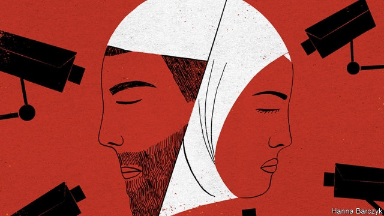

###### Chaguan

# Few Chinese officials are blushing at a damning leak about Xinjiang 

 

> print-edition iconPrint edition | China | Nov 21st 2019 

CHINA WAS this week confronted with documentary evidence that it has built a vast and cruel police state in its far-western region of Xinjiang. In what appears to be an extraordinary leak of official Chinese papers, the New York Times published secret speeches by President Xi Jinping urging that Muslims infected with the “virus” of extremism undergo “a period of painful, interventionary treatment”. The leak lays bare the cold-blooded bureaucracy required as China, starting in 2017, seized hundreds of thousands of Muslims, most of them from the Uighur minority, and locked them without trial in re-education camps for even modest acts of piety, from growing long beards to praying outside state-controlled mosques. The paperwork of repression includes a script to be used on youngsters whose parents are behind bars: “Treasure this chance for free education that the party and government has provided to eradicate erroneous thinking.” 

Chinese officials have offered three contradictory responses. The government of Xinjiang called the report a “complete fabrication” cooked up by anti-China forces in the West who cannot bear to see their region succeed. A spokesman for China’s foreign ministry took a more cautious line. Rather than deny the report outright, he called it a “clumsy patchwork” that distorted “so-called internal documents” in order to smear China’s successful counter-terrorism and de-radicalisation policies. The third response offered by state media and some officials is strikingly different. It skates close to an admission that Xinjiang is indeed under iron-fisted rule, and that the world should be glad of it. 

Zhao Lijian is a Chinese diplomat and licensed provocateur with his own account on Twitter, a social-media platform banned inside China. Mr Zhao, who was recently brought back to a senior post in Beijing, took to Twitter on November 18th to denounce Western “preaching”. Taunting the West for being wrong about weapons of mass destruction in Iraq, he declared, “China deserves a big like for showing how to deal effectively with terrorism and extremism in Xinjiang. Toughness and prosperity are a great combination!” That tone was echoed by the Global Times, a tabloid owned by the People’s Daily, the Communist Party’s flagship newspaper. In an editorial paired with a photograph of dancing Uighurs, the tabloid credited “decisive measures” with preventing Xinjiang from becoming another Afghanistan or Chechnya. The Global Times nodded to a strain of thought among nationalist intellectuals and party ideologues, who chafe at the idea that China’s 100m ethnic-minority citizens, and notably restive groups such as Uighurs or Tibetans, should enjoy special privileges as the price of peaceful co-existence with the 1.3bn-strong Han Chinese majority. They favour promoting a collective national identity. 

The Global Times took a bluntly majoritarian line in its editorial, suggesting that when Western elites grumble about Uighurs, they underplay the rights of all Chinese. “The dispute over Xinjiang is a clash between not only two value systems, but also two interest systems. All Chinese people, including people of all ethnic groups in Xinjiang, hope for peace and prosperity in the region. Measures that help reach this goal are in line with morality and justice,” opined the Communist Party tabloid, which has been at the forefront of the more candid, defiant line on Xinjiang. 

It may sound counter-intuitive, given the risks that Uighur activists, exiles and Western researchers run to bring information about Xinjiang to the outside world, but honesty may turn out to be harder for the West to handle than outrageous lies. That is because, judging by the Mr Xi seen in the leaked papers, that unapologetic worldview—China is ruthless, and needs to be—is close to his own. The leaked papers include a secret speech from 2014 in which Mr Xi tells senior officials to shrug off international criticism: “Don’t be afraid if hostile forces whine, or if hostile forces malign the image of Xinjiang.” That was in a time of murderous terrorist attacks by Uighur militants, and in the leaked cache Mr Xi distances himself from predecessors who hoped that economic growth would cure militancy. “In recent years Xinjiang has grown very quickly and the standard of living has consistently risen, but even so ethnic separatism and terrorist violence have still been on the rise,” he noted. In the leaked papers Mr Xi puts his faith in all-pervasive surveillance, strict ideological training and increased flows of Han Chinese settlers into heavily Uighur regions. 

Mr Xi’s lodestar is the absolute authority of the Communist Party. But he may also be understood as a populist, centralising nationalist. And whether Mr Xi is promoting his “China Dream” of national greatness or demanding tighter controls to “Sinicise” Islam, Christianity and other religions, his ideas resonate with many citizens. Chinese public opinion is not monolithic, and the leaked papers reveal how some Han Chinese officials in Xinjiang resisted the new get-tough regime, even quietly releasing Uighur detainees. But ordinary Chinese live amid a pounding drumbeat of nationalism and constant reminders of an unspecified terrorist threat. There are security checkpoints at every airport, railway station and metro stop in China, complete with giant armoured pots like witches’ cauldrons, into which bombs may be popped. There is little evidence that such security theatre is resented. Domestic tourism to Xinjiang has flourished even as police checkpoints and surveillance cameras turned the region into a techno-authoritarian dystopia, with famous Chinese travel bloggers marvelling at how safe the region is. Anti-Muslim paranoia is rampant on the Chinese internet. 

Secret brutality by Chinese authorities was hard enough for the world to deal with. Open, unblushing repression is a still greater headache. Challenging horrors in Xinjiang may involve confronting Chinese public opinion, as well as China’s rulers. It is unclear whether the world has the stomach for that fight.■ 

