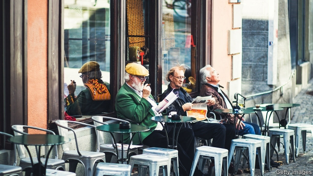

###### A nation of have-beans

# Defending Switzerland’s coffee stockpile 

 

> print-edition iconPrint edition | Europe | Nov 23rd 2019 

TO DEFEND THEIR independence the Swiss have mountains, conscription and a fierce sense of self-reliance. They also have a vast stockpile of food, medicine, animal feed and cooking oil, which they have maintained since the 1920s. This makes sieges easier to withstand, but costs a fortune. So in April the Federal Office for National Economic Supply announced a plan to trim it a little. In future, it suggested, it would no longer pay for a huge emergency supply of coffee. This wonderful drink, it claimed, is not “vital for life”. 

The Alpine nation’s coffee-lovers and sellers choked on their macchiatos. Switzerland’s 8.5m residents sip around 9kg (20lb) of coffee per person annually, twice as much as Americans, according to the International Coffee Organisation. A Swiss breakfast without coffee would be like a Swiss army knife without a tool for removing stones from horses’ hooves. A poll on Twitter (paid for by Migros, a supermarket chain, which owns Delica, a coffee brand), found that two-thirds of respondents could barely imagine a life without coffee. The federal office took note of the outrage and postponed a decision about the plan’s implementation until next year. It may abandon it altogether. 

The 15 big Swiss coffee retailers, roasters and importers, such as Nestlé, are required by law to store heaps of raw coffee. Together, these mandated coffee reserves amount to about 15,000 tonnes—enough for three months’ consumption. The government finances the storage costs through a levy on imports of coffee. All 15 companies are in favour of maintaining the coffee reserve—as long as they are paid for it. 

IG Kaffee, a lobby group, asks why the government wants to scrap a stockpile that has served Switzerland so well. Shortages are possible, it warns. Low water levels of the river Rhine last year, for instance, led to bottlenecks in the coffee supply chain. A longer interruption would have “devastating” consequences for the industry. Moreover, coffee has health benefits, especially in moments of stress, claims IG Kaffee. Quite so. Food shortages, were they to happen, would surely be stressful. Also, the Swiss army can hardly be expected to remain alert without coffee. Come to think of it, is there enough chocolate in case of a national emergency?■ 

