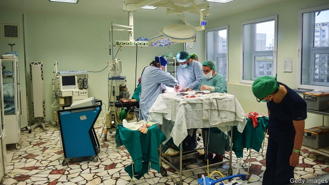

###### Critical condition

# Romania’s health-care system, the EU’s worst, struggles to reform 

 

> print-edition iconPrint edition | Europe | Nov 23rd 2019 

“WE HAVE HIGHER wages, we do not need bribes,” exclaims a poster taped to a glass screen at Slatina County Emergency Hospital in Romania. Five doctors draped in stethoscopes smile encouragingly: “We let corruption suffer, we will cure you!” Still, Romania’s health care consistently ranks as the EU’s worst, according to the Euro Health Consumer Index. Despite wages doubling in the past five years, corruption, underinvestment and an exodus of trained staff are still a plague. 

The culture of expediting care with petty bribes is notoriously hard to root out. Even more worrying, however, are the large sums of money thought to be laundered through heavily marked-up deals with providers of equipment and supplies. In a big case in 2016, Hexi Pharma, a supplier of antiseptics to 350 public hospitals, was found to have diluted them significantly. A report accused hospital directors of taking a 30% cut on contracts. 

Eurostat reckons Romania has the EU’s lowest spending on health care, both per head (a 13th of what Luxembourg, the front-runner, spends) as well as by share of GDP. No new government hospital has been built since communism fell in 1989. The EU has offered $170m to fund construction, but no work has started. So the existing ancient buildings are biological time-bombs. Last December 39 babies were infected with an antibiotic-resistant superbug at one of the country’s best maternity hospitals. Romania has Europe’s highest rate of hospital-acquired infections. 

Though the country produces high numbers of medical graduates, many do not stay to practise. Since joining the EU in 2007, Romania has haemorrhaged 15,000-20,000 doctors, who move in search of better pay. That leaves an estimated third of hospital posts in the country vacant. Only 10% of doctors work in rural outposts that are often understaffed and poorly equipped. As a result, one in four Romanians has insufficient access to essential health care, admits the ministry of health. 

The government is keen to show that progress is being made. Medical salaries are growing faster than those in other sectors, rising from 88% to 122% of the national average in the past five years. As part of a crackdown, doctors are being asked to sign anti-corruption declarations. On July 15th Romania’s then health minister announced that undercover patients are being sent into state hospitals in order to expose corrupt staff. A day later, she announced her first catch. 

But much more must change. Adapting old hospitals to today’s sanitary standards may prove more expensive than building new ones, says Cristian Vladescu, head of the National School of Public Health, though that will be politically hard. Rooting out corruption will take years. Until then, better not get ill in Romania. ■ 

