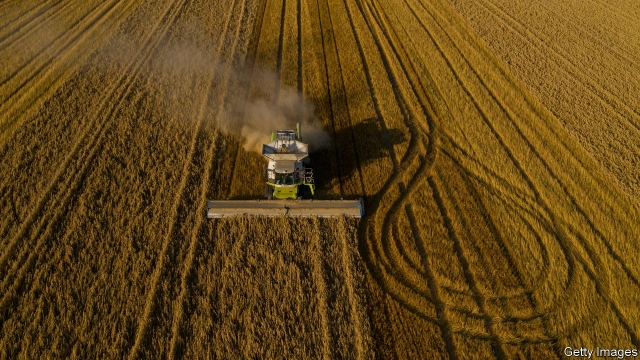
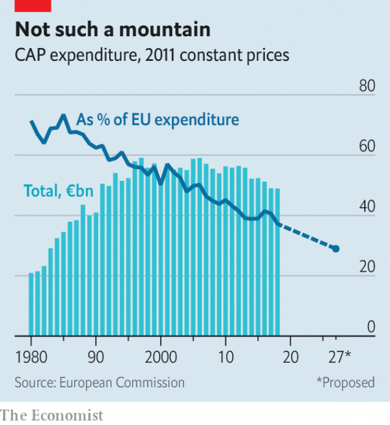

###### Udder waste

# Some farmers are especially good at milking European taxpayers 

 

> print-edition iconPrint edition | Europe | Nov 23rd 2019 

IN THE SUMMER EU member states squabbled over top European jobs. At least the fighting was fairly brief. Not so the agonising deliberations over the EU’s seven-year budget, or the “multi-annual financial framework” (MFF), which have been under way for nearly two years. Officials had hoped to agree a deal by the end of the year. Though the budget was discussed again on November 19th, its chances seem slim. The European Commission has proposed spending €1.1trn ($1.2trn), or 1.1% of the combined national income of the EU27 (excluding Britain) between 2021 and 2027. Frugal governments in the north want to spend no more than 1%. Some others, meanwhile, want to decide the shopping list before they agree on the bill. 

A big, contentious item is agriculture, which gobbles up 37% of spending in the current MFF. Once mocked for creating mountains of butter and lakes of wine, the common agricultural policy (CAP) is less wasteful than it used to be, and has shrunk as a share of overall spending (see chart). The commission wants to shift funds from agriculture to research and technology. That means, for the first time, a cut in absolute terms—of around 5%, says Alan Matthews of Trinity College, Dublin. 

The CAP’s champions, which include France and Ireland as well as eastern European countries, want to maintain current spending. In February Emmanuel Macron, France’s president, told farmers that spending should not shrink even by a euro. But looking at the numbers a different way might cause these countries to think again. 

 

France is often assumed to be keen on the CAP because it gets the most cash. A better measure, though, is to look at receipts as a share of farmers’ income. This is what the OECD, a club of mostly rich countries, does—though it calculates figures only for the EU as a whole. In a new paper, researchers from the Centre for Global Development (CGD) work it out for each member. They look at how much subsidy farmers receive and add an estimate of the protection afforded by the EU’s tariffs, which shelter home produce from foreign competition. 

Seen in this way, the flow of money looks rather different. Latvia does best: a whopping one-third of its farm income comes from EU support. Greece and Estonia also fare well. Although they champion farm subsidies, France, Luxembourg and Ireland fare only moderately well—as does CAP-hating Britain. At the bottom end, Dutch farmers get a mere 7% of their income from EU support. Rather than reflecting deliberate policy choices, these differences reflect the fact that subsidy rates were often linked to historical values of production, or set when a country joined the EU, says Ian Mitchell of the CGD. This might make politicians—and farmers—in some countries more amenable to cuts that make the level of support more uniform. 

That would allow more time for politicians to decide how to spend the money. One question is whether funding should be more closely tied to efforts to reduce greenhouse-gas emissions. John Springford of the Centre for European Reform, a think-tank, notes that farming emissions have been creeping up since 2012, partly because of increases in livestock. But the commission’s cuts seem concentrated, bafflingly, on the part of the agricultural budget that could be used to do so, while sparing farm subsidies. 

In early November an investigation by the New York Times revealed that politicians in Hungary and other central European countries were rigging land sales to capture subsidies or directing EU cash to their chums. That raises the question of whether the EU should monitor its funds more closely. Payments also tend to be linked to a farm’s acreage, meaning that large landowners get the biggest handouts. The commission wants to cap the size of payments, but former communist countries, where farms tend to be large, oppose that. European taxpayers, it seems, will keep getting milked. ■ 

