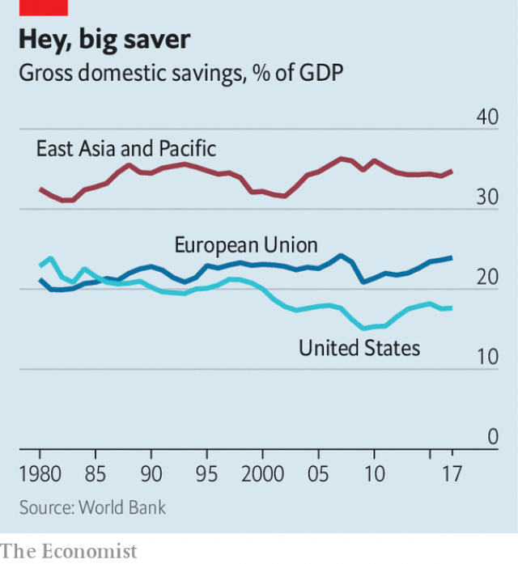

###### Glut maximus

# Excess Asian savings are weighing on global interest rates 

 

> print-edition iconPrint edition | Finance and economics | Nov 23rd 2019 

IT IS NEARLY 15 years since Ben Bernanke, then the chairman of the Federal Reserve, argued that a “global saving glut” had fuelled America’s giant current-account deficit. Much has changed since then. The American deficit has shrunk, oil exporters’ surpluses have dwindled and central banks everywhere have dramatically expanded their balance-sheets. But another feature of the world that Mr Bernanke described in early 2005 looks strikingly familiar: Asia’s stockpile of savings remains enormous, and it is getting bigger by the year. 

For East Asia as a whole, each year gross domestic savings add up to 35% of GDP, and little has changed over the past three decades (see chart). This is not just an academic curiosity. Mr Bernanke’s concern in the early 2000s was that Asia’s excess cash was flooding into bond markets in America and beyond, depressing long-term real interest rates. When the global financial crisis erupted in 2008, some economists pointed to the Asian saving glut as an underlying cause of the housing boom and bust from Las Vegas to Dublin. With interest rates even lower now, some are again asking whether excessive saving in Asia is storing up trouble for the global economy. 

There are certainly echoes with 15 years ago. High savings rates in Asia continue to translate into large current-account surpluses. Over the past five years East Asia’s current-account surplus has averaged about $525bn annually, a touch higher in cash terms than the average in the five years preceding the 2008 crisis. The distribution has shifted: China’s surplus peaked a decade ago, while those of South Korea and Taiwan are bigger than they used to be. The current-account surpluses in Asia’s big economies add up to about 0.6% of global GDP, roughly the same as that of Europe’s surplus economies, including Germany’s, in combination. 

 

“It is one of the main global cross-border flows impacting asset markets and pulling down yields globally,” says Brad Setser, an economist with the Council on Foreign Relations in New York. In the early 2000s the focus was on Asia’s currency reserves, especially China’s, much of which ended up in safe assets such as American treasuries. Now a wider array of Asian investors are channelling household and corporate savings into global markets. But their impact can, in some segments, be more pronounced. 

The IMF calculates that Taiwanese life insurers own 18% of all dollar debt issued by non-American banks. Japanese banks own about 15% of globally issued collateralised loan obligations, potentially risky securitisations of corporate debt. South Korea’s national pension fund, the world’s third-biggest, with nearly $600bn in assets, plans to double its investments in foreign bonds over the next five years. 

Nevertheless, the continued rise in Asian savings looks less harmful from other angles. Most crucially, it has not been accompanied by the same degree of intervention to hold down currencies as in the early 2000s. Then, China was the most flagrant actor. But its central bank is no longer a big buyer of dollars. If anything, its enforcement of capital controls has probably kept the yuan from falling more sharply. Across much of Asia, tolerance for stronger currencies has increased. Of the 60 economies monitored by the Bank for International Settlements, a club of central banks, only 16 have seen their real effective exchange rates rise by more than 5% since 2010; of this small group, seven are Asian. 

Some countries have also taken steps to make their role in currency markets more transparent. America’s Treasury has welcomed decisions by South Korea and Singapore to start publishing regular data about their interventions. That said, other countries are now intervening more heavily. Vietnam and Thailand have started accumulating foreign-exchange reserves at a rapid clip. And Mr Setser has published forensic analysis suggesting that Taiwan’s currency reserves might be 40% bigger than officially declared, because the country’s central bank does not report its exposure to derivatives. 

A broader question is whether Asia should be faulted for its predilection for saving. Take Singapore, which lies at the extreme end with a current-account surplus of 18% of GDP. The IMF argues that the country’s external position is “substantially stronger” than warranted by fundamentals. It has called for the government to spend more on infrastructure and on social security, which would help reduce its citizens’ precautionary savings. 

But Singapore has pushed back against such criticisms. Before the mid-1980s it regularly ran a current-account deficit. Its surplus ballooned as it hit a demographic sweet spot, with lots of workers and few retired people. In the coming years, though, it expects its surplus to narrow as its population gets older. Households will draw down savings and the government will face mounting health-care costs. For China, South Korea and Taiwan, all of which are set to age rapidly, the dynamics are likely to be similar. 

Economists also continue to question how much blame Asian savers really deserve for the global financial turmoil of 2008. There were plenty of other culprits. They included America’s lax mortgage regulations and Europe’s rash banks, which borrowed heavily and scooped up dangerous debt products. Once again, the West is doing much on its own terms that is alarming enough, from America’s trade wars to Europe’s inability to muster a co-ordinated fiscal response to its economic woes. Surplus savings in Asia are yet another drag on a world suffering from weak demand. But of all the things to worry about, they are not top of the list. ■ 

