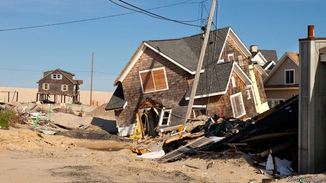

###### Sunny days

# Firms that analyse climate risks are the latest hot property 

 

> print-edition iconPrint edition | Finance and economics | Nov 23rd 2019 

SOON AFTER Hurricane Sandy battered Manhattan in 2012, Emilie Mazzacurati founded a firm in California to analyse the risks posed by climate change to business. She called it Four Twenty Seven, after the state’s target of lowering annual greenhouse-gas emissions to the equivalent of 427m tonnes of carbon dioxide by 2020. That reference quickly became outdated. The target was adjusted for technical reasons two years later, and rendered moot in 2018 by the announcement of a net-zero goal. Ms Mazzacurati is still happy with the name, though. “That is the risk of doing business in an uncertain climate,” she says. 

Such uncertainty has sent financial firms scrambling to buy climate-service providers, as such firms are known. In July Moody’s, a credit-rating agency, bought a majority stake in Four Twenty Seven. In September MSCI, an equity-index maker, snapped up Carbon Delta, a climate-service startup. Wells Fargo invested in Climate Service. In March CO-Firm, based in Hamburg, was bought by PwC, a consultancy. In a funding round earlier this year Jupiter Intelligence, another climate-data outfit, added three insurance firms to its backers. 

Most climate-service firms are small startups led by scientists. They use public climate data, usually couched in meteorological terms—that a certain land mass, say, will become on average 1°C hotter over the next ten years. That is fed into economic models, which the firms use to put a dollar value on the risks climate change poses to properties and businesses, usually over the coming five or ten years. 

On such a timescale the range of estimates for the impact of global warming should be quite narrow, says James McMahon of Climate Service. To handle unpredictable inputs, such as whether a city will decide to build sea walls, climate-service firms offer a range of scenarios. 

One reason for the buying spree is that acquirers want to apply climate analysis to their own books. Four Twenty Seven recently found that about a fifth of all local-government debt rated by Moody’s in America is exposed to high heat stress. Borrowers’ creditworthiness will be affected by climate-related costs such as air conditioning, lower labour productivity and lower agricultural output. 

Another factor in the spree is a coming surge of new clients for climate services. Policymakers are gearing up to make financial institutions disclose the climate risks they face. At a UN summit in September Mark Carney, the governor of the Bank of England, argued for mandatory disclosure of such risks to investors and regulators. France already has such a law. Britain, Canada and the EU may follow soon. 

Many companies are unprepared. A recent survey by HSBC found that about two-fifths of companies were disclosing climate-related risks in line with the expected rules. A poll of signatories to the Principles for Responsible Investing, a UN-supported group of investors with $90trn under management, found similar gaps. 

Rather than buying climate intelligence, some companies are training their own staff. Earlier this year AllianceBernstein, an American fund manager, sent 35 portfolio managers on a course on climate risk at Columbia University. Columbia has trained analysts from pension funds and major banks, says Satyajit Bose, who teaches part of the course. Last year Wellington, an asset manager, announced a tie-up with Woods Hole Research Centre, a think-tank, aimed at improving its climate analysis. 

One problem for the nascent industry is that many climate-service startups come from Silicon Valley, where experimentation is prized. “It’s one thing to have a disruptive app, but it’s a problem when that app is inaccurately predicting climate risk,” says Jesse Keenan of Harvard University. In August the New York Times reported problems at One Concern, an earthquake- and climate-analytics firm. Software updates changed estimates for the cost of disasters; its platform gave inaccurate data on buildings’ structural integrity. Company leaders said that product iteration was common in Silicon Valley and helped customers. But more such stories and the industry’s credibility could suffer, slowing a shift towards data-driven preparation for climate change that is already overdue. ■ 

