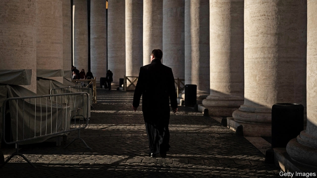

###### Good intentions

# Pope Francis promised to clean up the Vatican’s murky finances 

 

> print-edition iconPrint edition | Finance and economics | Nov 23rd 2019 

AFTER A WEEK of resignations and exclusions, the Vatican faces the very real risk of being reduced once more to the status of an international financial pariah. In the coming days its officials are due to answer a detailed questionnaire for Moneyval, Europe’s anti-money-laundering and anti-terrorist-financing watchdog. The picture they will have to paint could scarcely be less reassuring. 

The Financial Information Authority (AIF)—the Vatican’s regulatory body and the cornerstone of a nine-year campaign to dispel the Holy See’s image as a refuge for hot money and shady dealings—is no longer eligible to receive intelligence on suspected financial crime from its counterparts in other states. The AIF’s president, René Brülhart, has left (the Vatican announced on November 19th that his contract would not be renewed). Half his board has since resigned. And the authority’s director is suspended from duty. 

Earlier this month the Egmont Group, a network of more than 160 national financial-intelligence agencies, barred the AIF from the secure communications system its members use to swap information. The decision, reported on November 20th, was not unexpected. Last month the Vatican’s gendarmes raided the offices of the AIF and the Secretariat of State, the Holy See’s equivalent of a foreign ministry. They were acting on a warrant that had been issued by Vatican prosecutors in connection with a controversial investment in property in London by the Secretariat of State, which had been reported by the auditor-general’s office and the Vatican bank. 

The AIF’s director, Tommaso Di Ruzza, was among several Vatican officials who were subsequently barred from entering the walled city. But why he was targeted remains a mystery. The warrant did not level any specific accusation at him, merely stating that the AIF’s role in the transaction was unclear. The raid on the AIF was all the more controversial because its statutes guarantee protection for the often highly sensitive data it gathers. 

The authority has not had an inventory of the data the police impounded, and has thus been unable to provide the Egmont Group with an assurance that its information is safe. The group has evidently decided it could not run the risk of supplying further information to the AIF, which acts as both a banking supervisor and a financial-intelligence unit. 

“The direct consequence is on the AIF’s role as financial-intelligence unit, which is now dysfunctional,” says Mr Brülhart. “You cannot have an effective system for fighting money-laundering if you can’t exchange information with your international partners.” The authority’s other, supervisory, role will be indirectly affected by the suspension of Mr Di Ruzza and the board resignations, he adds. 

First to go, mere hours after Mr Brülhart, was Marc Odendall, a retired Swiss-German banker, who declared there was no point in staying in an “empty shell”. According to two Vatican sources another of the four board members, Juan Zarate, an American counter-terrorism expert, has since resigned. 

Cock-up or conspiracy? The AIF may simply have got caught in the crossfire of an attack on the Secretariat of State by its internal enemies. But few in the Vatican believe that anything there happens by chance, and there are plenty of people within and beyond its walls who would be happy for it to return to its previous status as a refuge for tax-dodging and other financial shenanigans. 

In any event, the shambles casts serious doubt on the judgment of Pope Francis, who made it a priority of his papacy to clean up the Vatican’s tenebrous financial sector. Speaking to the Wall Street Journal, Mr Odendall said that the raids could not have happened without the pontiff’s approval. “This has been completely managed by the Holy Father from A to Z.” ■ 

