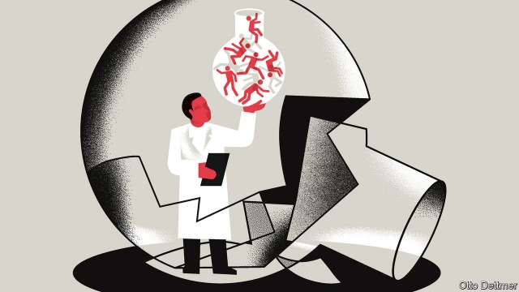

###### Free exchange

# This year’s Nobel prizes prompt soul-searching among economists 

 

> print-edition iconPrint edition | Finance and economics | Nov 23rd 2019 

NOBEL PRIZES are usually given in recognition of ideas that are already more or less guaranteed a legacy. But occasionally they prompt as much debate as admiration. This year’s economics award, given to Abhijit Banerjee, Esther Duflo and Michael Kremer, was unusual both for the recency of the contributions it recognised and the relative youth of the recipients. (For a review of “Good Economics for Hard Times”, by Mr Banerjee and Ms Duflo, see Books and arts section.) Intentionally or not, it has inflamed arguments about the direction of the profession. 

The prize, awarded in early October, recognised the laureates’ efforts to use randomised controlled trials (RCTs) to answer social-science questions. In an RCT, researchers assess the effect of a policy intervention by dividing participants into groups, only some of which are treated with the policy. This year’s winners used RCTs to study the effectiveness of anti-poverty programmes in developing economies. To take one example, Mr Kremer suspected that poor health might depress learning by reducing school attendance. By using randomisation to set the schedule by which different schools’ pupils would be treated for intestinal worms, Mr Kremer and his co-author, Edward Miguel, learned that deworming improved health and attendance—but not test scores. Their work has been highly acclaimed, before the Nobel and after. But strikingly, given its practical success, it has also faced sustained criticism. 

RCT evangelists sometimes argue that their technique is the “gold standard”, better able than other analytical approaches to establish what causes what. Not so, say some other economists. Angus Deaton, himself a Nobel prizewinner, published an essay in October arguing that RCTs deserve no special status, but should be used only when the context demands it. Martin Ravillion, formerly of the World Bank, has pointed out that insistence on RCTs will skew the direction of research, since not all economic questions can be suitably framed. Results are contextually dependent in ways that are hard to discern; a finding from a study in Kenya might not reveal much about policy in Guatemala. 

Then there are ethical quandaries. In a medical context, RCTs were once criticised for denying some participants access to potentially beneficial interventions. Those concerns have largely dissipated as RCTs proved effective at sorting treatments wrongly thought to improve health from those that actually do. Such worries are harder to dispatch in economics. An RCT might test the economic effect of a treatment that is clearly welfare-improving (like deworming medicine), meaning some participants are deprived of that welfare-improving intervention, for a time at least. Power imbalances are also a problem. Participants in rich-world medical trials are typically rich-world citizens themselves, who have, moreover, given informed consent. But Mr Deaton notes that, in development economics, experimenters tend to be well-off, well-educated and “paler” than their subjects. And informing participants in social-science RCTs of the nature of an experiment can change behaviour and bias results. William Easterly, a development economist, has warned against the “technocratic illusion”: the idea that clever people in rich countries can fix poor countries with technical solutions that sidestep the messiness of political action and social reform. 

It takes nothing away from this year’s Nobelists to say that RCTs are a valuable tool when used carefully. Other criticisms are more fundamental. No one questions that policies which reduce illness and improve education in poorer countries are welcome. But some economists suspect that such interventions are merely palliative, rather than steps along a path to sustained development. Advanced economies grew rich as a result of a broad transformation that affected everything from the aspirations of working people to the functioning of the state, not by making a series of small, technocratic changes, no matter how well-supported by evidence. The dramatic decline in global poverty in the past two decades owes more to shifts in global trade, and radical reform in China, than to tweaks to education. As Mr Easterly has argued, RCTs cannot be used to answer the biggest of questions: how do such massive shifts occur? Economists cannot randomly assign one set of institutions to one country and a different set to another. 

Indeed, some economists have a sneaking suspicion that the rise of RCTs represents a pivot not just to smaller questions but also to smaller ambitions. Over the past two decades, economics has unquestionably become more empirical. Stars of the profession today build their reputations on discovering new facts about the economy; giants of the past made their names parachuting into a corner of the economy and summing up its workings in a few neat equations (wrongly, often enough). Researchers are still guided by theory, which shapes the empirical questions that get asked and whether results are interpreted as capturing some deeper aspect of an economy’s nature. But a world in which economists are mostly policy-tweakers—or “plumbers”, in Ms Duflo’s phrase—is very different from the one to which many economists once aspired. 

Paul Krugman, another Nobel laureate, hoped through economics to become like a hero from Isaac Asimov’s “Foundation” science-fiction series, which portrayed a universe in which the mathematical understanding of society was so complete that crises could be predicted with certainty millennia into the future. By comparison, this year’s laureates’ achievements are modest indeed. What critics do not seem to acknowledge is that something bolder might not be possible. The Nobelists’ work could be done only because economists, despite their considerable efforts, do not know how to transform poor countries into rich ones. If they did, there would be no poor villages to experiment on. Some criticisms of RCTs are valid. Others seem little more than an expression of fear: that this is in fact the best that economics can be. ■ 

