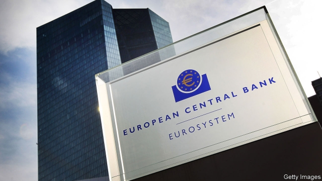
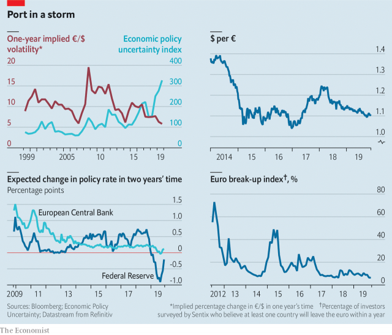

###### Safe haven

# Why currency traders are serene even as Western politics gets messy 

 

> print-edition iconPrint edition | Finance and economics | Nov 23rd 2019 

TRADE WARS; talk of impeachment; the spread of populist politicians and hung parliaments across Europe. It is hardly surprising that an index from Policy Uncertainty, a geopolitical think-tank, puts global economic uncertainty at its highest since the gauge was created in 1997. By contrast, implied euro-dollar volatility is trading at its lowest since the single currency was born in 1999 (see chart). 

Derivative contracts indicate that investors think the currency pair, the most traded asset on financial markets, at $400trn annually, will move less than 6% next year. On November 14th the volatility implied by the cost of “call” and “put” options (contracts that grant the right to buy or sell at a pre-agreed price at some future date) fell below the levels of the serene days before the financial crisis in 2007. 

Why the disconnect? One explanation is monetary policy on both sides of the Atlantic. The Federal Reserve started to tighten in 2013, tapering its quantitative-easing programme and, from 2015, raising interest rates. In July its first rate cut since 2008 marked a policy U-turn. Its chairman, Jerome Powell, cited global uncertainty as the main reason. In September the European Central Bank (ECB) cut rates for the fifth time over the same period, to -0.5%. 

 

The two central banks’ differing monetary-policy trajectories sent the dollar up— and the euro down. As a result, a greenback buys 22% more euros than in 2014. Now, however, the two currencies have stopped being dragged in opposite directions. Markets forecast no policy change from the ECB in the next two years, and just one rate cut from the Fed. 

A second explanation is that no matter how rocky geopolitics has become, the turbulence pales into insignificance compared with fears during Europe’s sovereign-debt crisis that the single currency would break up. The various debt woes of Cyprus, Greece, Ireland, Italy, Portugal and Spain meant currency traders priced in such risk. A survey by Sentix, a consultancy, asking investors to provide an estimate of the probability that a euro-zone member would leave within 12 months exceeded 70% in July 2012. The potential of an ensuing collapse in the euro caused implied volatility to soar. More recently fears of contagion from Brexit, and the possibility that France would elect a populist president, Marine Le Pen, did the same. 

That nerves have been calmed can be seen in the yield on Italy’s ten-year government bonds. In 2011 it went above 7%; now it sits around 1%. And despite electoral shocks and deadlocks, a break-up of the euro is not on the agenda. The Sentix survey reading is now 6%. But traders should keep their guard up. As in the financial crisis, even when markets seem calm, volatility may come roaring back.■ 

