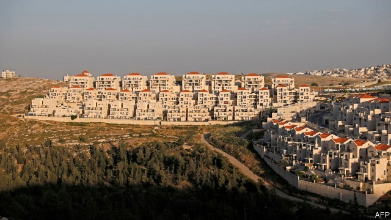

###### Unsettling

# America’s decision to recognise Israeli settlements makes peace less likely 

 

> print-edition iconPrint edition | Leaders | Nov 23rd 2019 

NOT LONG after Israel routed the Arab armies that surrounded it in 1967, Theodor Meron sent a “Top Secret” and “Extremely Urgent” memo to his bosses at the Israeli foreign ministry. Mr Meron, the ministry’s legal adviser, wrote that it would be illegal for Israel to settle the territory that it captured in the fighting. For decades that has also been the view of nearly all Israel’s allies. But Israel built scores of settlements anyway, so that 428,000 Israelis now live in the West Bank (not including East Jerusalem). Recognising that “reality on the ground”, Mike Pompeo, the American secretary of state, made a leap of legal logic on November 18th, saying the settlements were “not, per se, inconsistent with international law” (see article). 

This is merely the latest gift from President Donald Trump to Binyamin Netanyahu, Israel’s prime minister. Others have included recognising the disputed city of Jerusalem as Israel’s capital and accepting its sovereignty over the occupied Golan Heights. These gestures seem intended to please Israel-loving evangelicals in America, and to boost Mr Netanyahu, a right-wing populist akin to Mr Trump. They also embolden Israeli annexationists, who want to take parts of the West Bank unilaterally. That would doom the two-state solution, whereby a Palestinian state would be created in the West Bank and Gaza. It would thus force Israel to make a dreadful choice about its future. 

Israel defends the settlements by noting that Jews have been in the West Bank for thousands of years. Their presence was recognised by the League of Nations in 1922. Moreover, Jordan’s right to rule over the land until 1967 was not widely recognised, and Palestinian sovereignty is disputed. So it is not clear whose land Israel is meant to be illegally occupying. And anyway the legal status of the settlements will be sorted out in a final agreement with the Palestinians, which is likely to include land swaps. Such arguments were enough to convince Ronald Reagan, an American president, that there was nothing inherently unlawful about the settlements, a position cited by Mr Pompeo. Other American administrations took to calling the settlements “illegitimate” rather than “illegal”. 

But the more convincing argument, made by Mr Meron and backed by the UN, the International Court of Justice and most legal scholars, is that the settlements violate the Fourth Geneva Convention, which stipulates that “the occupying power shall not deport or transfer parts of its own civilian population into the territory it occupies.” The reality on the ground that Mr Pompeo ignores is that 2.6m Palestinians live in the West Bank, which most of the world, and even past Israeli leaders, see as part of a future Palestinian state. “You may not like the word, but what is happening is an occupation; it is a disaster for Israel and the Palestinians,” said Ariel Sharon, then prime minister, in 2003. 

Mr Netanyahu, by contrast, courts the pro-settler crowd, who have helped him win four elections. In September he vowed to annex large parts of the West Bank, which no previous prime minister thought wise. Cynics dismissed this as a vote-getting stunt by a politician who is not really ready for annexation. But by giving the enthusiasts a green light, Mr Trump has hemmed in the prime minister—or whoever leads Israel next. The country is in political gridlock after an inconclusive election in September. If Mr Netanyahu forms a government, now or after another poll, he will come under pressure from his coalition to annex the land quickly, while Mr Trump is still in office. The prime minister, who wants his allies in the Knesset to shield him from prosecution on corruption charges, is in no position to resist. 

The settlements pose no less a challenge to Benny Gantz, whose Blue and White party won a plurality of seats. Mr Gantz, a former general who pummelled the Palestinians in Gaza, has failed to form a government of his own. He welcomed the announcement by Mr Pompeo, and may yet team up with some annexationists. But should he succeed in cobbling together a ruling coalition, he will have to grapple with the settlements, too. He has not presented any ideas for doing so. Nor has Mr Trump revealed his own long-promised plan for the “ultimate deal” between Israelis and Palestinians. 

The Trump administration may not realise it, but it is pushing Israel into a dangerous corner. It is not just that the settlements are “an obstacle to peace”, as even Reagan conceded, or that those deep within the West Bank are a financial and security burden on the Israeli state. They also challenge Israel’s character. 

Annexation could eat up so much land that what is left would not leave a coherent or functional Palestine. The resulting death of the two-state solution would present Israel with terrible options in the occupied territories. One path would be to give the Palestinians equal rights and watch as they matched or even outnumbered and outvoted the country’s Jewish population. Another would be to turn them into second-class citizens or corral them in Bantustans, both of which would turn Israel into a place with different laws for different peoples—an apartheid state. ■ 

