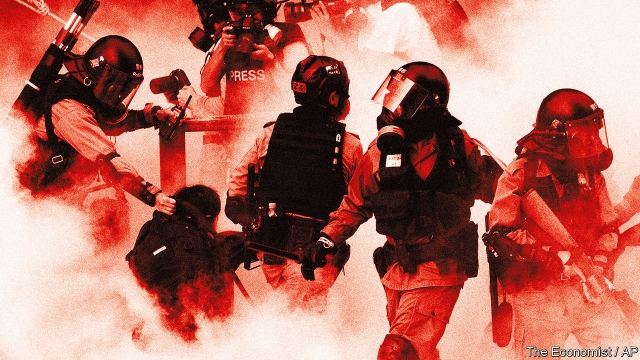

###### Hong Kong in revolt

# China’s unruly periphery resents the Communist Party’s heavy hand 

 

> print-edition iconPrint edition | Leaders | Nov 21st 2019 

A  FEW DAYS ago hundreds of young people, some teenagers, turned the redbrick campus of the Hong Kong Polytechnic University into a fortress. Clad in black, their faces masked in black too, most of them remained defiant as they came under siege. Police shot rubber bullets and jets of blue-dyed water at them. Defenders crouched over glass bottles, filling them with fuel and stuffing them with fuses to make bombs. Many cheered the news that an arrow shot by one of their archers had hit a policeman in the leg. After more than five months of anti-government unrest in Hong Kong, the stakes are turning deadly. 

This time, many exhausted protesters surrendered to the police—the youngest of them were given safe passage. Mercifully, massive bloodshed has so far been avoided. But Hong Kong is in peril (see article). As The Economist went to press, some protesters were refusing to leave the campus, and protests continued in other parts of the city. They attract nothing like the numbers who attended rallies at the outset—perhaps 2m on one occasion in June. But they often involve vandalism and Molotov cocktails. Despite the violence, public support for the protesters—even the bomb-throwing radicals—remains strong. Citizens may turn out in force for local elections on November 24th, which have taken on new significance as a test of the popular will and a chance to give pro-establishment candidates a drubbing. The government’s one concession—withdrawing a bill that would have allowed suspects to be sent to mainland China for trial—did little to restore calm. Protesters say they want nothing less than democracy. They cannot pick their chief executive, and elections for Hong Kong’s legislature are wildly tilted. So the protests may continue. 

The Communist Party in Beijing does not seem eager to get its troops to crush the unrest. Far from it, insiders say. This is a problem that the party does not want to own; the economic and political costs of mass-firing into crowds in a global financial centre would be huge. But own the problem it does. The heavy-handedness of China’s leader, Xi Jinping, and public resentment of it, is a primary cause of the turmoil. He says he wants a “great rejuvenation” of his country. But his brutal, uncompromising approach to control is feeding anger not just in Hong Kong but all around China’s periphery. 

When Mao Zedong’s guerrillas seized power in China in 1949, they did not take over a clearly defined country, much less an entirely willing one. Hong Kong was ruled by the British, nearby Macau by the Portuguese. Taiwan was under the control of the Nationalist government Mao had just overthrown. The mountain terrain of Tibet was under a Buddhist theocracy that chafed at control from Beijing. Communist troops had yet to enter another immense region in the far west, Xinjiang, where Muslim ethnic groups did not want to be ruled from afar.  

Seventy years on, the party’s struggle to establish the China it wants is far from over. Taiwan is still independent in all but name. In January its ruling party, which favours a more formal separation, is expected to do well once again in presidential and parliamentary polls. “Today’s Hong Kong, tomorrow’s Taiwan” is a popular slogan in Hong Kong that resonates with its intended audience, Taiwanese voters. Since Mr Xi took power in 2012 they have watched him chip away at Hong Kong’s freedoms and send warplanes on intimidating forays around Taiwan. Few of them want their rich, democratic island to be swallowed up by the dictatorship next door, even if many of them have thousands of years of shared culture with mainlanders. 

Tibet and Xinjiang are quiet, but only because people there have been terrorised into silence. After widespread outbreaks of unrest a decade ago, repression has grown overwhelming. In the past couple of years Xinjiang’s regional government has built a network of prison camps and incarcerated about 1m people, mostly ethnic Uighurs, often simply for being devout Muslims. Official Chinese documents recently leaked to the New York Times have confirmed the horrors unleashed there (see article). Officials say this “vocational training”, as they chillingly describe it, is necessary to eradicate Islamist extremism. In the long run it is more likely to fuel rage that will one day explode. 

The slogan in Hong Kong has another part: “Today’s Xinjiang, tomorrow’s Hong Kong”. Few expect such a grim outcome for the former British colony. But Hong Kongers are right to view the party with fear. Even if Mr Xi decides not to use troops in Hong Kong, his view of challenges to the party’s authority is clear. He thinks they should be crushed. 

This week America’s Congress passed a bill, nearly unanimously, requiring the government to apply sanctions to officials guilty of abusing human rights in Hong Kong. Nonetheless, China is likely to lean harder on Hong Kong’s government, to explore whether it can pass a harsh new anti-sedition law, and to require students to submit to “patriotic education” (ie, party propaganda). The party wants to know the names of those who defy it, the better to make their lives miserable later. 

Mr Xi says he wants China to achieve its great rejuvenation by 2049, the 100th anniversary of Mao’s victory. By then, he says, the country will be “strong, democratic, culturally advanced, harmonious and beautiful”. More likely, if the party remains in power that long, Mao’s unfinished business will remain a terrible sore. Millions of people living in the outlying regions that Mao claimed for the party will be seething. 

Not all the Communist elite agree with Mr Xi’s clenched-fist approach, which is presumably why someone leaked the Xinjiang papers. Trouble in the periphery of an empire can swiftly spread to the centre. This is doubly likely when the peripheries are also where the empire rubs up against suspicious neighbours. India is wary of China’s militarisation of Tibet. China’s neighbours anxiously watch the country’s military build-up in the Taiwan Strait. A big fear is that an attack on the island could trigger war between China and America. The party cannot win lasting assent to its rule by force alone. 

In Hong Kong “one country, two systems” is officially due to expire in 2047. On current form its system is likely to be much like the rest of China’s long before then. That is why Hong Kong’s protesters are so desperate, and why the harmony Mr Xi talks so blithely of creating in China will elude him. ■ 

