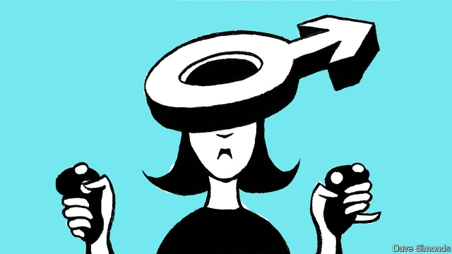

###### One size fits men

# Silicon Valley is bad at making products that suit women. That is a missed opportunity 

 

> print-edition iconPrint edition | Leaders | Nov 23rd 2019 

TAILORS WORKED out long ago that men and women have different shapes. Yet this message has failed to penetrate many other areas of design. Car seatbelts, for example, which date back to the 1880s, are often still configured for men, who tend to sit farther back than women when driving. Most protective gear used by workers is designed for men’s bodies. And today the most forward-looking place on Earth—Silicon Valley—is still embedding old-school bias into new products. 

Consider virtual-reality headsets. Women are significantly more likely than men to feel sick when using them, perhaps because 90% of women have pupils that are closer together than the typical headset’s default setting (see article). This is not an isolated example. Most smartphones are too big to fit comfortably into the average woman’s hand, as are many video-game controllers. 

An obvious part of the explanation for Silicon Valley’s design problem is that men control most of its companies—male-run firms receive 82% of venture-capital (VC) funding—and entrepreneurs often build products to solve problems or address needs that affect them personally. Male bosses and entrepreneurs may be unaware of the problems women face. They may not flag up obvious areas of concern, or ask the right questions when doing their research (famously, Apple did not originally include menstrual-cycle tracking in its smartwatch, or in the iPhone’s Health app). 

Once an idea gets the green light it will then be handled by product-design and engineering teams, three-quarters of whose members are men. These teams often use data to make decisions, but lumping all users together means they may fail to spot trends based on sex differences. Reliance on historical data, and the sparsity of data on underrepresented groups, can also create bias in algorithms. Amazon binned a hiring algorithm that was persistently sexist, and Apple is being investigated over its new credit card, which offers women lower credit limits. 

Next comes testing. Naturally, designers test prototypes on their intended customers, but they may not get feedback from a broad enough group of people. There is also the risk of confirmation bias—designers may listen to what they want to hear, and discount negative reactions from some groups of users. 

Tech’s design bias needs fixing for ethical, safety and business reasons. The ethical imperative is obvious: it is wrong that women have to make do with a “one-size-fits-men” world, as Caroline Criado Perez, a writer, puts it. As for safety, regulators can tackle that by clamping down on things that are dangerous to women—including seatbelts—because they are not designed properly. 

But there is also a powerful business case for avoiding design bias, because huge opportunities are being missed. Women are 50% of the population, and make 70-80% of the world’s consumer-spending decisions. That means they control the deployment of more than $40trn a year. 

Change may be coming. The first voice-recognition systems struggled to understand female voices, but most now manage just fine. “Femtech” startups, which focus on women’s health and well-being, may raise $1bn by the end of this year. VC funds and tech firms are recruiting more women. Ensuring that products are designed for everyone would lead to happier and safer customers. For the companies that get it right, that means higher profits. What is holding them back?■ 

