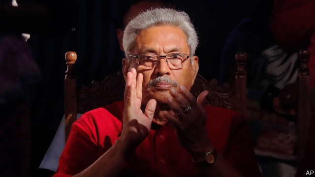

###### Oh brother

# Sri Lanka’s new president has a worrying past 

 

> print-edition iconPrint edition | Leaders | Nov 23rd 2019 

AS SRI LANKA’S long civil war was drawing to a close in 2009, the army surrounded 100,000 civilians on a tiny sliver of beach, barely three square kilometres in size. Mixed in among them were a small number of separatist guerrillas, the remnants of a once-formidable force that had been battling for an independent state for the country’s Tamil minority for 26 years. The insurgents had no compunction about using innocent villagers as human shields. The army claimed to have more scruples: it had designated the area a “no-fire zone”, where civilians could safely gather. Nonetheless, it continued to shell the beach mercilessly. The UN warned that a humanitarian disaster was unfolding and urged the government to declare a ceasefire, to no avail. In the end resistance crumbled and the army took control. But the beach was left piled with bodies, with more floating in the adjacent lagoon. The number of civilians who died in the final phase of the war, the UN concluded years later after a long investigation, was probably in the “tens of thousands”. 

Gotabaya Rajapaksa, the man who, as secretary of defence, presided over this horrifying episode, has just been elected president of Sri Lanka (see article). To Sinhalese Buddhists, about 70% of the population, he is a hero. After all, the militia he destroyed was appallingly cruel and bloodthirsty and had tormented Tamils as much as, if not more than, other Sri Lankans. To the 15% or so of the population that is Tamil, however, Mr Rajapaksa’s ends do not justify his means. In Jaffna, the biggest Tamil city, he won just 6% of the vote. 

Mr Rajapaksa tried to reassure minorities during the election campaign. He visited a mosque, for example, in a sop to the 10% of Sri Lankans who are Muslim. But Sinhalese groups with which he is closely aligned kept up a steady anti-Muslim diatribe, especially after suicide-bombings at several churches and hotels at Easter killed more than 250 people. Tellingly, the only district where Tamils are a minority that Mr Rajapaksa failed to carry was Ampara, where Muslims are the biggest group. 

When asked about the past, Mr Rajapaksa parries, saying that it is more important to think about the future. People in his circle admit that he made mistakes, but promise that he will do things differently this time. Many businessmen, in particular, are thrilled at the outcome of this election. They are hoping for a period of decisive economic management, after four years of bickering and dithering. 

It may be that Mr Rajapaksa proves a good economic manager, although the record of his brother, Mahinda, who was president from 2005 to 2015 and whom Gotabaya intends to appoint as prime minister, was mixed. Sri Lanka certainly needs to get on with post-war reconstruction, which has proceeded distressingly slowly and would benefit from a more efficient, driven government. 

For the most part, though, Sri Lanka does not need a strongman. It has been remarkably peaceful for a decade, despite the carnage at Easter. If there is a pressing concern about security, beyond the hunt for terrorists, it is that the sort of Sinhalese nationalists at whom Mr Rajapaksa has been winking will resort to mob violence. Anti-Muslim riots have taken place not only after the bombings this year, but also in 2014 and 2018. 

The election results show that Sri Lanka is still ethnically polarised. If Mr Rajapaksa really wants to demonstrate that he is a changed man, he should start by reassuring minorities. It is encouraging that he has said he sees himself as president for all Sri Lankans, not just those who voted for him. But for every gesture of unity, there has been a contrary, sectarian one. For example, Mr Rajapaksa chose to be sworn in at a Buddhist temple. 

The end of the war, however bloody, held out the hope of a peaceful and prosperous future for all Sri Lankans. It would be tragic if Mr Rajapaksa undermined his own achievement by inflaming the divisions of the past. ■ 

