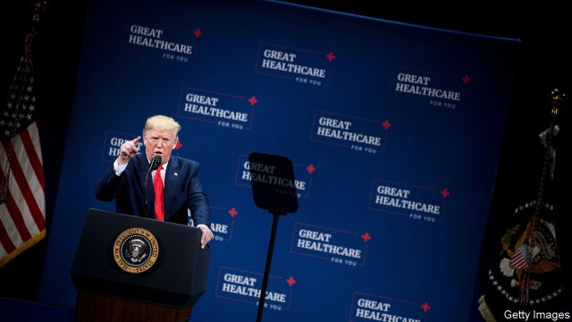
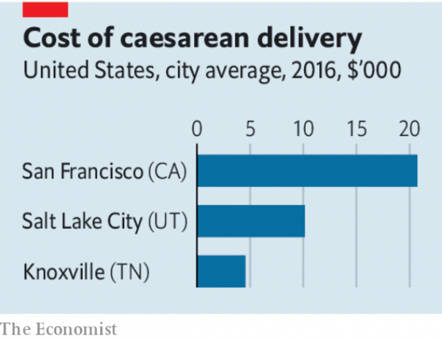

###### President Trump tries to cut health-care costs

# Tackling America’s giant hospital bill 

 

> print-edition iconPrint edition | Leaders | Nov 23rd 2019 

THE HEALTH-CARE system in America has long suffered from two grave problems. The first is that not enough people have reasonable access to medical treatment if they fall ill. President Barack Obama tackled this with his landmark reforms in 2010, which succeeded in extending coverage to some 20m Americans who previously lacked insurance. Mr Obama cut a deal with America’s powerful health-care lobbies and built a grand coalition for reform that included hospitals, insurers and Big Pharma. The law was passed after an epic battle in Congress. 

Unfortunately, since that success the second problem—exorbitant costs—has spiralled even further out of control. Health spending has risen from 17.3% of GDP before Obamacare was passed to 17.9% today. The average figure for rich countries is 9%. Now President Donald Trump is aiming to slay the monster. On November 15th he announced plans to require hospitals and insurance firms to disclose the true prices they charge. More transparency is a vital step in ending the health-care racket. But the plan will not work unless there is also a drive to boost competition in rigged local hospital markets. 

Mr Trump has correctly identified a big villain behind health-care cost inflation, and it is not Big Pharma. Hospitals account for over 30% of health-care spending, whereas drugs account for less than 15%. Add in doctors and related professional services, and the share rises to over half. Hospital costs have been climbing by roughly 5% a year of late, compared with 1% for drugs. 

 

This reflects pricing strategies that make Mount Rushmore look transparent. Patients and their insurance firms pay for advice and procedures provided by practitioners and hospitals. Exactly how much is a lottery. A mammogram can cost $150 or $550 in Philadelphia, depending on which provider you choose, but your hospital and insurer will not tell you that price in advance. A scan of your lower back can cost just $150 in Louisiana but more than $7,500 in California. Insurers receive big—but secret—discounts on list prices from hospitals and doctors. 

Patients who are fed up have little choice. The hospital industry has consolidated in a wave of more than 680 mergers since 2010 (see article). Many cities and regions are dominated by one or two big hospital operators. A recent study found that, by a standard measure, over three-quarters of hospital markets rank as “highly concentrated”. Hospital chains have also been acquiring physicians’ practices in order to create large, vertically integrated health-care outfits that dominate their local market. Privately run hospital firms thrive on opacity and consolidation, which boost earnings. The motives of non-profit hospital organisations that are ostensibly run in the public interest are harder to fathom, but presumably some want to expand their empires and to boost revenues so that they can pay their senior medical staff and managers more. 

In order to create more transparency, Mr Trump’s new rules mean that hospitals will say what they really charge insurance companies by 2021 and will create a price list for 300 or so common procedures, to allow patients to shop around. Insurance firms will have to make public the actual prices they are charged for services, after they have negotiated discounts. The rule changes do not need approval from Congress, although they will probably be challenged in the courts. 

It is a good start, but reform needs to go further. Health care is not a normal market. Consumers are often not price-sensitive—you do not haggle during a heart attack. People with decent insurance plans are not directly on the hook for the vast majority of their costs. And the industry’s cosy structure means that transparency could backfire. For example, rather than expensive hospitals cutting prices, cheap ones in a market without competition might raise theirs instead, once they realise just how much insurers have been willing to pay. 

Mr Trump should build on an innovative experiment in California that uses reference pricing to encourage patients to choose less expensive providers or insist that hospitals benchmark their prices to those in the most efficient and competitive hospital markets. The government also needs to stiffen the daily penalties for hospitals that fail to comply with the new rules beyond the current, paltry $300 fine. 

At the same time a big drive is needed to inject more competition into local hospital markets. This means blocking more medical mergers and may ultimately require unwinding deals that have already happened, in order to ensure that patients have a genuine choice. This in turn may demand new laws that reboot America’s rickety antitrust regulators. As in other consolidating industries, from airlines to telecoms, they have let the public down with dire consequences. 

Mr Trump deserves credit for taking on a demon that none of his predecessors dared to touch. But transparency will not count for much unless it is accompanied by strong and creative efforts to weaken the grip of America’s medical oligopolies.■ 

