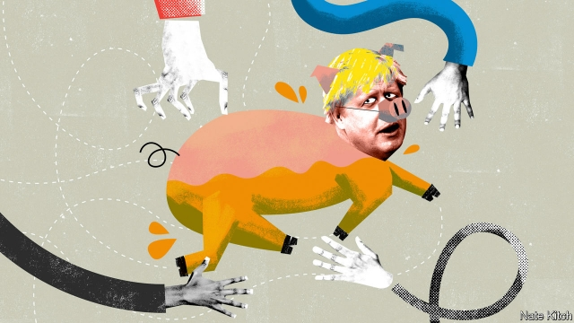

###### On the MBA, religion, wind power, British prime ministers, Romania, “Seinfeld”

# Letters to the editor 

> Nov 23rd 2019 

 

In reference to “The MBA, disrupted” (November 2nd), the most valued faculty at business schools are academics whose publications have most influenced their field, which to a large extent comes from writing in the more distinguished journals. Indeed, the desire to teach the same course instead of developing new ones reflects a desire to clear academic time for research and writing. So inventing new MBA programmes is a time-demanding activity that is generally avoided by faculty when possible. 

Salaries and reputations strongly reflect publication activity. The salaries of deans strongly reflect their success at raising funds. Expecting business programmes to revise their practice and allocate substantial time and resources specifically to “thinking outside the box” in order to “spearhead the next management revolution” is, unfortunately, unlikely to happen. 

THOMAS DYCKMANProfessor emeritusCornell UniversityIthaca, New York 

You stressed the need for business schools to change, yet The Economist’s own MBA ranking perpetuates the status quo because of its unhealthy obsession with graduates’ salaries. Companies now recognise that profit maximisation is not the sole purpose of business, so you should acknowledge that the quality of an MBA is not solely determined by the money a graduate can earn. To do otherwise encourages business schools to recruit only a certain type of student who will pursue a certain type of career. The schools at the top of your ranking understand these incentives very well. Expecting them to embrace a purpose-driven view of capitalism is like asking turkeys to vote for Thanksgiving. 

SAUL KLEINDeanGustavson School of BusinessUniversity of VictoriaVictoria, Canada 

 

Banyan dismissed Australia’s proposed religious discrimination bill as “virtue-signalling by the political right” (November 2nd). Rather, it is intended to help secure a fundamental freedom in a country where more than 60% of the people retain a religious affiliation. The bill would have been unnecessary had it not been for the intolerant actions of the secular left, determined to silence and shame religious believers who dare to voice their beliefs in public. 

Few would be surprised if an environmental group chose not to employ an advocate of fossil fuels. Yet arms are thrown up in horror when a religious school asks its staff to be sympathetic to the doctrines of the religion in question. A doctor or a pharmacist may argue that religious belief justifies their refusal to provide a service, but if challenged in court, they will need to show that it was religious belief, and not merely prejudice, that informed their actions. 

Not that the right to religious freedom is absolute; it must always be balanced against the rights of other citizens. Nor can religious practice ever be justified simply because it is motivated by faith. The law prohibits female genital mutilation and child marriage. No matter what pieties are preached by proponents of such practices, they will always be illegal. 

Rather than confecting absurd examples of religious intolerance, such as the imagined expulsion of gay students, Banyan would do better to reflect on what it is that has brought this country to the point where legislation is needed to enforce the right to religious liberty. The tyrants of tolerance have only themselves to blame for having so taunted their religious neighbours that a government came to office pledged to act. 

PETER KURTISenior research fellowCentre for Independent StudiesSydney 

Jim Platts asked whether wind power is truly sustainable, taking into account its cradle-to-grave carbon emissions (Letters, November 9th). Depending on his preconceptions, Mr Platts may or may not be reassured to know that the answer is an emphatic “yes”. 

A number of studies convey this, including one by Camilla Thomson and Gareth Harrison in 2015 for ClimateXChange. They conclude that the cradle-to-grave carbon payback for onshore wind farms is six months to two years, unless they are built on forested peatlands; if that is the case the payback period can be up to six years. For offshore wind the range is five months to one year. All of these are well within an assumed lifetime of 20 years. 

The authors also considered the impact on efficiency of “conventional” generation of operating at lower capacity because of the presence of wind power in the system, and conclude that the impact is marginal. Wind turbines that were constructed up to 30 years ago are still going strong. 

KIT BEAZLEYMalmesbury, Wiltshire 

 

Could The Economist stop sarcastically drawing attention to the apparent paucity of Boris Johnson’s mandate? Bagehot is the latest culprit: “Mr Johnson was installed in Downing Street in July by an electorate of just 160,000 Conservative Party members” (November 2nd). Winston Churchill (in 1940), Anthony Eden, Harold Macmillan and Alec Douglas-Home were put in office as prime minister by only a handful of people. Jim Callaghan was selected as Labour leader and both John Major and Theresa May as Tory leader by between 300 and 400 MPs. Gordon Brown became prime minister without a vote being taken in the Labour Party at all. I don’t recall The Economist banging on about the lack of mandate for these prime ministers; okay, except for Mr Brown (Bagehot, August 2nd 2008). Furthermore, before Mr Johnson, only Eden actually called an election soon after entering Number 10. 

I hold no brief for Mr Johnson, but he won the Tory leadership through the accepted party system. A prime minister’s mandate is justified by the rules that provide it, not by a crude numbers game. 

KIERON O’HARAThe Hague 

 

Romania was mentioned only once, as “a grisly counter-example” to the bloodless disintegration of the Soviet Union in “Thirty years of freedom, warts and all” (November 2nd). Indeed, Romania’s exceptionally bloody revolution may deserve its own article later this year when it celebrates the end of the Ceausescu regime, which culminated in the execution of the president and his wife on December 25th 1989. 

My late father was imprisoned in the late 1980s for crossing the border into Yugoslavia. In 2014 we took a road trip, crossing four European borders. He was amazed that there were virtually no controls from Romania to France. It was one of the highlights of his life. A bloody revolution, yes, but some stories do have a happy ending. 

ELENA OCENICSibiu, Romania 

 

We can all relate to having a cognitive bias (“This article is full of lies”, November 2nd). An episode of “Seinfeld” nailed it with the advice that George Costanza gave to Jerry before a lie-detector test: “It’s not a lie, if you believe it.” 

MATT DEMICHIEIWarrensburg, Missouri 

