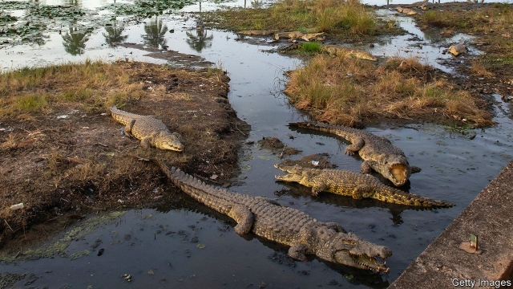

###### Pet peeves

# A former president’s crocodiles are terrorising Ivory Coast’s capital 

 

> print-edition iconPrint edition | Middle East and Africa | Nov 23rd 2019 

THE FIRST president of Ivory Coast, Félix Houphouët-Boigny, liked to build monuments to himself. After independence he erected a new political capital on top of his remote home village, Yamoussoukro. No expense was spared. He equipped the city with a Concorde runway, West Africa’s first ice-skating rink, the largest basilica in the world and a grand palace, surrounded by an artificial lake filled with crocodiles. 

Since the president’s death in 1993 officials have preferred to work in the commercial capital, Abidjan, leaving the political capital to fall into disrepair. But potholed roads and broken streetlights are not the only problems locals face. The president’s pets have escaped into the city’s waterways, and reproduced. “There has been no policy for the crocodiles. If you go near the water, they will eat you,” frets Souaga Gérard, a teacher. 

The crocodiles were gifts from Moussa Traoré, the brutal dictator of next-door Mali. “It was a sort of ‘This is how I deal with my enemies’ gesture,” says a Western diplomat. For more than three decades they were looked after by a wiry keeper, Dicko Toki. He gave them names like “Capitaine” and “Chef de Cabinet” and kept them in check with a blunt machete. In 2012, however, Mr Toki was allegedly dragged out into the lake by Chef de Cabinet, never to be seen again. 

In the wild, crocodiles can get by with only the occasional meal. The oxen that the presidency buys to feed them every month ought to be enough to satisfy even the hungriest of them. Alas, irresponsible tourists have developed the habit of paying locals good money (around $5 a chomp) to see them gobble down live chickens. This rich diet has allowed the animals to grow and multiply. There were about 20 originally, but no one knows how many there are now—or how many people they have killed. “It is particularly dangerous in the rainy season when there are floods,” says Mr Gérard. 

In most cities in Africa hardly anyone would shed a tear at the removal of cold-blooded killers, or their conversion into stylish handbags. But Yamoussoukro’s crocs have a sacred aura, thanks to the big man to whom they once belonged. Some say anyone who does them harm will be cursed. So when they come out of the water looking for a snack, the palace guards do not shoot them. Instead, firemen are called to put them gingerly back.■ 

