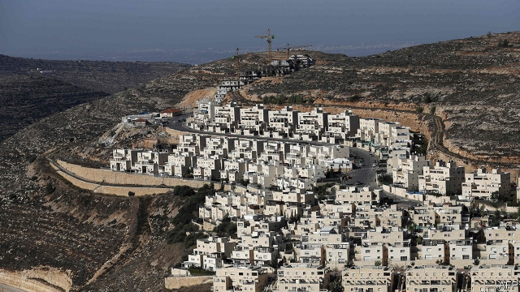
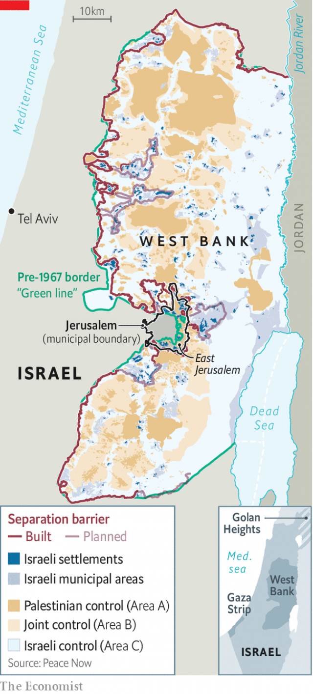

###### Unsettled status

# America says Israeli settlements in the West Bank are legal 

 

> print-edition iconPrint edition | Middle East and Africa | Nov 21st 2019 

THE ANNOUNCEMENT on November 18th by Mike Pompeo, the American secretary of state, was unscheduled but not unexpected. After a legal review by his department, Mr Pompeo said, Israeli settlements in the West Bank were found to be in line with international law. That declaration was just the latest in a series of gestures by the Trump administration benefiting Israel over the past two years. 

The move is wholly in tune with Donald Trump’s tendency to disregard diplomatic norms, as he did when he recognised Israel’s sovereignty over the occupied Golan Heights and Jerusalem as Israel’s capital. Despite some dissenting views, the international consensus for decades has been that the settlements Israel has built in the territories it captured in its war with Arab states in 1967 are indeed illegal. They are deemed to contravene the Fourth Geneva Convention, which says “the occupying power shall not deport or transfer parts of its own civilian population into the territory it occupies”. 

Israel, undeterred, has clung to its own interpretation of international law. Over the past 52 years it has built scores of settlements, both in East Jerusalem, which it formally annexed in 1967, and in the wider areas of the West Bank (which Israel calls Judea and Samaria). Palestinians, and much of the rest of the world, regard these, as well as the Gaza Strip, as belonging to a future Palestinian state. 

 

Settlements have been built and expanded under every Israeli government of the past half-century, whichever party was in power. Labour regarded the occupied territories as bargaining chips in negotiations over a future peace deal with Jordan or the Palestinians. Likud, the party of the present prime minister, Binyamin Netanyahu, sees the West Bank as the ancient Jewish homeland, never to be relinquished. According to Peace Now, an Israeli advocacy group, 428,000 Israeli settlers live in the West Bank (not including East Jerusalem), alongside 2.6m Palestinians. 

The timing of the announcement may well have been engineered by pro-settler elements in the Trump administration. Chief among them is David Friedman, Mr Trump’s former bankruptcy lawyer and his current ambassador to Israel, who has been pushing for such a shift. It was partly in response to a ruling on November 12th by the European Court of Justice, reinforcing European Union guidelines that food products exported from the West Bank settlements should not be labelled “Made in Israel”, but specify that they were processed in the occupied territories. 

Mr Pompeo’s announcement is unlikely to have any immediate impact on the ground. The settlements have been growing at a steady clip anyway; in the three years since Mr Trump took office, 30,000 new settlers have arrived. Although Mr Netanyahu’s government has in this period officially added only one new settlement, settlers have independently opened 26 new “outposts”, with the government usually turning a blind eye. 

For the Palestinians, whose leaders were swift to condemn the move, it will not change much either. They cut off all talks with the Trump administration two years ago, after it recognised Jerusalem—the putative capital of a future Palestinian state—as Israel’s capital. Mahmoud Abbas, the Palestinian president, had already rejected Mr Trump’s much-vaunted peace plan (the “deal of the century”), though it is unclear whether it will ever actually be presented. The administration has since ordered the closure of the Palestinian mission in Washington and cut nearly all the funding it provided to the Palestinian Authority, which runs parts of the West Bank but has lost control of the Gaza Strip to its Islamist rival, Hamas. Following the announcement about settlements, the State Department warned Americans of potential unrest in Jerusalem, the West Bank and Gaza. But in the short term it is unlikely to lead to a big surge in violence. 

So it is easy to dismiss the administration’s change of policy as an empty gesture, aimed at a domestic audience, and intended mainly to appeal to the pro-Israel evangelical American voters Mr Trump will need for re-election in 2020. But it could have important effects in the longer term. 

Mr Netanyahu has announced a number of times this year that he intends in the near future to annex parts of the West Bank formally. His political rival, Benny Gantz, also welcomed Mr Pompeo’s announcement, though he has presented no plans for dealing with the settlement issue. After an inconclusive election in September, Israel is in political deadlock; neither leader has been able to form a ruling coalition. But America’s shift will probably encourage any future Israeli government to move ahead with annexation. ■ 

