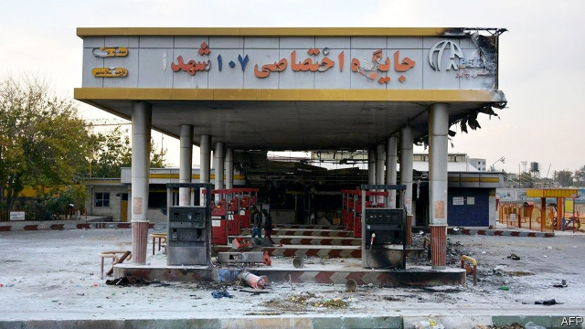

###### A fuel and their money

# Rises in the price of petrol are fuelling unrest in Iran 

 

> print-edition iconPrint edition | Middle East and Africa | Nov 23rd 2019 

AFTER A BIG rise in the state-controlled price of fuel on November 15th, anger erupted across Iran. Protesters in more than 100 cities blocked traffic, torched banks and burned down petrol stations. They targeted anything that smacked of the state, even mosques and ambulances. It was the most dramatic expression of hostility to the ruling ayatollahs since a disputed election in 2009 sparked a “green revolution” that shook the regime for a year. The most violent unrest occurred in Khuzestan, an oil-rich province on the Persian Gulf, and in a belt of commuter suburbs and small towns ringing Tehran, the capital. Amnesty International, a human-rights watchdog in London, said over 100 protesters nationwide had been killed. 

Complaints about petrol prices have turned into denunciations of the regime. Protesters burned portraits of the supreme leader, Ayatollah Ali Khamenei, and shouted “Mullahs get lost!” Two years ago working-class Iranians demonstrated angrily when the government raised the price of eggs. This time middle-class car-owners also joined the protests. The gulf between the ruling clergy and Iran’s 83m people appears to be widening. 

The government knew its decision to raise the fuel price would bring trouble. It had repeatedly suggested it would do so, only to back down. This time the government waited until midnight on November 15th, just as the Iranian weekend began. It then announced a 50% increase in the price of the first 60 litres of petrol that may be bought every month (enough for a car’s tank of fuel) and a threefold increase for any more purchases. As the first snow of the year fell, the government hoped that people would stay indoors. No such luck. 

So far, the regime shows no sign of backing down. In some places security forces opened fire to protect public buildings. The government turned off the internet and jammed satellite television. Videos shared online showed gunmen shooting into crowds of protesters. Citizens near the sites of protests received anonymous messages saying: “We know you are here.” 

The various branches of Iran’s government, often at odds, have closed ranks behind a newly formed Supreme Council of Economic Co-ordination, which signed the decision to raise prices. Mr Khamenei publicly backed the president, Hassan Rouhani, whom he has often criticised. The supreme leader denounced the protesters as “thugs” and blamed “the centres of villainy around the world that oppose us” for stirring up the unrest. 

It is unclear why the clerics took this gamble. Petrol arouses passions in Iran like no other commodity. Ever since its British-run oilfields were nationalised in 1951, Iranians have considered ridiculously cheap fuel a birthright. Many believe that Ayatollah Ruhollah Khomenei, the Islamic Republic’s founder, promised the people free energy in 1979. Iran has some of the world’s most heavily subsidised petrol. The refined stuff costs less than crude—and less even than bottled water. Cheap fuel prompts many Iranians to commute to cities from distant satellite towns with low rents, or even to drive in from the provinces each day. Others make a living by smuggling petrol abroad. Air pollution in Tehran is, unsurprisingly, terrible. 

Recent economic data may have given the government a false sense of confidence. Mr Rouhani has boasted that it has fended off America’s campaign to exert “maximum pressure” on Iran, after President Donald Trump’s ditching of the deal to curb Iran’s nuclear programme. Iran’s currency, the rial, has recovered a bit, after plummeting by 60% when Mr Trump imposed sanctions on countries that buy Iranian oil. Tax rises, land sales and petrochemical exports have partly compensated for the loss of oil revenues. Last month the World Bank predicted that inflation would fall by almost a quarter in the year ahead and that an 8.7% fall in GDP this year would be followed by a return to modest growth. Iran is still the Middle East’s second-biggest economy after Saudi Arabia. 

All the same, Mr Trump’s sanctions are hurting. Mr Rouhani had budgeted to export oil this year at a rate of 1.5m barrels per day, but Iran is struggling to find buyers for a third of that. Revenues should have covered the subsidy bill, estimated at $25bn (5% of GDP), but are 70% below budget, says an Iranian finance official. So the people are paying the price. The fall in the rial’s value and soaring inflation have sharply cut the purchasing power of public-sector workers. A senior civil servant on the equivalent of $2,000 a month at the start of this year may now be earning $400. Food prices are rising faster than inflation, hitting the poorest hardest. Middle-class families, too, are slipping into penury as they exhaust their savings. Poverty has soared. 

The clerics know they must somehow dampen the anger. Parliamentary elections are due early next year. Mr Rouhani says that the savings from the reduction in petrol subsidies will be distributed as welfare. Some 18m households (three-quarters of Iran’s population) will qualify, say officials, acknowledging the extent of deprivation. But few Iranians trust the government to keep its promise. Mr Rouhani previously cut the welfare payments his predecessor, Mahmoud Ahmadinejad, made after raising fuel prices a decade ago. Moreover, many fear that rising transport costs will push up the price of groceries, wiping out the benefits of additional welfare. 

Mr Trump is sure to proclaim Iran’s troubles as an American foreign-policy success. “The United States is with you,” tweeted Mike Pompeo, America’s secretary of state, to the protesters. But it is unclear whether the latest bout of unrest will spur the regime to reform, let alone topple it. Previous protests have faded. Repression may curb the latest ones. The authorities have kept city centres under control. Oil workers have not gone on strike to back the protesters. The opposition is incoherent. 

Meanwhile, the regime is toughening up. It has become more belligerent abroad, crueller at home and less democratic. So far, the protests have failed to make it change course. ■ 

