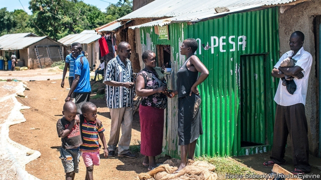

###### Helicopter money

# Unconditional handouts benefit recipients—and their neighbours too 

 

> print-edition iconPrint edition | Middle East and Africa | Nov 23rd 2019 

ECONOMISTS HAVE long argued that people should give each other money rather than gifts, since it is hard to know what others truly want. Though they have failed to ruin Christmas, a study in Kenya shows how they are changing the war on poverty by encouraging cash handouts to the poor. 

Of 142 countries in a database compiled by the World Bank, 70% now use unconditional cash transfers as part of their welfare programmes. About 40% have conditional payments, in which recipients must fulfil certain obligations, such as getting their children vaccinated or enrolling them in school. Brazil’s Bolsa Família, launched in 2003, is now the world’s biggest such scheme. It helped slash the country’s extreme-poverty rate from 9.7% to 4.3% in a decade. China’s unconditional cash-transfer programme, dibao, boosts the incomes of 69m people, according to the World Bank, though many poor households miss out because of corruption and red tape. 

Most research has found that both types of cash transfers reduce poverty, and that conditional ones can boost school attendance and improve public health. Still, some economists worry about unintended consequences. Spending on one thing means not spending on another. Grants targeted at some people might disadvantage their business competitors. And large handouts could cause inflation in isolated areas where markets are thin. 

A new working paper, however, alleviates many of those concerns—and goes further.* Cash grants, it seems, benefit not just the recipients, but their neighbours, too. Between 2014 and 2017 GiveDirectly, a charity, handed $1,000 to more than 10,000 randomly chosen households in rural Kenya. This amounted to around 75% of a typical local family’s annual expenditure. The authors found that consumption rose by 13% for both the households that received the grants and neighbours who received nothing. Wages for the latter rose substantially, suggesting that grant recipients paid their employees more. Meanwhile local prices rose by less than 1%. The authors estimate that local GDP rose by $2.60 for every dollar granted. The comparable figure in America has been estimated as $1.50-2. 

The authors did not find a different kind of spillover effect, however: feelings of envy at witnessing the good fortune of others. But an earlier paper found that neighbours of recipients reported significant declines in life satisfaction, though their finances had not changed. ■ 

*“General equilibrium effects of cash transfers: experimental evidence from Kenya”, by Dennis Egger, Johannes Haushofer, Edward Miguel, Paul Niehaus and Michael Walker. November 2019 

