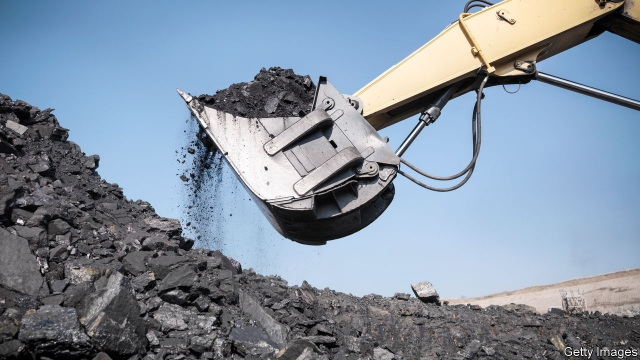
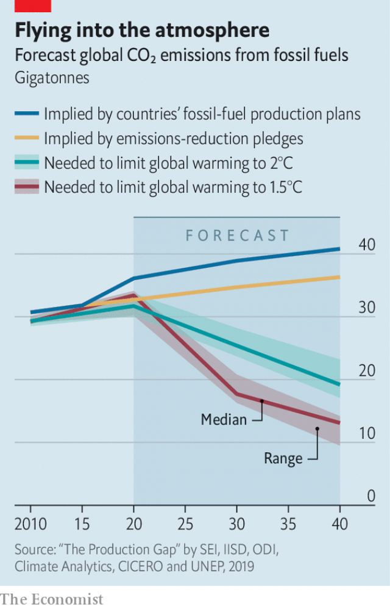

###### Climate goals

# Fossil-fuel-producing countries say one thing and do another 

 

> print-edition iconPrint edition | Science and technology | Nov 23rd 2019 

 

AT A SUMMIT in Paris in 2015, 188 countries pledged to curb their greenhouse-gas emissions. Collectively, these pledges, known as “nationally determined contributions” or NDCs, fall well short of what is needed to achieve another part of the Paris agreement, which is to avoid more than 2°C of warming above pre-industrial temperature levels. A report by the United Nations Environment Programme finds, however, that even these unambitious targets will probably be missed. Researchers studied policy documents from big fossil-fuel-producing countries to calculate how much coal, oil and natural gas is likely to be extracted over the next 20 years. According to these documents, global CO2 emissions from fossil fuels will reach 41 gigatonnes by 2040. That is higher than the 36 gigatonnes implied by the NDCs—and well above the 19 gigatonnes needed to keep warming below 2°C.■ 

